# InferaDB Ledger

Ledger is InferaDB's storage layer — a blockchain database for cryptographically verifiable auditing. Built in Rust, it exposes a gRPC API (HTTP/2 over TCP) and uses TCP for inter-node Raft consensus.

## Overview

Ledger uses a Raft-based replicated log with cryptographic block structure and materialized state indexes. The architecture mirrors FoundationDB's "fearless replication" model, replacing the transaction log with a verifiable chain.

**Key differentiator**: Unlike Amazon QLDB (deprecated 2024) which only verified the transaction log, Ledger's merkle-ized state tree includes indexes — enabling verifiable queries, not just verifiable writes.

### Design Goals

1. **High Performance**: Sub-millisecond reads, <50ms writes
2. **Fault Isolation**: Chain-per-vault ensures tenant failures don't cascade
3. **Cryptographic Auditability**: Every state can be proven against a merkle root
4. **Fearless Replication**: Raft consensus with self-verifying chain structure
5. **Operational Simplicity**: Snapshot recovery, zero-downtime migrations

### Inspiration

- FoundationDB — "fearless replication", deterministic simulation testing
- SpacetimeDB — database-blockchain convergence
- Amazon QLDB — verifiable ledger (lessons from its deprecation)
- Hyperledger Fabric — permissioned blockchain architecture
- Bitcoin/Nostr — cryptographic chain linking

### Table of Contents

- [Architecture](#architecture)
  - [Chain-per-Vault with Raft Consensus](#chain-per-vault-with-raft-consensus)
  - [Block Structure](#block-structure)
  - [Operation Semantics](#operation-semantics)
  - [State Layer: Hybrid Storage](#state-layer-hybrid-storage)
  - [Write Amplification Analysis](#write-amplification-analysis)
  - [State Root Computation](#state-root-computation)
  - [Write Path](#write-path)
  - [Transaction Batching](#transaction-batching)
  - [Read Path](#read-path)
  - [Fault Tolerance & Recovery](#fault-tolerance--recovery)
  - [Historical Reads](#historical-reads)
  - [Vault Lifecycle](#vault-lifecycle)
  - [Performance Characteristics](#performance-characteristics)
  - [Scaling Architecture: Shard Groups](#scaling-architecture-shard-groups)
- [Discovery & Coordination](#discovery--coordination)
  - [System Raft Group](#system-raft-group-_system)
  - [Client Discovery Flow](#client-discovery-flow)
  - [Block Announcements](#block-announcements)
  - [Peer-to-Peer Properties](#peer-to-peer-properties)
  - [Bootstrap Discovery](#bootstrap-discovery)
  - [Node Join](#node-join)
  - [Node Leave](#node-leave)
  - [Membership Reconfiguration Safety](#membership-reconfiguration-safety)
  - [Vault Routing](#vault-routing)
  - [Failure Modes](#failure-modes)
- [Durability & Finality Model](#durability--finality-model)
- [Persistent Storage Architecture](#persistent-storage-architecture)
  - [Directory Layout](#directory-layout)
  - [Storage Backend: redb](#storage-backend-redb)
  - [Block Archive Format](#block-archive-format)
  - [Snapshot Format](#snapshot-format)
  - [Crash Recovery](#crash-recovery)
  - [File Locking](#file-locking)
  - [Storage Invariants](#storage-invariants)
- [Corruption Detection & Resolution](#corruption-detection--resolution)
- [Network Partition Handling](#network-partition-handling)
- [Control Data Storage](#control-data-storage)
- [Client Idempotency & Retry Semantics](#client-idempotency--retry-semantics)
- [Vault Owner Verification Protocol](#vault-owner-verification-protocol)
- [Observability & Monitoring](#observability--monitoring)
- [Consistency Guarantees](#consistency-guarantees)
- [Limitations & Trade-offs](#limitations--trade-offs)
- [Snapshot & Retention Policy](#snapshot--retention-policy)
- [Testing & Validation Strategy](#testing--validation-strategy)
- [System Invariants](#system-invariants)

---

## Architecture

### Chain-per-Vault with Raft Consensus

Each vault maintains its own cryptographic blockchain. For scalability, multiple vaults share a Raft group (see [Shard Groups](#scaling-architecture-shard-groups)). The chain provides:

- Consensus and ordering (Raft, shared across vaults in a shard)
- Replication and fault tolerance (Raft followers)
- Immutability and verification (per-vault cryptographic chain linking)
- Audit trail (chain IS the history)

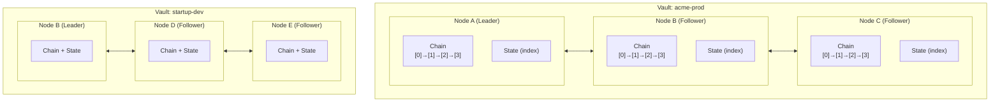

Vaults share physical nodes and Raft groups (shard groups) but maintain independent cryptographic chains. In this example, Vault 1 and Vault 2 could share the same shard group while keeping separate chain histories.

**Raft transport**: gRPC/HTTP2 over TCP. TCP's kernel implementation and hardware offload provide optimal latency for single-stream consensus.

### Block Structure

Each vault maintains a logical block chain. Physically, vault blocks are packed into `ShardBlock` entries for Raft efficiency (see [Shard Groups](#scaling-architecture-shard-groups)).

```rust
/// Per-vault block (logical view, extracted from ShardBlock for verification)
struct VaultBlock {
    // Identity
    height: u64,
    vault_id: VaultId,

    // Chain linking (immutability)
    previous_hash: Hash,      // SHA-256 of previous vault block

    // Content
    transactions: Vec<Transaction>,
    tx_merkle_root: Hash,     // Merkle root of transactions

    // State commitment (verification)
    state_root: Hash,         // Merkle root of state AFTER applying this block

    // Metadata
    timestamp: DateTime<Utc>,
    leader_id: NodeId,

    // Raft integration (from containing ShardBlock)
    term: u64,
    committed_index: u64,
}

struct Transaction {
    id: TxId,                 // Unique transaction ID
    client_id: ClientId,      // Identifies submitting client
    sequence: u64,            // Monotonic per-client (for idempotency)
    operations: Vec<Operation>,
    timestamp: DateTime<Utc>,
}

enum Operation {
    // Relationship operations (Engine)
    CreateRelationship { resource: String, relation: String, subject: String },
    DeleteRelationship { resource: String, relation: String, subject: String },

    // Entity operations (Control)
    SetEntity { key: String, value: Bytes },
    DeleteEntity { key: String },
}
```

### Operation Semantics

All operations are **idempotent** and resolved by **Raft total ordering**:

| Operation            | Pre-state  | Post-state | Return           |
| -------------------- | ---------- | ---------- | ---------------- |
| `CreateRelationship` | not exists | created    | `CREATED`        |
| `CreateRelationship` | exists     | no change  | `ALREADY_EXISTS` |
| `DeleteRelationship` | exists     | deleted    | `DELETED`        |
| `DeleteRelationship` | not exists | no change  | `NOT_FOUND`      |
| `SetEntity`          | any        | value set  | `OK`             |
| `DeleteEntity`       | exists     | deleted    | `DELETED`        |
| `DeleteEntity`       | not exists | no change  | `NOT_FOUND`      |

**Concurrent operation resolution:**

Raft provides deterministic total ordering. Concurrent operations from different clients serialize in Raft log order:

```
Client A: CREATE(user:alice, viewer, doc:1)  →  Raft index 100
Client B: DELETE(user:alice, viewer, doc:1)  →  Raft index 101

Result: Relationship does NOT exist (DELETE at 101 wins)
```

```
Client A: DELETE(user:alice, viewer, doc:1)  →  Raft index 100
Client B: CREATE(user:alice, viewer, doc:1)  →  Raft index 101

Result: Relationship EXISTS (CREATE at 101 wins)
```

**Security implications:**

The second scenario (DELETE then CREATE) can unexpectedly grant access. Mitigations:

1. **Check after write**: Read at the committed block height to confirm final state before acting on the result. This is the primary defense.

2. **Tombstone TTL**: Configure a cooldown period during which deleted relationships cannot be recreated. Prevents rapid DELETE→CREATE races at the cost of delayed re-grants.

**Fail-secure default:**

For authorization, prefer:

- Deny access on any ambiguity
- Engine should cache permission checks with block height
- On cache miss after a delete, re-check at current height
- Short TTL on permission caches (default: 1 second)

**Retry behavior:**

| Scenario                          | Client sees                | Correct action                  |
| --------------------------------- | -------------------------- | ------------------------------- |
| `CREATE` returns `ALREADY_EXISTS` | Relationship exists        | No retry needed, goal achieved  |
| `DELETE` returns `NOT_FOUND`      | Relationship doesn't exist | No retry needed, goal achieved  |
| Network timeout on `CREATE`       | Unknown                    | Retry with same sequence number |
| Network timeout on `DELETE`       | Unknown                    | Retry with same sequence number |

Retries with the same `(client_id, sequence)` return the original result (see [Client Idempotency](#client-idempotency--retry-semantics)).

### State Layer: Hybrid Storage

The state layer separates **state commitment** (merkleized, for verification) from **state storage** (non-merkleized, for fast queries), avoiding the severe write amplification of fully-merkleized indexes.

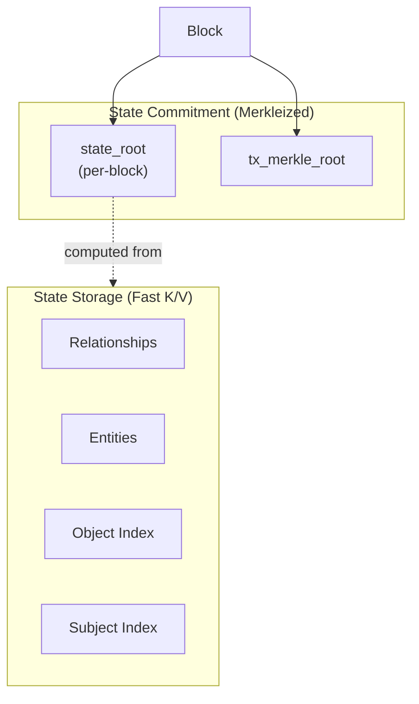

**What's merkleized:**

- `tx_merkle_root`: Merkle root of transactions in each block (proves tx inclusion)
- `state_root`: Commitment to state after applying block (proves state at height N)

**What's NOT merkleized per-write:**

- Individual index entries (stored in redb for O(1) lookup)
- Dual indexes for relationship traversal

**Verification approach:**

- **Transaction inclusion**: Standard merkle proof against `tx_merkle_root`
- **State verification**: Replay transactions from trusted snapshot to derive state
- **On-demand proofs**: Compute merkle path when explicitly requested (not precomputed)

```rust
struct StateLayer {
    // Fast K/V storage for queries (redb)
    kv: Database,

    // Indexes for relationship traversal
    obj_index: Table<ObjectKey, Vec<SubjectId>>,
    subj_index: Table<SubjectKey, Vec<ObjectId>>,

    // State commitment (computed at block boundaries)
    state_root: Hash,
}

impl StateLayer {
    /// Fast query path (no proof)
    fn get(&self, key: &[u8]) -> Option<Value> {
        self.kv.get(key)
    }

    /// Apply block operations, compute new state_root
    fn apply_block(&mut self, block: &Block) -> Hash {
        for tx in &block.transactions {
            for op in &tx.operations {
                self.apply_operation(op);
            }
        }
        self.compute_state_root()
    }

    /// Compute state root via deterministic traversal
    fn compute_state_root(&self) -> Hash {
        // Hash all key-value pairs in deterministic order
        // This is O(n) but only computed once per block
        let mut hasher = StateHasher::new();
        for (key, value) in self.kv.iter() {
            hasher.update(key, value);
        }
        hasher.finalize()
    }
}
```

### Write Amplification Analysis

**Problem**: Fully-merkleized state creates severe write amplification for authorization workloads.

**Naive MPT approach** (what we avoid):

```
1 relationship tuple =
  1 relationship entry × O(log n) merkle nodes +
  1 obj_index update × O(log n) merkle nodes +
  1 subj_index update × O(log n) merkle nodes
  = 3 × 5 levels × 3 replicas × fsync
  = ~45 disk writes per tuple (for 1M keys)
```

**Hybrid approach** (what we use):

```
1 relationship tuple =
  3 K/V writes (relationship + 2 indexes) +
  1 state_root computation (amortized across block)
  = ~3 disk writes per tuple + O(1) amortized merkle cost
```

**Authorization relationship breakdown:**

Each relationship tuple (e.g., `document:123#viewer@user:alice`) requires:

| Write         | Key Pattern                           | Purpose                                  |
| ------------- | ------------------------------------- | ---------------------------------------- |
| Relationship  | `rel:{resource}#{relation}@{subject}` | Primary tuple storage                    |
| Object index  | `obj_idx:{resource}#{relation}`       | Forward lookup: "who can view doc:123?"  |
| Subject index | `subj_idx:{subject}`                  | Reverse lookup: "what can alice access?" |

**Batch optimization:**

| Pattern                         | Writes | Fsyncs       | Throughput       |
| ------------------------------- | ------ | ------------ | ---------------- |
| Single tuple (interactive)      | 3      | 1 (via Raft) | ~200 tx/sec      |
| N tuples to same resource       | 3N     | 1            | ~50K tuples/sec  |
| Bulk import (1000 tuples/block) | 3000   | 1            | ~100K tuples/sec |

Interactive single-tuple writes are bounded by Raft RTT (~3-5ms). Batch imports amortize consensus overhead for 500x higher throughput.

**Trade-offs:**

| Aspect              | Naive MPT      | Hybrid               |
| ------------------- | -------------- | -------------------- |
| Write amplification | 10-50x         | ~1x                  |
| Per-key proofs      | Instant        | Requires computation |
| State verification  | O(log n) proof | Replay from snapshot |
| Query latency       | O(log n)       | O(1)                 |

**Design rationale**: Authorization workloads are read-heavy (permission checks) with bursty writes (policy updates). Fast queries and low write amplification matter more than instant per-key proofs. Vault owners can request proofs on-demand or verify by replaying the transaction log.

**References:**

- [QMDB](https://github.com/LayerZero-Labs/qmdb): Append-only log with O(1) merkleization
- [SeiDB](https://docs.sei.io/learn/seidb): Separates state commitment from state storage
- [Zanzibar](https://research.google/pubs/pub48190/): Uses temporal consistency, not merkle proofs

### State Root Computation

**When computed**: After applying all block transactions, before Raft commit. The leader includes `state_root` in the block header; followers verify their computed root matches.

**Computation strategy**: Incremental bucket-based hashing avoids O(n) full traversal.

```rust
struct StateCommitment {
    /// Keyspace divided into 256 buckets by first byte of key hash
    bucket_roots: [Hash; 256],

    /// Keys modified in current block (cleared after commit)
    dirty_buckets: BitSet<256>,
}

impl StateCommitment {
    /// O(k) where k = keys modified, not total keys
    fn compute_state_root(&mut self, kv: &Database, dirty_keys: &[Key]) -> Hash {
        // Mark affected buckets
        for key in dirty_keys {
            let bucket = key.hash()[0] as usize;
            self.dirty_buckets.set(bucket);
        }

        // Recompute only dirty bucket roots
        for bucket in self.dirty_buckets.iter() {
            self.bucket_roots[bucket] = self.hash_bucket(kv, bucket);
        }

        self.dirty_buckets.clear();

        // Final root = hash of all bucket roots
        hash_concat(&self.bucket_roots)
    }

    fn hash_bucket(&self, kv: &Database, bucket: u8) -> Hash {
        let mut hasher = BucketHasher::new();
        for (key, value) in kv.prefix_iter(bucket) {
            hasher.update(key, value);
        }
        hasher.finalize()
    }
}
```

**Complexity analysis**:

| Scenario                   | Naive O(n)   | Bucket-based               |
| -------------------------- | ------------ | -------------------------- |
| 1M keys, 100 ops/block     | Hash 1M keys | Hash ~100 keys + 256 roots |
| 1M keys, 10K ops/block     | Hash 1M keys | Hash ~10K keys + 256 roots |
| Cold start (snapshot load) | Hash 1M keys | Hash 1M keys (unavoidable) |

**Raft integration sequence**:

```
1. Leader receives transactions
2. Leader applies transactions to state (tracks dirty keys)
3. Leader computes state_root via incremental bucket hashing
4. Leader constructs block with state_root
5. Leader proposes block to Raft (AppendEntries)
6. Followers replicate log entry
7. On commit: followers apply transactions, verify state_root
8. If state_root mismatch: follower halts and alerts (see Divergence Handling)
```

**Divergence handling**: If a follower computes a different `state_root` than the block header:

1. Follower halts processing for this vault (not the whole node)
2. Follower emits critical alert: `state_root_divergence{vault_id, height, expected, computed}`
3. Operator investigates: corruption, non-deterministic bug, or version mismatch
4. Resolution: Follower rebuilds state from snapshot + log replay, or is removed from Raft group

Divergence indicates a bug or corruption, not a consensus failure. The committing quorum is authoritative.

### Write Path

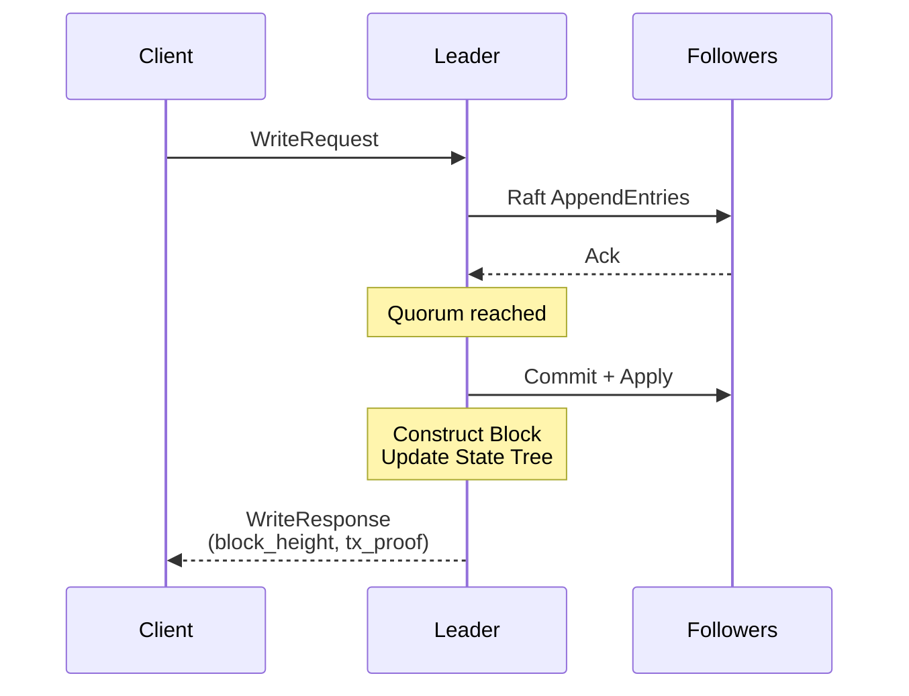

Write response includes:

- block_height: Which block contains this transaction
- tx_proof: Merkle proof that tx is in block (optional, for verification)

### Transaction Batching

Batching amortizes Raft consensus overhead across transactions, balancing throughput (larger batches) against latency (smaller batches).

**Authorization workload characteristics**:

| Metric              | Typical Value   | Implication                                                  |
| ------------------- | --------------- | ------------------------------------------------------------ |
| Read:write ratio    | 100:1 to 1000:1 | Writes are rare, optimize for low latency                    |
| Write burst size    | 10-1000 ops     | Policy updates come in batches (new employees, role changes) |
| Transaction size    | ~200 bytes      | Lightweight, validation cost is negligible                   |
| Latency sensitivity | High            | Security policies should propagate quickly                   |

**Adaptive batching strategy**:

```rust
struct BatchConfig {
    /// Maximum transactions per block
    max_batch_size: usize,        // Default: 100

    /// Maximum wait time for first transaction in batch
    max_batch_delay: Duration,    // Default: 5ms

    /// Commit immediately when queue drains to zero
    eager_commit: bool,           // Default: true
}

impl Leader {
    async fn batch_loop(&mut self) {
        loop {
            // Wait for first transaction
            let first_tx = self.pending.recv().await;
            let deadline = Instant::now() + self.config.max_batch_delay;

            let mut batch = vec![first_tx];

            // Collect more transactions until deadline or batch full
            while batch.len() < self.config.max_batch_size {
                let timeout = deadline.saturating_duration_since(Instant::now());

                match tokio::time::timeout(timeout, self.pending.recv()).await {
                    Ok(tx) => batch.push(tx),
                    Err(_) => break,  // Deadline reached
                }

                // Eager commit: if queue is empty, don't wait
                if self.config.eager_commit && self.pending.is_empty() {
                    break;
                }
            }

            self.commit_block(batch).await;
        }
    }
}
```

**Key behaviors**:

- **Eager commit**: When queue drains, commit immediately. Single-transaction blocks are acceptable for latency-sensitive workloads.
- **Burst absorption**: During policy update bursts, batches fill before timeout, maximizing throughput.
- **No artificial floor**: Unlike fixed 10ms batching, a single transaction can commit in <1ms (plus Raft RTT).

**Configuration per vault**:

```rust
struct VaultConfig {
    batching: BatchConfig,
    // ... other config
}

// High-throughput vault (batch processing)
let batch_vault = BatchConfig {
    max_batch_size: 500,
    max_batch_delay: Duration::from_millis(20),
    eager_commit: false,
};

// Low-latency vault (interactive)
let interactive_vault = BatchConfig {
    max_batch_size: 50,
    max_batch_delay: Duration::from_millis(2),
    eager_commit: true,
};
```

**Tuning guidance**:

| Workload              | max_batch_size | max_batch_delay | eager_commit |
| --------------------- | -------------- | --------------- | ------------ |
| Interactive (default) | 50             | 2ms             | true         |
| Batch import          | 500            | 20ms            | false        |
| Real-time sync        | 10             | 1ms             | true         |

**Latency breakdown** (single transaction, eager commit):

```
Client → Leader:        ~0.5ms (network)
Raft AppendEntries:     ~1-2ms (quorum RTT)
State application:      ~0.1ms
State root computation: ~0.5ms (bucket-based)
Response:               ~0.5ms (network)
─────────────────────────────────
Total p50:              ~3-4ms
Total p99:              ~10-15ms
```

This meets the <50ms p99 target with margin.

### Read Path

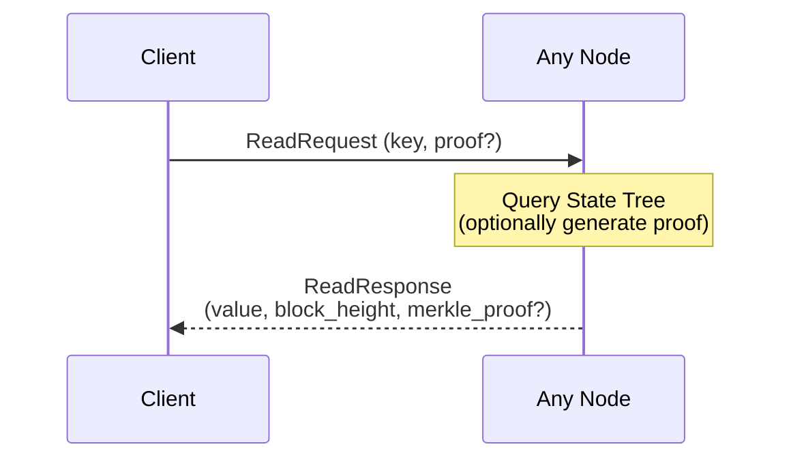

Read options:

- Fast read: Just return value, no proof (default for permission checks)
- Verified read: Return value + merkle proof + block header
- Historical read: Read state at specific block height (see [Historical Reads](#historical-reads))
- List relationships: Query with optional filters (resource, relation, subject)
- List resources: Get all resources matching a type prefix

#### Query Operations

The dual indexes enable efficient relationship queries:

```proto
// Query relationships with filters
rpc ListRelationships(ListRelationshipsRequest) returns (ListRelationshipsResponse);

// List resources by type prefix
rpc ListResources(ListResourcesRequest) returns (ListResourcesResponse);
```

**ListRelationships** uses the indexes based on provided filters:

| Filters Provided    | Index Used | Example                          |
| ------------------- | ---------- | -------------------------------- |
| resource only       | obj_index  | "Who can access doc:readme?"     |
| subject only        | subj_index | "What can user:alice access?"    |
| resource + relation | obj_index  | "Who are viewers of doc:readme?" |
| relation only       | Full scan  | Avoid in production              |
| None                | Full scan  | Avoid in production              |

**ListResources** uses type prefix matching on the obj_index:

```
ListResources(vault, "document") → ["document:1", "document:2", "document:readme"]
```

Both support pagination via `page_token` and `limit`, and historical reads via `at_height`.

Vault owners verify responses locally:

```rust
struct VerifiedResponse {
    value: Value,
    block_height: u64,
    block_header: BlockHeader,  // Contains state_root
    merkle_proof: MerkleProof,  // Path from value to state_root
}

impl VerifiedResponse {
    fn verify(&self) -> bool {
        // 1. Verify merkle_proof leads to block_header.state_root
        // 2. Verify block_header.previous_hash chains to known block
        // (Client maintains trusted block headers)
    }
}
```

### Fault Tolerance & Recovery

Node failure (minority):

- Raft handles automatically
- Remaining nodes continue
- Failed node catches up via log replay

Node failure (majority):

- Vault becomes read-only (can't achieve quorum)
- Reads still work from any surviving replica
- Manual intervention to restore quorum

Corruption detection:

- Every read can optionally verify against merkle root
- Background integrity checks: replay chain, verify state roots match
- Any divergence is immediately detectable

Recovery from snapshot:

```rust
struct Snapshot {
    vault_id: VaultId,
    block_height: u64,
    block_hash: Hash,           // For verification
    state_root: Hash,           // Expected state root
    state_data: StateTreeData,  // Serialized state tree
}

impl Node {
    async fn recover_from_snapshot(&mut self, snapshot: Snapshot) {
        // 1. Load state tree from snapshot
        self.state = StateTree::from_snapshot(snapshot.state_data);

        // 2. Verify state root matches
        assert_eq!(self.state.root(), snapshot.state_root);

        // 3. Fetch blocks from snapshot.block_height to current
        let blocks = self.fetch_blocks_since(snapshot.block_height).await;

        // 4. Apply blocks, verify each state_root
        for block in blocks {
            self.state.apply(&block.transactions);
            assert_eq!(self.state.root(), block.state_root);
        }

        // 5. Join Raft group
        self.raft.join().await;
    }
}
```

### Historical Reads

Historical reads return state as it existed at a specific block height. Since the state tree stores only current state, historical reads require snapshot-based reconstruction.

**Architecture:**

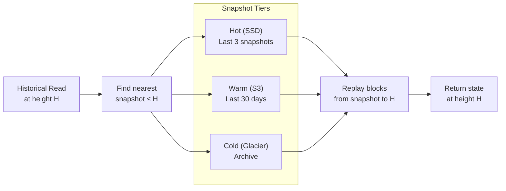

**Latency model:**

| Scenario                          | Latency   | Notes                                     |
| --------------------------------- | --------- | ----------------------------------------- |
| Current state                     | <1ms      | Direct state tree lookup                  |
| Height within hot snapshot range  | 5-20ms    | Load snapshot + replay 0-10K blocks       |
| Height within warm snapshot range | 100-500ms | S3 fetch + decompress + replay            |
| Height in cold archive            | 1-10s     | Glacier retrieval + replay                |
| No snapshot available             | O(blocks) | Full replay from genesis (emergency only) |

**Block replay cost:**

- ~10μs per block (apply transactions to in-memory state tree)
- 10,000 blocks = ~100ms replay
- Snapshots every 10K blocks keeps worst-case replay bounded

**Implementation:**

```rust
async fn historical_read(vault_id: VaultId, key: &str, at_height: u64) -> Option<Value> {
    // 1. Find nearest snapshot at or before at_height
    let snapshot = find_snapshot_for_height(vault_id, at_height)?;

    // 2. Load snapshot into memory (may fetch from S3/Glacier)
    let mut state = load_snapshot(snapshot).await;

    // 3. Fetch blocks from snapshot.height+1 to at_height
    let blocks = fetch_blocks(vault_id, snapshot.block_height + 1, at_height).await;

    // 4. Replay transactions to reconstruct state at at_height
    for block in blocks {
        state.apply(&block.transactions);
    }

    // 5. Return value at reconstructed state
    state.get(key)
}
```

**Optimization: Hot snapshot caching**

- Keep last 3 snapshots decompressed in memory
- Queries within hot range require no disk I/O for snapshot loading
- LRU eviction when memory pressure

**Optional time-travel index** (for frequent audit queries):

- Stores `(key, block_height, value)` tuples for high-frequency audit targets
- Opt-in per vault (storage overhead ~10x for indexed keys)

### Vault Lifecycle

Creation:

```rust
async fn create_vault(vault_id: VaultId, replication_factor: u8) {
    // 1. Select nodes for this vault's Raft group
    let nodes = scheduler.select_nodes(replication_factor);

    // 2. Initialize genesis block
    let genesis = Block {
        height: 0,
        vault_id,
        previous_hash: Hash::zero(),
        transactions: vec![],
        tx_merkle_root: Hash::empty_tree(),
        state_root: Hash::empty_tree(),
        timestamp: Utc::now(),
        leader_id: nodes[0],
        term: 0,
        committed_index: 0,
    };

    // 3. Bootstrap Raft group on selected nodes
    for node in nodes {
        node.bootstrap_vault(vault_id, genesis.clone()).await;
    }
}
```

Migration (moving vault to different nodes):

1. Add new node to Raft group (catches up via log/snapshot)
2. Once caught up, promote to voter
3. Remove old node from group
4. Zero-downtime, no data movement needed (Raft handles it)

Deletion:

- Mark vault as deleted (metadata operation)
- After retention period: garbage collect chain + state, or archive to cold storage for compliance

### Performance Characteristics

| Operation                      | Latency   | Bottleneck                           |
| ------------------------------ | --------- | ------------------------------------ |
| Read (no proof)                | <1ms      | State tree lookup                    |
| Read (with proof)              | 1-5ms     | Merkle proof generation              |
| Write (single)                 | 10-50ms   | Raft consensus round-trip            |
| Write (batched)                | 10-50ms   | Same, amortized across batch         |
| Historical read (hot snapshot) | 5-20ms    | Snapshot load + block replay (0-10K) |
| Historical read (warm)         | 100-500ms | S3 fetch + decompress + replay       |
| Historical read (cold)         | 1-10s     | Glacier retrieval + replay           |

Scaling dimensions:

- More vaults: Linear scaling (independent chains)
- Larger vaults: State tree depth grows logarithmically
- More writes: Batching amortizes consensus cost
- More reads: Add followers (reads can go to any replica)

### Benchmark Baseline

Reference hardware for performance targets:

| Component | Spec                                                 |
| --------- | ---------------------------------------------------- |
| CPU       | AMD EPYC 7763 (64 cores) or Apple M2 Pro (12 cores)  |
| RAM       | 128 GB DDR4/DDR5                                     |
| Storage   | NVMe SSD with power-loss protection (fsync p99 <1ms) |
| Network   | 10 Gbps between nodes, <1ms RTT (same datacenter)    |

**Target metrics** (3-node Raft cluster, 1M keys in state tree, **same datacenter**):

| Metric             | Target          | Measurement                    | Rationale                         |
| ------------------ | --------------- | ------------------------------ | --------------------------------- |
| Read (p50)         | <0.5ms          | Single key, no proof, follower | redb lookup + gRPC                |
| Read (p99)         | <2ms            | Single key, no proof, follower | Tail latency from GC/compaction   |
| Read + proof (p99) | <10ms           | With merkle proof generation   | Bucket-based O(k) proof           |
| Write (p50)        | <10ms           | Single tx, quorum commit       | Raft RTT + fsync                  |
| Write (p99)        | <50ms           | Single tx, quorum commit       | Includes state_root computation   |
| Write throughput   | 5,000 tx/sec    | Batched, sustained             | 100 tx/batch × 50 batches/sec     |
| Read throughput    | 100,000 req/sec | Per node, batched              | Follower reads scale horizontally |

**Why these targets are achievable:**

- **Read p99 <2ms**: Follower reads bypass Raft consensus. redb B-tree lookup is O(log n). etcd achieves ~2ms p99 for serializable reads.
- **Write p99 <50ms**: Aggressive for blockchain but achievable because:
  - Bucket-based state root: O(k) where k = dirty keys, not O(n) full tree
  - Single Raft RTT: ~1-2ms same datacenter
  - NVMe fsync: <1ms with power-loss protection
  - Batching amortizes merkle cost across transactions
- **Throughput 5K tx/sec**: TigerBeetle achieves 400K tx/sec with aggressive batching; we target 1/80th with simpler batching

**Industry comparison:**

| System                    | Write p99  | Notes                         |
| ------------------------- | ---------- | ----------------------------- |
| etcd (Raft, no merkle)    | ~10ms      | Pure consensus, no blockchain |
| TiKV (Raft)               | ~10ms      | RocksDB backend               |
| CockroachDB (Raft + SQL)  | 5-20ms     | Single AZ                     |
| Hyperledger Fabric (Raft) | 100-500ms  | Block-based batching          |
| TigerBeetle (custom)      | ~100ms p99 | 400K tx/sec batched           |

InferaDB targets Raft-like latency (10-50ms) while adding merkle commitments. This is aggressive but achievable with the bucket-based state root design.

**Multi-region targets** (cross-region, ~50ms RTT):

| Metric      | Target | Notes                      |
| ----------- | ------ | -------------------------- |
| Read (p99)  | <5ms   | Follower reads still local |
| Write (p99) | <150ms | Dominated by network RTT   |

**Methodology**:

- Use [criterion](https://github.com/bheisler/criterion.rs) for micro-benchmarks
- Use custom load generator for system benchmarks
- Measure with tracing disabled (production mode)
- Warm up caches before measurement
- Report p50, p95, p99, p99.9 percentiles

**Benchmark suite**:

```
ledger-bench/
├── micro/
│   ├── state_tree_get.rs      # Raw state tree lookup
│   ├── state_tree_insert.rs   # State tree mutation
│   ├── merkle_proof.rs        # Proof generation
│   └── hash_block.rs          # Block hashing
├── system/
│   ├── single_node.rs         # Single node operations
│   ├── three_node.rs          # 3-node Raft cluster
│   └── mixed_workload.rs      # 90% read, 10% write
├── authz/                     # Authorization-specific
│   ├── check_direct.rs        # Direct tuple lookup
│   ├── check_expand.rs        # Group expansion traversal
│   ├── list_objects.rs        # Fanout query (all docs user can access)
│   ├── bulk_write.rs          # 1000 tuples to same resource
│   └── watch_latency.rs       # Write-to-notification delay
└── stress/
    ├── hot_key.rs             # Contention on single key
    ├── large_batch.rs         # 10K transactions/batch
    └── recovery.rs            # Time to recover from snapshot
```

**Authorization benchmark targets:**

| Benchmark                 | Pattern                         | Target     | Notes                 |
| ------------------------- | ------------------------------- | ---------- | --------------------- |
| Permission check (direct) | `doc:X#viewer@user:Y` lookup    | p99 <2ms   | Single index lookup   |
| Permission check (expand) | Group membership expansion      | p99 <10ms  | Multiple index hops   |
| ListObjects               | All docs user can access (1000) | p99 <50ms  | Fanout query          |
| Bulk relationship write   | 1000 tuples to same resource    | p99 <100ms | Batched, single block |
| Watch latency             | Write → subscriber notification | p99 <100ms | Includes Raft commit  |

### What This Enables for Engine/Control

Engine benefits:

- Relationship storage with built-in history (no more soft-delete overhead)
- Time-travel queries native: "What permissions existed at block N?"
- Watch API becomes trivial: Subscribe to block stream
- Dual indexes can be merkle-ized for verifiable graph traversal

Control benefits:

- Audit log is free — it's just the chain
- TTL can be modeled as "valid_until" in entity, garbage collected later
- Session/token verification can include proof of issuance
- Per-vault chains provide cryptographic tenant isolation

### Scaling Architecture: Shard Groups

A naive 1:1 vault-to-Raft mapping doesn't scale:

| Vaults  | Replicas | Raft State Machines | Heartbeat Traffic (150ms) |
| ------- | -------- | ------------------- | ------------------------- |
| 1,000   | 3        | 3,000               | ~20K msgs/sec             |
| 10,000  | 3        | 30,000              | ~200K msgs/sec            |
| 100,000 | 3        | 300,000             | ~2M msgs/sec              |

**Solution: Vault Shard Groups**

Multiple vaults share a single Raft group while maintaining independent cryptographic chains:

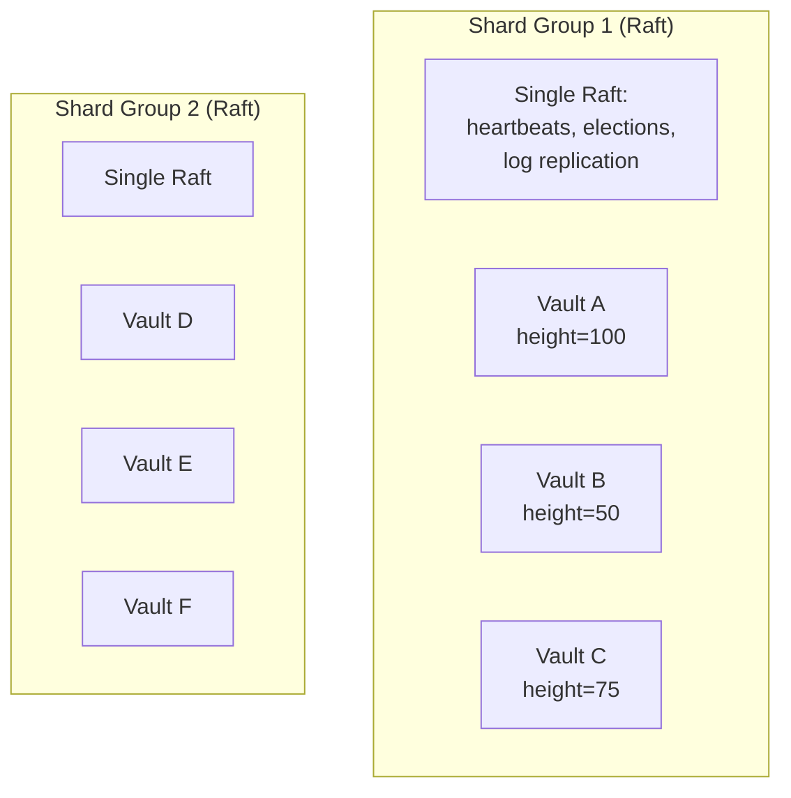

**What's shared (per shard group):**

- Raft consensus (single leader election, heartbeat, log)
- Physical replication
- Snapshot coordination

**What's independent (per vault):**

- Cryptographic chain (height, previous_hash, state_root)
- State tree and indexes
- Merkle proofs and verification

**Block structure with shard groups:**

```rust
struct ShardBlock {
    shard_id: ShardId,
    shard_height: u64,           // Monotonic per shard
    previous_shard_hash: Hash,   // Shard-level chain linking

    vault_entries: Vec<VaultEntry>,

    timestamp: DateTime<Utc>,
    leader_id: NodeId,
    term: u64,
    committed_index: u64,
}

struct VaultEntry {
    vault_id: VaultId,
    vault_height: u64,           // Per-vault height (continues across shard blocks)
    previous_vault_hash: Hash,   // Per-vault chain linking

    transactions: Vec<Transaction>,
    tx_merkle_root: Hash,
    state_root: Hash,
}
```

**Verification semantics:**

- Clients verify per-vault chains using `previous_vault_hash` → independent of shard structure
- Shard blocks provide ordering and replication
- Each vault's chain is extractable and independently verifiable

**Scaling with shard groups:**

| Vaults    | Vaults/Shard | Shard Groups | Raft Machines | Heartbeats |
| --------- | ------------ | ------------ | ------------- | ---------- |
| 1,000     | 100          | 10           | 30            | ~200/sec   |
| 10,000    | 100          | 100          | 300           | ~2K/sec    |
| 100,000   | 100          | 1,000        | 3,000         | ~20K/sec   |
| 1,000,000 | 1,000        | 1,000        | 3,000         | ~20K/sec   |

**Shard assignment:**

- New vaults assigned to shard with lowest load
- Vaults can migrate between shards (coordinated via `_system`)
- Hot vaults can be promoted to dedicated shards

**Trade-offs vs dedicated Raft per vault:**

| Aspect           | Dedicated Raft | Shard Groups         |
| ---------------- | -------------- | -------------------- |
| Raft overhead    | O(vaults)      | O(vaults / N)        |
| Fault isolation  | Physical       | Logical              |
| Noisy neighbor   | None           | Possible (mitigated) |
| Verification     | Same           | Same                 |
| Operational cost | High           | Low                  |

**Noisy neighbor mitigation:**

- Per-vault rate limiting at shard leader
- Promote high-throughput vaults to dedicated shards
- Shard rebalancing when load skews

---

## Discovery & Coordination

A dedicated `_system` Raft group serves as the authoritative service registry, replicated to all nodes. Production precedent: TiKV, CockroachDB, etcd.

**Properties:**

- O(1) lookups from local cache
- Strongly consistent (Raft consensus)
- No additional dependencies beyond Raft
- WireGuard provides all necessary security

### Architecture

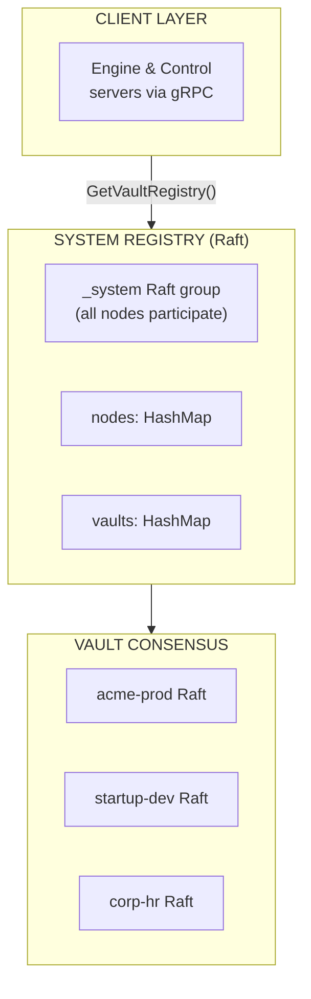

**Why this works**: Vault membership already exists in Raft state machines—make them directly queryable instead of syncing to a separate registry.

### System Raft Group (`_system`)

```rust
struct SystemState {
    /// All nodes and their addresses
    nodes: HashMap<NodeId, NodeInfo>,

    /// Vault → member nodes mapping
    vaults: HashMap<VaultId, VaultRegistry>,

    /// Version for cache invalidation
    version: u64,
}

struct NodeInfo {
    node_id: NodeId,
    addresses: Vec<SocketAddr>,  // WireGuard IPs
    grpc_port: u16,
    capabilities: Capabilities,
    last_heartbeat: DateTime<Utc>,
}

struct VaultRegistry {
    vault_id: VaultId,
    members: Vec<NodeId>,
    leader_hint: Option<NodeId>,  // May be stale
    config_version: u64,
}
```

**Properties:**

- Every node participates in `_system` (voter for small clusters, learner for large)
- Any node can answer "where is vault X?" from local state
- Updates propagate via Raft consensus (strongly consistent)
- No separate DHT maintenance or gossip mesh overhead

### Client Discovery Flow

```rust
impl Client {
    async fn bootstrap(config: &ClientConfig) -> Result<Self> {
        // Try bootstrap nodes from config
        for addr in &config.bootstrap_nodes {
            if let Ok(conn) = try_connect(addr).await {
                // Any node can serve system state
                let system = conn.get_system_state().await?;
                return Ok(Client {
                    conn,
                    system_cache: system,
                    cache_version: system.version,
                });
            }
        }

        // Fallback: cached nodes from previous session
        if let Some(cached) = config.load_cached_nodes() {
            for node in cached.nodes.values() {
                if let Ok(conn) = try_connect(&node.addresses[0]).await {
                    let system = conn.get_system_state().await?;
                    return Ok(Client { conn, system_cache: system, .. });
                }
            }
        }

        Err(ClusterUnavailable)
    }

    async fn route_to_vault(&mut self, vault_id: &VaultId) -> Result<VaultConn> {
        // Refresh cache if stale
        let current_version = self.conn.get_system_version().await?;
        if current_version > self.cache_version {
            self.system_cache = self.conn.get_system_state().await?;
            self.cache_version = current_version;
        }

        // O(1) local lookup
        let registry = self.system_cache.vaults.get(vault_id)
            .ok_or(VaultNotFound)?;

        self.connect_to_vault_members(registry).await
    }
}
```

### Block Announcements

Raft replication propagates blocks to followers. Clients subscribe via gRPC streaming:

```rust
// WatchBlocks is part of ReadService (see ledger.proto)
// Returns lightweight announcements; clients fetch full blocks via GetBlock if needed

impl VaultReplica {
    async fn on_block_committed(&self, block: &Block) {
        // Raft followers already have the block via AppendEntries
        // Notify local gRPC subscribers
        self.block_subscribers.broadcast(BlockAnnouncement {
            vault_id: block.vault_id.clone(),
            height: block.height,
            hash: block.hash(),
            state_root: block.state_root,
        }).await;
    }
}
```

### Peer-to-Peer Properties

Fully decentralized:

- **No privileged nodes**: Any node can serve discovery queries, bootstrap new nodes, or become `_system` leader
- **Bootstrap nodes are entry points, not authorities**: After joining, nodes discover all peers
- **Dynamic peer list**: Nodes cache peers from `_system` state, surviving bootstrap node failures
- **Symmetric roles**: All nodes participate equally in `_system` consensus

### Bootstrap Discovery

Nodes discover initial peers through multiple mechanisms:

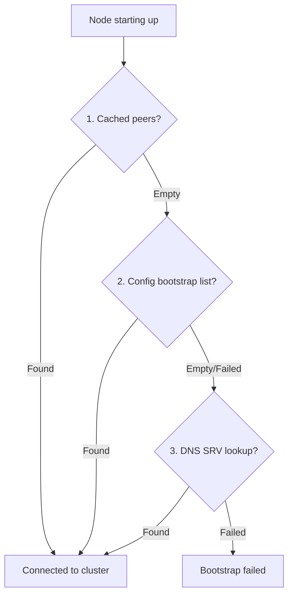

#### DNS SRV Records

DNS SRV records enable dynamic bootstrap node management:

```
; Zone file example
_ledger._tcp.infra.example.com. 300 IN SRV 10 50 9000 node1.infra.example.com.
_ledger._tcp.infra.example.com. 300 IN SRV 10 50 9000 node2.infra.example.com.
_ledger._tcp.infra.example.com. 300 IN SRV 20 50 9000 node3.infra.example.com.
```

**Resolution:**

```rust
struct BootstrapConfig {
    /// DNS domain for SRV lookup (e.g., "infra.example.com")
    srv_domain: Option<String>,

    /// Static bootstrap nodes (fallback)
    bootstrap_nodes: Vec<SocketAddr>,

    /// Cached peers from previous session
    cached_peers_path: PathBuf,
}

async fn resolve_bootstrap_peers(config: &BootstrapConfig) -> Vec<SocketAddr> {
    let mut peers = Vec::new();

    // 1. Try cached peers first (fastest, survives DNS outages)
    if let Ok(cached) = load_cached_peers(&config.cached_peers_path) {
        peers.extend(cached);
    }

    // 2. Static config (operator-provided)
    peers.extend(&config.bootstrap_nodes);

    // 3. DNS SRV lookup (dynamic, no config changes needed)
    if let Some(domain) = &config.srv_domain {
        if let Ok(records) = dns_srv_lookup(&format!("_ledger._tcp.{}", domain)).await {
            for record in records {
                peers.push(SocketAddr::new(record.target, record.port));
            }
        }
    }

    // Shuffle for load distribution
    peers.shuffle(&mut thread_rng());
    peers.dedup();
    peers
}
```

**Benefits:**

- Update bootstrap nodes via DNS without client reconfiguration
- TTL-based caching reduces DNS load
- Priority/weight fields enable load balancing
- Works with split-horizon DNS for different environments

#### Peer Exchange Protocol

Nodes share peer information for faster discovery and resilience:

```proto
// See SystemDiscoveryService in ledger.proto for full definition
service SystemDiscoveryService {
    rpc GetPeers(GetPeersRequest) returns (GetPeersResponse);
    rpc AnnouncePeer(AnnouncePeerRequest) returns (AnnouncePeerResponse);
    rpc GetSystemState(GetSystemStateRequest) returns (GetSystemStateResponse);
}
```

**Peer exchange behavior:**

```
On connection to any node:
  1. Call GetPeers() to fetch known peers
  2. Merge with local peer cache
  3. Persist updated cache to disk

Periodic refresh (every 5 minutes):
  1. Select random subset of known peers
  2. Call GetPeers() on each
  3. Merge responses, update cache
  4. Prune peers not seen in >1 hour

On _system state change:
  1. Broadcast AnnouncePeer() to connected nodes
  2. Propagates faster than waiting for refresh
```

**Properties:**

- **Compatible with \_system**: GetPeers returns subset of SystemState
- **Lightweight**: Doesn't require full Raft membership to participate
- **Protocol extensible**: New nodes can discover cluster before joining `_system`
- **Byzantine-tolerant for bootstrap**: Queries multiple nodes, compares results

### Node Join

```
New Node Startup:
  1. Resolve bootstrap peers (cached → config → DNS SRV)
  2. Connect to ANY reachable peer
  3. Call GetPeers() to discover more nodes
  4. Request _system Raft membership (AddNode)
  5. Existing nodes vote on membership change
  6. Once accepted, node receives full _system log
  7. Node persists peer list locally (survives restarts)

Vault Assignment:
  1. Operator calls: create_vault(vault_id, [node_a, node_b, node_c])
  2. Control plane queries _system for node addresses
  3. Sends bootstrap_vault RPC to each node
  4. Nodes initialize genesis block and Raft group
  5. Vault leader updates _system with VaultRegistry
```

### Node Leave

**Graceful departure:**

```
  1. Node announces intention to leave via LeaveCluster RPC
  2. _system leader proposes RemoveNode to Raft
  3. Node is removed from _system membership
  4. Vault Raft groups handle the departure:
     - If node was vault member, Raft reconfigures
     - If node was vault leader, triggers election
  5. Other nodes update cached peer lists
```

**Unexpected departure** (crash, network loss):

```
  1. _system leader detects missing heartbeats (default: 30s timeout)
  2. Leader proposes RemoveNode after timeout
  3. Node marked as unavailable in _system state
  4. Vault Raft groups detect member failure, continue with remaining quorum
  5. If departed node returns, it must rejoin as new member
```

### Membership Reconfiguration Safety

Raft membership changes can break consensus if mishandled. Ledger uses Openraft's joint consensus with additional safety constraints.

#### Joint Consensus

Openraft implements the Raft joint consensus protocol (Section 6 of the Raft paper):

```
Configuration change: [A, B, C] → [A, B, D]

1. Leader proposes C_old,new = [{A,B,C}, {A,B,D}] (joint config)
2. Joint config committed when majority of BOTH old AND new configs agree
3. Leader proposes C_new = [A,B,D] (final config)
4. Final config committed, old config members can be safely removed
```

**Why joint consensus**: Single-step membership changes can create disjoint majorities during leader failures. Joint consensus ensures at most one valid configuration can achieve quorum at any point.

#### Serialization of Membership Changes

```rust
impl VaultManager {
    /// Add a node to a vault's Raft group
    async fn add_vault_member(&self, vault_id: VaultId, node_id: NodeId) -> Result<()> {
        // 1. Acquire vault-level membership lock (prevents concurrent changes)
        let _guard = self.membership_locks.lock(vault_id).await;

        // 2. Add as learner first (receives log but can't vote)
        self.raft.add_learner(node_id, node_info, blocking=true).await?;

        // 3. Wait for learner to catch up
        self.wait_for_log_sync(node_id).await?;

        // 4. Promote to voter via joint consensus
        self.raft.change_membership(
            new_members.add(node_id),
            retain_learners=false
        ).await?;

        Ok(())
    }

    /// Remove a node from a vault's Raft group
    async fn remove_vault_member(&self, vault_id: VaultId, node_id: NodeId) -> Result<()> {
        let _guard = self.membership_locks.lock(vault_id).await;

        // Single change_membership call triggers joint consensus
        self.raft.change_membership(
            current_members.remove(node_id),
            retain_learners=false
        ).await?;

        Ok(())
    }
}
```

**Key behaviors**:

- `change_membership()` is **blocking**: Returns only after joint consensus completes
- Vault-level lock prevents concurrent membership changes to the same vault
- Learner-first pattern ensures new node is caught up before gaining vote

#### Leader Election Safety

After a leader election, the new leader must commit a no-op entry before processing membership changes:

```rust
impl RaftLeader {
    async fn on_become_leader(&mut self) {
        // Commit no-op to establish leader's commit index
        // This ensures we know which entries from previous terms are committed
        self.raft.client_write(LogEntry::NoOp).await?;

        // Now safe to process membership changes
        self.membership_changes_enabled = true;
    }
}
```

**Why this matters**: A new leader may have uncommitted log entries from previous terms. The no-op entry, once committed, guarantees all prior entries are also committed—preventing membership changes from referencing uncommitted configurations.

Openraft implements this automatically via its leader initialization sequence.

#### Safety Constraints

| Constraint                                 | Enforcement                            |
| ------------------------------------------ | -------------------------------------- |
| No concurrent membership changes per vault | Vault-level mutex                      |
| Learner must sync before promotion         | `wait_for_log_sync()` check            |
| No-op after leader election                | Openraft built-in                      |
| Joint consensus required                   | Openraft-only mode                     |
| Minimum quorum maintained                  | Reject changes that would break quorum |

**Quorum protection**:

```rust
fn validate_membership_change(current: &[NodeId], proposed: &[NodeId]) -> Result<()> {
    let current_quorum = (current.len() / 2) + 1;
    let proposed_quorum = (proposed.len() / 2) + 1;

    // Can't remove nodes if it would break quorum
    if proposed.len() < current_quorum {
        return Err(MembershipError::WouldBreakQuorum);
    }

    // Can't add more than one node at a time (safety heuristic)
    let added = proposed.len().saturating_sub(current.len());
    if added > 1 {
        return Err(MembershipError::TooManyAdditions);
    }

    Ok(())
}
```

#### Reconfiguration Test Scenarios

Simulation tests must verify these edge cases:

| Scenario                                      | Expected Behavior                               |
| --------------------------------------------- | ----------------------------------------------- |
| Node added during leader failover             | New leader completes or aborts the change       |
| Cascading failures during migration           | Joint consensus ensures consistency             |
| Network partition during joint config         | Minority side cannot commit; majority continues |
| Leader crash after joint commit, before final | New leader completes transition                 |
| Concurrent add/remove requests                | Second request waits for first to complete      |
| Adding a crashed node                         | Learner sync times out, operation fails         |

```rust
// Simulation test example
#[test]
fn test_membership_change_during_leader_failure() {
    let sim = Simulation::new(seed: 42);
    let cluster = sim.create_cluster(nodes: 3);

    // Start adding node D to [A, B, C]
    let add_future = cluster.add_member(node_d);

    // Crash leader after joint config proposed but before final commit
    sim.inject_fault(Fault::NodeCrash { node: cluster.leader() });

    // New leader should complete the membership change
    sim.run_until(add_future.is_complete());

    assert!(cluster.members().contains(&node_d));
    assert!(cluster.is_consistent());
}
```

### Vault Routing

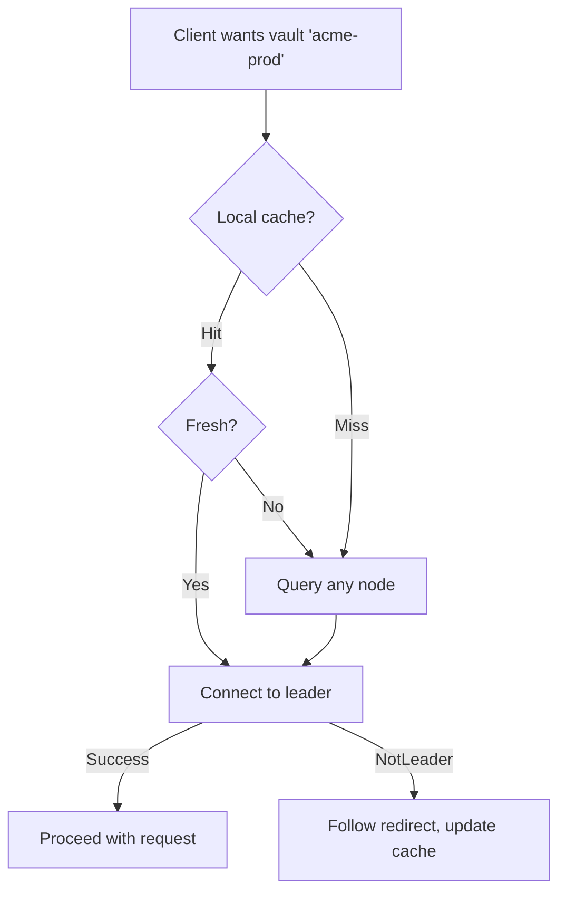

### Failure Modes

| Scenario                 | Behavior                                                   |
| ------------------------ | ---------------------------------------------------------- |
| All bootstrap nodes down | Client uses cached peer list from previous session         |
| Vault leader unknown     | Query any node's `_system` state                           |
| Network partition        | Majority partition continues; minority becomes read-only   |
| Node crashes             | Removed from `_system` after 30s heartbeat timeout         |
| Node gracefully leaves   | Immediately removed from `_system`, Raft reconfigures      |
| `_system` leader fails   | Raft elects new leader automatically (<500ms)              |
| Majority of nodes fail   | Cluster halts until quorum restored (safety over liveness) |

---

## Durability & Finality Model

### Write Durability Levels

Writes progress through these stages:

1. **Received**: Leader accepts transaction into pending queue
2. **Replicated**: Raft log entry replicated to quorum (2f+1 nodes)
3. **Committed**: Raft marks entry as committed
4. **Applied**: Block constructed, state tree updated, state_root computed
5. **Persisted**: Block written to disk with fsync

**Client guarantee**: WriteResponse returns after stage 4 (Applied). Data is durable once replicated to quorum—individual node failures cannot lose committed data.

### Block Finality

A block is **final** when:

- Committed in the Raft log (quorum acknowledged)
- Applied to the state tree
- state_root computed and included in the block header

**Reorg safety**: Raft guarantees committed entries are never removed. Unlike proof-of-work blockchains, no reorg risk—once committed, a block is permanent.

### Write-Ahead Log (WAL)

Each node maintains a WAL for Raft log entries:

- Entries fsync'd before acknowledging to leader
- WAL truncated after snapshotting
- Recovery replays WAL from last snapshot

---

## Persistent Storage Architecture

This section documents the file system layout, storage backends, and data organization for Ledger nodes.

### Directory Layout

Each node uses a single data directory with subdirectories per concern:

```
/var/lib/ledger/
├── node.toml                    # Node configuration
├── node_id                      # Persisted node identity (UUID)
├── shards/
│   ├── _system/                 # System Raft group
│   │   ├── raft/                # Openraft storage
│   │   │   ├── log.redb         # Raft log entries
│   │   │   └── vote             # Current term + voted_for
│   │   ├── state.redb           # State machine (system registry)
│   │   └── snapshots/
│   │       ├── 000001000.snap   # Snapshot at height 1000
│   │       └── 000002000.snap   # Snapshot at height 2000
│   ├── shard_0001/              # User shard group
│   │   ├── raft/
│   │   │   ├── log.redb
│   │   │   └── vote
│   │   ├── state.redb           # State for all vaults in shard
│   │   ├── blocks/
│   │   │   ├── segment_000000.blk   # Blocks 0-9999
│   │   │   ├── segment_000001.blk   # Blocks 10000-19999
│   │   │   └── segment_000002.blk   # Blocks 20000-...
│   │   └── snapshots/
│   │       └── ...
│   └── shard_0002/
│       └── ...
└── tmp/                         # Temporary files (snapshot staging)
```

**Key design decisions:**

| Decision                      | Rationale                                                  |
| ----------------------------- | ---------------------------------------------------------- |
| Per-shard directories         | Matches Raft group boundaries; independent failure domains |
| Separate raft/ and state.redb | Raft log is append-heavy; state is random-access heavy     |
| Block segments                | Append-only writes; easy archival of old segments          |
| Snapshots by height           | Predictable naming; simple retention policy                |

### Storage Backend: redb

[redb](https://github.com/cberner/redb) provides ACID transactions with a simple API. Each shard uses two redb databases:

**raft/log.redb** — Raft log storage:

```rust
// Tables in log.redb
const LOG_ENTRIES: TableDefinition<u64, &[u8]> = TableDefinition::new("log");
const LOG_META: TableDefinition<&str, &[u8]> = TableDefinition::new("meta");

struct RedbLogStorage {
    db: Database,
}

impl RaftLogStorage<TypeConfig> for RedbLogStorage {
    async fn get_log_state(&mut self) -> Result<LogState<TypeConfig>> {
        let txn = self.db.begin_read()?;
        let table = txn.open_table(LOG_META)?;

        let last_log_id = table.get("last_log_id")?
            .map(|v| deserialize(&v))
            .transpose()?;
        let last_purged = table.get("last_purged")?
            .map(|v| deserialize(&v))
            .transpose()?;

        Ok(LogState { last_log_id, last_purged_log_id: last_purged })
    }

    async fn save_vote(&mut self, vote: &Vote<NodeId>) -> Result<()> {
        let txn = self.db.begin_write()?;
        {
            let mut table = txn.open_table(LOG_META)?;
            table.insert("vote", serialize(vote)?)?;
        }
        txn.commit()?;  // fsync
        Ok(())
    }

    async fn append(&mut self, entries: &[Entry<TypeConfig>]) -> Result<()> {
        let txn = self.db.begin_write()?;
        {
            let mut log = txn.open_table(LOG_ENTRIES)?;
            let mut meta = txn.open_table(LOG_META)?;

            for entry in entries {
                log.insert(entry.log_id.index, serialize(entry)?)?;
            }

            if let Some(last) = entries.last() {
                meta.insert("last_log_id", serialize(&last.log_id)?)?;
            }
        }
        txn.commit()?;  // fsync
        Ok(())
    }

    async fn truncate(&mut self, log_id: LogId<NodeId>) -> Result<()> {
        let txn = self.db.begin_write()?;
        {
            let mut log = txn.open_table(LOG_ENTRIES)?;
            // Remove entries > log_id.index
            let to_remove: Vec<_> = log.range(log_id.index + 1..)?
                .map(|r| r.map(|(k, _)| k.value()))
                .collect::<Result<_, _>>()?;

            for idx in to_remove {
                log.remove(idx)?;
            }
        }
        txn.commit()?;
        Ok(())
    }

    async fn purge(&mut self, log_id: LogId<NodeId>) -> Result<()> {
        let txn = self.db.begin_write()?;
        {
            let mut log = txn.open_table(LOG_ENTRIES)?;
            let mut meta = txn.open_table(LOG_META)?;

            // Remove entries <= log_id.index
            let to_remove: Vec<_> = log.range(..=log_id.index)?
                .map(|r| r.map(|(k, _)| k.value()))
                .collect::<Result<_, _>>()?;

            for idx in to_remove {
                log.remove(idx)?;
            }

            meta.insert("last_purged", serialize(&log_id)?)?;
        }
        txn.commit()?;
        Ok(())
    }
}
```

**state.redb** — State machine storage:

```rust
// Tables in state.redb (per shard, contains all vaults)
const RELATIONSHIPS: TableDefinition<&[u8], &[u8]> = TableDefinition::new("rel");
const ENTITIES: TableDefinition<&[u8], &[u8]> = TableDefinition::new("ent");
const OBJ_INDEX: TableDefinition<&[u8], &[u8]> = TableDefinition::new("obj_idx");
const SUBJ_INDEX: TableDefinition<&[u8], &[u8]> = TableDefinition::new("subj_idx");
const VAULT_META: TableDefinition<&[u8], &[u8]> = TableDefinition::new("vault_meta");

// Key format: vault_id (8 bytes) + key bytes
fn make_key(vault_id: VaultId, key: &[u8]) -> Vec<u8> {
    let mut k = vault_id.to_be_bytes().to_vec();
    k.extend_from_slice(key);
    k
}
```

**Per-shard isolation**: All vaults in a shard share a single redb instance. Keys are prefixed with `vault_id` for isolation. This reduces file handle count and enables cross-vault operations within a shard if needed.

### Block Archive Format

Blocks are stored in append-only segment files for efficient sequential writes and easy archival:

```rust
const SEGMENT_SIZE: u64 = 10_000;  // Blocks per segment

struct BlockArchive {
    shard_dir: PathBuf,
    current_segment: Option<SegmentWriter>,
}

struct SegmentWriter {
    file: File,
    segment_id: u64,
    index: Vec<BlockIndex>,  // In-memory index for segment
}

struct BlockIndex {
    vault_id: VaultId,
    height: u64,
    offset: u64,
    length: u32,
}

impl BlockArchive {
    fn segment_path(&self, segment_id: u64) -> PathBuf {
        self.shard_dir.join("blocks")
            .join(format!("segment_{:06}.blk", segment_id))
    }

    async fn append_block(&mut self, block: &ShardBlock) -> Result<()> {
        let segment_id = block.shard_height / SEGMENT_SIZE;

        // Rotate segment if needed
        if self.current_segment.as_ref().map(|s| s.segment_id) != Some(segment_id) {
            self.rotate_segment(segment_id).await?;
        }

        let writer = self.current_segment.as_mut().unwrap();

        // Append block with length prefix
        let data = serialize(block)?;
        let offset = writer.file.seek(SeekFrom::End(0))?;

        writer.file.write_all(&(data.len() as u32).to_le_bytes())?;
        writer.file.write_all(&data)?;
        writer.file.sync_data()?;

        // Update index for each vault entry
        for entry in &block.vault_entries {
            writer.index.push(BlockIndex {
                vault_id: entry.vault_id,
                height: entry.vault_height,
                offset,
                length: data.len() as u32 + 4,
            });
        }

        Ok(())
    }

    async fn read_block(&self, shard_height: u64) -> Result<ShardBlock> {
        let segment_id = shard_height / SEGMENT_SIZE;
        let segment_path = self.segment_path(segment_id);

        // Load segment index (cached in practice)
        let index = self.load_segment_index(segment_id)?;

        let block_offset = shard_height % SEGMENT_SIZE;
        let entry = &index[block_offset as usize];

        let mut file = File::open(segment_path)?;
        file.seek(SeekFrom::Start(entry.offset))?;

        let mut len_buf = [0u8; 4];
        file.read_exact(&mut len_buf)?;
        let len = u32::from_le_bytes(len_buf) as usize;

        let mut data = vec![0u8; len];
        file.read_exact(&mut data)?;

        deserialize(&data)
    }
}
```

**Segment file format:**

```
┌──────────────────────────────────────────────────────┐
│ Block 0: [length: u32][ShardBlock bytes...]         │
│ Block 1: [length: u32][ShardBlock bytes...]         │
│ ...                                                  │
│ Block 9999: [length: u32][ShardBlock bytes...]      │
└──────────────────────────────────────────────────────┘
```

**Index file** (`.idx`): Stored alongside each segment for fast block lookup without scanning:

```
┌──────────────────────────────────────────────────────┐
│ Entry 0: [vault_id: u64][height: u64][offset: u64]  │
│ Entry 1: ...                                         │
└──────────────────────────────────────────────────────┘
```

### Snapshot Format

Snapshots serialize state at a point-in-time for fast recovery:

```rust
struct SnapshotFile {
    header: SnapshotHeader,
    state_data: CompressedStateData,
}

struct SnapshotHeader {
    magic: [u8; 4],           // "LSNP"
    version: u32,             // Format version
    shard_id: ShardId,
    shard_height: u64,
    vault_states: Vec<VaultSnapshotMeta>,
    checksum: [u8; 32],       // SHA-256 of state_data
}

struct VaultSnapshotMeta {
    vault_id: VaultId,
    vault_height: u64,
    state_root: Hash,
    key_count: u64,
}

// Snapshot naming: {shard_height:09}.snap
// Example: 000001000.snap for height 1000
```

**Compression**: State data uses zstd compression (typically 3-5x ratio for authorization data).

### Crash Recovery

Recovery follows a deterministic sequence:

```rust
impl Node {
    async fn recover(&mut self) -> Result<()> {
        // 1. Load node identity
        let node_id = self.load_or_create_node_id()?;

        // 2. Discover shards from directory structure
        for shard_dir in self.data_dir.join("shards").read_dir()? {
            let shard_id = parse_shard_id(&shard_dir.file_name())?;

            // 3. Recover Raft state
            let raft_storage = RedbLogStorage::open(shard_dir.join("raft/log.redb"))?;
            let vote = raft_storage.read_vote().await?;
            let log_state = raft_storage.get_log_state().await?;

            // 4. Find latest valid snapshot
            let snapshot = self.find_latest_snapshot(&shard_dir)?;

            // 5. Load state from snapshot
            let mut state = if let Some(snap) = snapshot {
                StateTree::from_snapshot(&snap)?
            } else {
                StateTree::empty()
            };

            // 6. Replay committed log entries after snapshot
            let start_index = snapshot.map(|s| s.shard_height + 1).unwrap_or(0);
            for entry in raft_storage.read_range(start_index..)? {
                if entry.log_id.index <= log_state.last_purged_log_id.index {
                    continue;  // Already in snapshot
                }
                state.apply(&entry.payload)?;
            }

            // 7. Verify state root matches last committed block
            let last_block = self.block_archive.read_block(log_state.last_log_id.index)?;
            for vault_entry in &last_block.vault_entries {
                let computed = state.compute_state_root(vault_entry.vault_id)?;
                if computed != vault_entry.state_root {
                    return Err(Error::StateRootMismatch {
                        vault_id: vault_entry.vault_id,
                        expected: vault_entry.state_root,
                        computed,
                    });
                }
            }

            // 8. Initialize Raft and join cluster
            self.start_raft(shard_id, raft_storage, state).await?;
        }

        Ok(())
    }
}
```

**Recovery guarantees:**

| Failure Mode         | Recovery Action                               |
| -------------------- | --------------------------------------------- |
| Clean shutdown       | Replay from last snapshot + committed log     |
| Crash during write   | Incomplete redb txn rolled back automatically |
| Corrupted snapshot   | Skip to older snapshot, replay more log       |
| Corrupted log entry  | Fetch from peer, or rebuild from snapshot     |
| Missing segment file | Fetch from peer (block archive is replicated) |

### File Locking

Each node exclusively locks its data directory to prevent concurrent access:

```rust
impl Node {
    fn acquire_lock(data_dir: &Path) -> Result<FileLock> {
        let lock_path = data_dir.join(".lock");
        let file = File::create(&lock_path)?;

        file.try_lock_exclusive()
            .map_err(|_| Error::DataDirectoryLocked)?;

        Ok(FileLock { file, path: lock_path })
    }
}
```

### Storage Invariants

30. **Raft log durability**: Log entries are fsync'd before Raft acknowledgment
31. **State consistency**: `state.redb` reflects all applied log entries up to `applied_index`
32. **Block archive append-only**: Segment files are never modified after creation (only new segments appended)
33. **Snapshot validity**: Snapshot `state_root` matches block header at `shard_height`

---

## Corruption Detection & Resolution

### Storage Layer Distinction

Three storage layers with different retention semantics:

| Layer             | Contents                                  | Truncatable?                               | Purpose                    |
| ----------------- | ----------------------------------------- | ------------------------------------------ | -------------------------- |
| **Raft WAL**      | Uncommitted/recent log entries            | Yes, after snapshot                        | Consensus, leader catch-up |
| **Block Archive** | Committed blocks (headers + transactions) | Headers: never; Transactions: configurable | Verification, audit        |
| **State Layer**   | Materialized K/V indexes                  | Rebuilt from chain                         | Fast queries               |

**Critical distinction**: Raft WAL truncation does not affect the Block Archive. After commit, blocks move from WAL to permanent storage. The WAL can then be truncated without losing verification capability.

### Block Retention Modes

```rust
enum BlockRetentionPolicy {
    /// Keep all blocks with full transactions indefinitely (compliance mode)
    Full,

    /// After snapshot, keep only headers for blocks older than threshold
    Compacted {
        full_retention_blocks: u64,  // e.g., 10,000 blocks
    },
}
```

| Mode      | Transaction Bodies      | Use Case                                              |
| --------- | ----------------------- | ----------------------------------------------------- |
| Full      | Kept indefinitely       | SOC 2, HIPAA compliance requiring full audit trail    |
| Compacted | Removed after threshold | High-volume workloads prioritizing storage efficiency |

In Compacted mode, block headers (including `state_root` and `tx_merkle_root`) are always preserved, enabling chain verification without full transaction replay.

### Detection Methods

**Continuous verification**:

- Every read can optionally verify against state_root
- Background task verifies chain and state_roots (method depends on retention mode)

**Hash chain verification**:

- Each block's previous_hash must match the prior block's hash
- Chain break indicates corruption or tampering
- Always possible since headers are never truncated

**State root divergence**:

- After applying block N, all replicas must have identical state_root
- Divergence indicates corruption in state tree or transaction application

### Detection Algorithm

The integrity check adapts to the retention mode:

```rust
async fn integrity_check(&self, mode: BlockRetentionPolicy) -> IntegrityReport {
    let mut report = IntegrityReport::new();

    // 1. Verify chain linking (always possible - headers preserved)
    for height in 1..=self.chain.tip_height() {
        let header = self.chain.get_header(height)?;
        let prev = self.chain.get_header(height - 1)?;
        if header.previous_hash != prev.hash() {
            report.chain_break(height);
        }
    }

    // 2. Verify state based on retention mode
    match mode {
        BlockRetentionPolicy::Full => {
            // Full replay from genesis
            let mut state = StateTree::empty();
            for height in 0..=self.chain.tip_height() {
                let block = self.chain.get_full(height)?;
                state.apply(&block.transactions);
                if state.root() != block.state_root {
                    report.state_divergence(height);
                }
            }
        }
        BlockRetentionPolicy::Compacted { .. } => {
            // Replay from most recent snapshot
            let snapshot = self.snapshots.latest()?;

            // Verify snapshot links to genesis
            self.verify_snapshot_chain(&snapshot, &mut report);

            // Verify state from snapshot to tip
            let mut state = StateTree::from_snapshot(&snapshot.state_data);
            if state.root() != snapshot.state_root {
                report.snapshot_corruption(snapshot.block_height);
                return report;
            }

            for height in (snapshot.block_height + 1)..=self.chain.tip_height() {
                let block = self.chain.get_full(height)?;
                state.apply(&block.transactions);
                if state.root() != block.state_root {
                    report.state_divergence(height);
                }
            }
        }
    }

    report
}
```

### Resolution Strategy

| Corruption Type     | Detection                       | Resolution                             |
| ------------------- | ------------------------------- | -------------------------------------- |
| Chain hash break    | previous_hash mismatch          | Re-fetch blocks from healthy replica   |
| State divergence    | state_root mismatch after apply | Rebuild state tree from chain          |
| Partial block       | Incomplete block data           | Re-fetch from quorum                   |
| Snapshot corruption | state_root mismatch on load     | Discard snapshot, use older or rebuild |

**Authoritative source**: Quorum determines truth. A corrupted node is outvoted and must resync.

---

## Network Partition Handling

### Trust Model

Ledger operates in a trusted environment:

- All nodes on a private WireGuard network
- Network presence implies trust
- Crash Fault Tolerance (CFT) via Raft—no Byzantine Fault Tolerance required

### Partition Scenarios

**Majority partition** (leader + quorum reachable):

- Continues normal operation
- Minority nodes become read-only (stale data)

**Minority partition** (leader unreachable):

- Vault becomes unavailable for writes
- Reads return stale data with warning
- No split-brain: minority cannot elect new leader

**Symmetric partition** (no quorum achievable):

- All writes fail
- Reads return stale data
- Manual intervention required

### Partition Healing

When partitions heal:

1. Minority nodes discover they're behind via Raft heartbeats
2. Leader sends missing log entries
3. Followers apply entries and converge to leader's state
4. Once state_roots match, full operation resumes

**Consistency guarantee**: Raft prevents accepting writes without quorum—no divergent writes can occur.

---

## Control Data Storage

Ledger serves as the unified storage layer for both Engine (authorization relationships) and Control (users, organizations, sessions). This provides a single operational model while supporting different data semantics.

### Data Model

Vaults store two types of data:

| Type              | Operations                             | Use Case                       |
| ----------------- | -------------------------------------- | ------------------------------ |
| **Relationships** | CreateRelationship, DeleteRelationship | Authorization tuples           |
| **Entities**      | SetEntity, DeleteEntity                | Users, orgs, sessions, configs |

Both types live in the same vault and follow the same consistency model (Raft consensus, merkle commitments).

### Entity Key Patterns

Control data uses convention-based key prefixes:

| Entity Type   | Key Pattern          | Example           |
| ------------- | -------------------- | ----------------- |
| User          | `user:{id}`          | `user:789`        |
| Organization  | `org:{id}`           | `org:123`         |
| Team          | `team:{org_id}:{id}` | `team:123:456`    |
| Session       | `session:{token}`    | `session:abc123`  |
| OAuth2 Client | `client:{id}`        | `client:456`      |
| Refresh Token | `token:{hash}`       | `token:sha256...` |

**Secondary indexes** use the `_idx:` prefix:

| Index          | Key Pattern                           | Value            |
| -------------- | ------------------------------------- | ---------------- |
| Email → User   | `_idx:user:email:{email}`             | `user:789`       |
| Org Name → Org | `_idx:org:name:{name}`                | `org:123`        |
| Session → User | `_idx:session:user:{user_id}:{token}` | `session:abc123` |

**Index maintenance**: Applications maintain indexes atomically via BatchWrite:

```rust
// Create user with email index
batch_write(vec![
    SetEntity { key: "user:789", value: user_json, expires_at: None },
    SetEntity { key: "_idx:user:email:alice@example.com", value: b"user:789", expires_at: None },
]);
```

### TTL and Expiration

Entities support time-based expiration for ephemeral data:

```proto
message SetEntity {
  string key = 1;
  bytes value = 2;
  optional uint64 expires_at = 3;  // Unix epoch seconds; 0 = never
}
```

**Expiration semantics**:

| Behavior         | Description                                                     |
| ---------------- | --------------------------------------------------------------- |
| Read filtering   | `Read` and `ListEntities` return null/skip for expired entities |
| State inclusion  | Expired entities remain in state tree until GC                  |
| state_root       | Includes expired entities (until GC deletes them)               |
| Historical reads | Expired entities visible at historical heights if not yet GC'd  |

**Why lazy expiration?** Automatic state changes would break the "state_root = f(block N)" invariant. Instead, expiration is a read-time filter; deletion is a committed operation.

### Garbage Collection

The leader periodically garbage-collects expired entities:

```rust
// Runs every 60 seconds on leader
async fn garbage_collect_expired(&self, vault_id: VaultId) {
    let now = current_epoch_seconds();
    let expired = self.list_entities(ListEntitiesRequest {
        vault_id,
        key_prefix: "",           // All keys
        include_expired: true,    // Include expired
        limit: 1000,
    }).await;

    let to_delete: Vec<_> = expired.entities
        .iter()
        .filter(|e| e.expires_at > 0 && e.expires_at < now)
        .collect();

    if !to_delete.is_empty() {
        self.write(WriteRequest {
            vault_id,
            operations: to_delete.iter()
                .map(|e| DeleteEntity { key: e.key.clone() })
                .collect(),
            actor: Some("system:gc".into()),
            // ...
        }).await;
    }
}
```

**GC properties**:

- Runs only on leader (followers skip)
- Batched deletions (max 1000 per cycle)
- Creates normal committed transactions
- Actor recorded as `system:gc` for audit trail
- Expired entities queryable with `include_expired: true` until GC runs

### Vault Structure for Multi-Tenancy

Each organization has a dedicated vault containing:

```
vault:org_123/
├── Relationships
│   ├── doc:readme#viewer@user:alice
│   ├── folder:root#owner@user:bob
│   └── ...
└── Entities
    ├── user:789              (Alice's user record)
    ├── user:790              (Bob's user record)
    ├── team:123:1            (Engineering team)
    ├── client:456            (API client)
    ├── session:abc123        (Active session, TTL 24h)
    ├── _idx:user:email:alice@example.com
    └── ...
```

Cross-org entities (global users, system config) live in the `_system` vault.

### Actor Metadata

Every transaction includes an optional `actor` field:

```proto
message WriteRequest {
  // ...
  optional string actor = 5;  // "user:123", "client:456", "system:gc"
}
```

| Actor Format    | Example      | Meaning                       |
| --------------- | ------------ | ----------------------------- |
| `user:{id}`     | `user:789`   | Human user                    |
| `client:{id}`   | `client:456` | OAuth2 client/service account |
| `system:{name}` | `system:gc`  | Internal system operation     |

**Audit query**:

```
Query: "Who modified doc:readme?"

1. ListRelationships(resource="doc:readme")
   → Block 1000: CreateRelationship, actor="user:789"
   → Block 1050: DeleteRelationship, actor="client:456"

2. Resolve actors: Read("user:789"), Read("client:456")
   → user:789 = {"name": "Alice Smith", "email": "alice@example.com"}
   → client:456 = {"name": "CI Pipeline", "org": "org:123"}

3. Result: Complete audit trail with human-readable attribution
```

### Query Patterns

| Query                     | RPC                                                     | Key Pattern                   |
| ------------------------- | ------------------------------------------------------- | ----------------------------- |
| Get user by ID            | `Read(key="user:789")`                                  | Exact key                     |
| Get user by email         | `Read(key="_idx:user:email:...")` → `Read(result)`      | Index lookup                  |
| List org users            | `ListEntities(prefix="user:")`                          | Prefix scan                   |
| List active sessions      | `ListEntities(prefix="session:")`                       | Prefix scan (filters expired) |
| List all sessions (admin) | `ListEntities(prefix="session:", include_expired=true)` | Include expired               |

### Conditional Writes (Compare-and-Set)

SetEntity supports optional conditions for atomic compare-and-set operations:

```proto
message SetEntity {
  string key = 1;
  bytes value = 2;
  optional uint64 expires_at = 3;
  optional SetCondition condition = 4;  // CAS condition
}

message SetCondition {
  oneof condition {
    bool not_exists = 1;     // Only set if key doesn't exist
    uint64 version = 2;      // Only set if version matches
    bytes value_equals = 3;  // Only set if current value matches
  }
}
```

| Condition      | Use Case                                         | Error on Failure      |
| -------------- | ------------------------------------------------ | --------------------- |
| `not_exists`   | Create-only operations, unique constraints       | `FAILED_PRECONDITION` |
| `version`      | Optimistic locking, concurrent update protection | `FAILED_PRECONDITION` |
| `value_equals` | Exact state assertions                           | `FAILED_PRECONDITION` |

**Version tracking**: Each entity includes a `version` field (block height when last modified) in query results, enabling version-based conditional writes.

**Example: Unique email constraint**

```rust
// Create user only if email index doesn't exist (enforces uniqueness)
ledger.batch_write(BatchWriteRequest {
    vault_id,
    writes: vec![WriteRequest {
        operations: vec![
            SetEntity {
                key: format!("_idx:user:email:{}", email),
                value: user_id.as_bytes().to_vec(),
                condition: Some(SetCondition::NotExists(true)),  // Fails if email taken
            },
            SetEntity {
                key: format!("user:{}", user_id),
                value: serialize(&user),
                condition: None,
            },
        ],
    }],
}).await?;
```

**Failure handling**: If a conditional write fails with `FAILED_PRECONDITION`, the condition was not met—read current state and retry or return error to caller.

### Bulk Delete (clear_range)

Ledger provides prefix queries but not native range delete. Bulk delete requires two operations:

```rust
async fn clear_range(
    ledger: &LedgerClient,
    vault_id: VaultId,
    key_prefix: &str,
) -> Result<usize> {
    let mut deleted = 0;
    let mut page_token = String::new();

    loop {
        let entities = ledger.list_entities(ListEntitiesRequest {
            vault_id,
            key_prefix: key_prefix.into(),
            include_expired: true,  // Delete expired too
            limit: 1000,
            page_token,
        }).await?;

        if entities.entities.is_empty() {
            break;
        }

        let ops: Vec<_> = entities.entities
            .iter()
            .map(|e| DeleteEntity { key: e.key.clone() })
            .collect();

        ledger.batch_write(BatchWriteRequest {
            vault_id,
            writes: vec![WriteRequest { operations: ops, .. }],
        }).await?;

        deleted += entities.entities.len();
        page_token = entities.next_page_token;

        if page_token.is_empty() {
            break;
        }
    }

    Ok(deleted)
}
```

**Trade-off**: This is less efficient than native range delete (O(n) vs O(1)) but preserves auditability—each deletion is recorded in the blockchain.

### Performance Considerations

| Operation                  | Latency | Notes                      |
| -------------------------- | ------- | -------------------------- |
| Entity read                | <5ms    | Direct key lookup          |
| Index lookup               | <10ms   | Two reads (index + entity) |
| Session validation         | <5ms    | Single read, TTL check     |
| ListEntities (100 results) | <20ms   | Prefix scan                |
| GC cycle (1000 deletions)  | <100ms  | Batched, runs on leader    |

**Session-heavy workloads**: Sessions use TTL and are read-heavy. Follower reads provide horizontal read scaling. GC runs periodically to clean expired sessions without impacting read latency.

---

## Client Idempotency & Retry Semantics

### Transaction Identification

Each transaction includes:

```rust
struct Transaction {
    id: TxId,              // Globally unique transaction ID
    client_id: ClientId,   // Identifies the submitting client
    sequence: u64,         // Strictly monotonic per-client sequence number
    operations: Vec<Operation>,
    timestamp: DateTime<Utc>,
    actor: Option<String>, // Who performed this action (see Actor Metadata)
}
```

### Persistent Sequence Tracking

The leader maintains persistent sequence state per client (not a time-based window):

```rust
struct ClientState {
    last_committed_seq: u64,
    // Bounded LRU cache for response replay
    recent_responses: LruCache<u64, WriteResponse>,  // max 1000 entries
}
```

**Sequence validation rules:**

| Condition                       | Response                                      | Rationale                              |
| ------------------------------- | --------------------------------------------- | -------------------------------------- |
| `seq <= last_committed_seq`     | Return cached response or `ALREADY_COMMITTED` | Duplicate/retry                        |
| `seq == last_committed_seq + 1` | Process transaction                           | Expected next                          |
| `seq > last_committed_seq + 1`  | Reject with `SEQUENCE_GAP`                    | Gap indicates client bug or lost state |

**Why no time-based window:**

- Window expiry creates double-write risk (client crashes, restarts after window, retries)
- Persistent tracking uses O(clients) storage, not O(transactions × window)
- Eliminates all window-related edge cases

### Retry Behavior

| Scenario             | Client Action                           | Server Response                                    |
| -------------------- | --------------------------------------- | -------------------------------------------------- |
| Network timeout      | Retry with same `(client_id, sequence)` | Idempotent: cached response or `ALREADY_COMMITTED` |
| `SEQUENCE_GAP` error | Client must recover sequence state      | Reject until sequence corrected                    |
| Success              | Increment sequence for next write       | N/A                                                |

**Exactly-once semantics**: Retrying any previously-committed sequence returns the cached result indefinitely (within LRU bounds) or `ALREADY_COMMITTED` status.

### Sequence Number Rules

**Client requirements:**

1. Persist `last_used_sequence` to durable storage before sending
2. Increment by exactly 1 for each new transaction
3. Reuse sequence number only for retries of the exact same transaction
4. On restart, resume from persisted sequence

**Server guarantees:**

1. Never accept `sequence <= last_committed_seq` as new transaction
2. Reject gaps (`sequence > last_committed_seq + 1`) to catch client bugs early
3. Persist `last_committed_seq` as part of vault state (survives leader failover)

### Client Recovery

If a client loses its sequence state:

```proto
// Part of ReadService (see ledger.proto)
rpc GetClientState(GetClientStateRequest) returns (GetClientStateResponse);
```

Client resumes from `last_committed_sequence + 1`.

### Sequence Wrap-around

Sequence numbers are `u64` (18 quintillion values). At 1M tx/sec sustained:

- Wrap-around time: ~584,942 years

No wrap-around handling required. If a sequence approaches `u64::MAX`, the client should rotate to a new `client_id`.

---

## Vault Owner Verification Protocol

### Verification Model

Vault owners verify any state on demand:

1. Request verified read from any replica
2. Receive value + merkle proof + block header
3. Verify proof independently without trusting the node

### Verification Flow

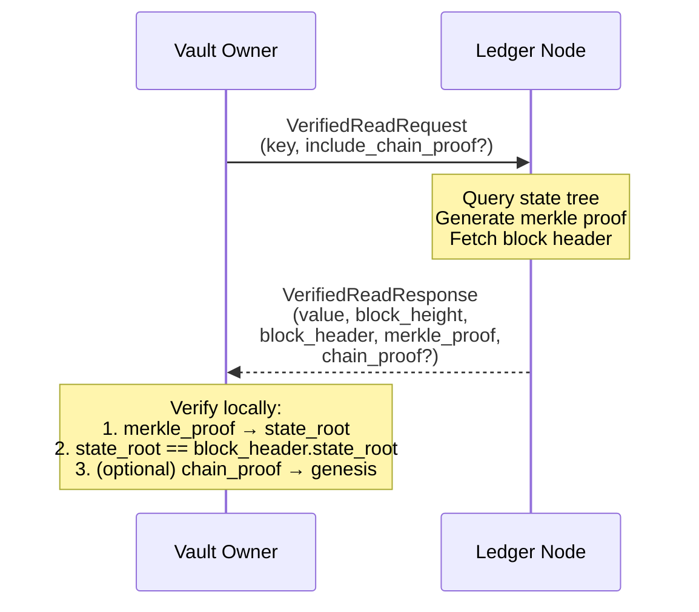

### Proof Structure

```rust
struct VerifiedReadResponse {
    value: Option<Value>,
    block_height: u64,
    block_header: BlockHeader,
    merkle_proof: MerkleProof,      // Siblings from leaf to state_root
    chain_proof: Option<ChainProof>, // Block headers back to trusted checkpoint
}

struct MerkleProof {
    leaf_hash: Hash,
    siblings: Vec<(Hash, Direction)>, // Siblings at each level
}

struct ChainProof {
    headers: Vec<BlockHeader>, // Chain of headers to trusted checkpoint
}
```

### Client-Side Verification

```rust
impl VerifiedReadResponse {
    fn verify(&self, trusted_checkpoint: &BlockHeader) -> VerifyResult {
        // 1. Verify merkle proof leads to state_root
        let computed_root = self.merkle_proof.compute_root();
        if computed_root != self.block_header.state_root {
            return VerifyResult::InvalidMerkleProof;
        }

        // 2. Verify chain proof links to trusted checkpoint
        if let Some(chain_proof) = &self.chain_proof {
            if !chain_proof.verify_chain_to(trusted_checkpoint) {
                return VerifyResult::InvalidChainProof;
            }
        }

        VerifyResult::Valid
    }
}
```

### Trusted Checkpoints

Vault owners maintain trusted block headers:

- Genesis block (known at vault creation)
- Periodic checkpoints (e.g., every 1000 blocks)
- Recent headers from verified reads

Vault owners verify state without downloading the entire chain.

---

## Observability & Monitoring

### Metrics

**Consensus metrics**:

- `raft_term`: Current Raft term
- `raft_commit_index`: Highest committed log index
- `raft_apply_index`: Highest applied log index
- `raft_leader`: Whether this node is leader
- `raft_replication_lag_blocks`: How far followers are behind

**Chain metrics**:

- `chain_height`: Current block height
- `chain_tip_age_seconds`: Time since last block
- `blocks_per_second`: Block production rate

**State metrics**:

- `state_tree_keys`: Number of keys in state tree
- `state_root_computation_ms`: Time to compute state_root (bucket-based)
- `dirty_buckets_per_block`: Buckets modified per block (efficiency indicator)
- `merkle_proof_generation_ms`: Proof generation latency

**Batching metrics**:

- `batch_size`: Transactions per block (histogram)
- `batch_wait_ms`: Time first transaction waited before commit
- `eager_commits_total`: Blocks committed due to queue drain
- `timeout_commits_total`: Blocks committed due to deadline

**Operation metrics**:

- `read_latency_ms`: Read operation latency (p50, p95, p99)
- `write_latency_ms`: Write operation latency (client-observed, includes batch wait)
- `write_raft_latency_ms`: Raft consensus latency (excludes batch wait)
- `reads_per_second`: Read throughput
- `writes_per_second`: Write throughput

### Health Checks

```rust
enum HealthStatus {
    Healthy,           // Leader or up-to-date follower
    Degraded,          // Follower behind by > threshold
    Unavailable,       // Cannot reach quorum
}

async fn health_check(&self) -> HealthStatus {
    if !self.raft.can_reach_quorum() {
        return HealthStatus::Unavailable;
    }
    if self.raft.replication_lag() > THRESHOLD {
        return HealthStatus::Degraded;
    }
    HealthStatus::Healthy
}
```

### Alerting Conditions

| Condition                      | Severity | Action                                     |
| ------------------------------ | -------- | ------------------------------------------ |
| No leader for vault            | Critical | Page on-call                               |
| Replication lag > 100 blocks   | Warning  | Investigate node health                    |
| State root divergence detected | Critical | Halt replica, page on-call, investigate    |
| Disk usage > 80%               | Warning  | Plan capacity expansion                    |
| state_root computation > 100ms | Warning  | Review bucket distribution, consider split |

---

## Consistency Guarantees

### Raft Properties

Ledger inherits Raft's consistency guarantees:

- **Leader completeness**: Committed entries are present in all future leaders' logs
- **State machine safety**: All nodes apply the same operations in the same order
- **Linearizability**: Writes appear atomic at some point between request and response

### Read Consistency

| Read Type     | Consistency           | Use Case                      |
| ------------- | --------------------- | ----------------------------- |
| Leader read   | Linearizable          | Strong consistency required   |
| Follower read | Eventually consistent | High throughput, staleness OK |
| Verified read | Linearizable + proven | Audit, compliance             |

**Default**: Reads go to any replica. Clients requiring strict consistency should read from leader or use verified reads.

### Cross-Vault Consistency

Vaults are independent—no cross-vault transactions. Cross-vault coordination requires:

1. Application-layer coordination
2. Saga pattern or two-phase commit
3. Each vault's chain as source of truth for its data

---

## Limitations & Trade-offs

### Known Limitations

**Scaling limits**:

| Dimension        | Recommended Max | Hard Limit        | Bottleneck                    |
| ---------------- | --------------- | ----------------- | ----------------------------- |
| Vaults per shard | 1,000           | 10,000            | Shard block size, memory      |
| Shard groups     | 10,000          | ~100,000          | Cluster coordination overhead |
| Total vaults     | 10M             | ~100M             | `_system` registry size       |
| Keys per vault   | 10M             | ~100M             | State tree memory             |
| Transactions/sec | 5,000 per shard | ~50,000 per shard | Raft throughput               |

**Single leader bottleneck**:

- Each shard has one leader for writes
- Under high contention, leader CPU/network becomes bottleneck
- Mitigation: Spread vaults across shards, promote hot vaults to dedicated shards

**Hot key contention**:

- Writes to same key serialize through Raft
- Similar to Hyperledger Fabric's MVCC conflicts
- Mitigation: Application-level sharding or batching

**Merkle proof size**:

- Size grows logarithmically with state tree size
- ~1KB per proof for 1M keys, ~1.5KB for 1B keys
- Bulk verification uses proof aggregation

### Trade-offs vs FoundationDB

| Aspect           | FoundationDB              | Ledger                                  |
| ---------------- | ------------------------- | --------------------------------------- |
| Replication      | Leaderless (f+1 replicas) | Leader-based Raft (2f+1 replicas)       |
| Write latency    | Lower (no consensus)      | Higher (Raft round-trip)                |
| Verification     | None                      | Per-vault merkle proofs                 |
| Audit trail      | Operational logs          | Immutable per-vault chain               |
| Tenant isolation | Logical (key prefix)      | Logical (shard) + Cryptographic (chain) |
| Scaling          | Single cluster            | Shard groups (1000 vaults/shard)        |

**Index verification trade-off**:

- Indexes (obj_index, subj_index) are non-merkleized for O(1) queries
- Individual index entries cannot be proven with instant merkle proofs
- Verification requires replaying transactions from a trusted snapshot
- Trade-off: Fast queries (~0.5ms) for computed verification (~5-20ms)
- Rationale: Authorization workloads prioritize read latency over proof latency

### Not Supported

- Cross-vault transactions (by design)
- Byzantine fault tolerance (trusted network assumption)
- Sub-millisecond writes (consensus overhead)
- Infinite retention (storage costs)
- Instant per-key merkle proofs (hybrid storage trade-off)

---

## Snapshot & Retention Policy

### Snapshot Strategy

**Triggering**:

- Time-based: Every 1 hour
- Size-based: Every 10,000 blocks
- Manual: On-demand via admin API

**Contents**:

```rust
struct Snapshot {
    vault_id: VaultId,
    block_height: u64,
    block_hash: Hash,
    state_root: Hash,
    state_data: CompressedStateTree,
    created_at: DateTime<Utc>,

    // Chain verification linkage (enables verification after block compaction)
    genesis_hash: Hash,                      // Links to genesis block
    previous_snapshot_height: Option<u64>,   // Snapshot chain
    previous_snapshot_hash: Option<Hash>,    // Snapshot chain integrity
    chain_commitment: ChainCommitment,       // Accumulated proof
}

/// Proves snapshot's lineage without requiring full block replay
struct ChainCommitment {
    /// Hash of all block headers from previous snapshot to this height
    accumulated_header_hash: Hash,

    /// Merkle root of state_roots in range (proves state evolution)
    state_root_accumulator: Hash,

    /// Range this commitment covers
    from_height: u64,  // 0 or previous_snapshot_height + 1
    to_height: u64,    // This snapshot's height
}
```

`ChainCommitment` enables verification continuity: even with transaction bodies compacted, the chain of `state_root` values proves state evolved through valid transitions. Each snapshot links to the previous, forming a verifiable chain back to genesis.

**Storage tiers**:

- Hot: Last 3 snapshots on local SSD
- Warm: Last 30 days on object storage
- Cold: Older snapshots archived (optional)

### Retention Policy

| Data Type          | Full Mode         | Compacted Mode             | Notes                                   |
| ------------------ | ----------------- | -------------------------- | --------------------------------------- |
| Block headers      | Indefinite        | Indefinite                 | Required for chain verification         |
| Transaction bodies | Indefinite        | Until compaction threshold | Controls storage vs. verifiability      |
| State snapshots    | 30 days           | Indefinite                 | Compacted mode relies on snapshot chain |
| Raft WAL           | Until snapshotted | Until snapshotted          | Consensus only, not verification        |
| Deleted vault data | 90 days           | 90 days                    | Compliance hold before GC               |

**Compacted mode behavior**: After creating a snapshot at height N, transaction bodies for blocks before N - `full_retention_blocks` are removed. Block headers (including `state_root`, `tx_merkle_root`, `previous_hash`) are always preserved.

### Archival

For compliance requirements:

- Chains export to S3 Glacier or equivalent immutable storage
- Archived chains remain verifiable (hash linking preserved)
- State reconstructs by replaying archived blocks

---

## Testing & Validation Strategy

### Correctness Testing

**Raft consensus**:

- Verify quorum calculations
- Test leader election under node failures
- Validate log replication ordering

**Chain integrity**:

- Verify hash chain linking
- Test that modifying a block invalidates descendants
- Validate merkle proof generation and verification

**State consistency**:

- After applying block N, all replicas have identical state_root
- Replaying chain from genesis produces same final state

### Performance Testing

**Baseline targets** (same datacenter):

- Read (no proof): p99 < 2ms
- Read (with proof): p99 < 10ms
- Write (single): p99 < 50ms
- Write (batched 100): p99 < 100ms

**Load testing**:

- Sustained throughput: 10,000 reads/sec, 1,000 writes/sec per vault
- Mixed workloads: 90% reads, 10% writes
- Hot key scenarios: measure degradation

### Fault Injection

**Node failures**:

- Kill leader, verify failover < 500ms
- Kill minority, verify continued operation
- Kill majority, verify graceful degradation to read-only

**Corruption injection**:

- Flip bits in stored blocks, verify detection
- Corrupt state tree, verify merkle proof fails
- Inject invalid transactions, verify rejection

### Integration Testing

**Engine integration**:

- Relationship CRUD operations
- Watch API block streaming
- Historical queries at specific block heights

**Control integration**:

- Entity lifecycle operations
- Session/token operations
- Multi-tenant isolation verification

### Testing Strategy: Phased Approach

FoundationDB-style deterministic simulation requires substantial custom infrastructure. We implement testing in phases, with each phase providing value independently:

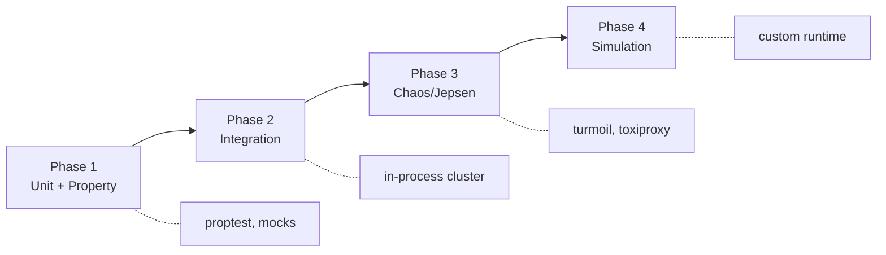

### Phase 1: Unit & Property Testing

**Tools**: `proptest`, standard Rust testing

```rust
// Property: Raft log replay produces same state
proptest! {
    fn state_determinism(ops: Vec<Operation>) {
        let state1 = replay_operations(&ops);
        let state2 = replay_operations(&ops);
        assert_eq!(state1.root(), state2.root());
    }
}

// Property: Merkle proofs are valid
proptest! {
    fn merkle_proof_validity(tree: StateTree, key: String) {
        let proof = tree.prove(&key);
        assert!(verify_proof(&proof, tree.root()));
    }
}
```

**Coverage targets**:

- State tree operations: 100%
- Block construction: 100%
- Merkle proof generation/verification: 100%
- Sequence number validation: 100%

### Phase 2: In-Process Integration

**Tools**: In-memory network, mock storage

```rust
#[tokio::test]
async fn three_node_cluster_basic_operations() {
    let cluster = TestCluster::new(3).await;

    // Write and verify replication
    let response = cluster.leader().write(create_relationship(...)).await;
    assert!(response.is_ok());

    // Verify all followers have the block
    for follower in cluster.followers() {
        let block = follower.get_block(response.block_height).await;
        assert_eq!(block.state_root, response.state_root);
    }
}
```

**Test scenarios**:

- Basic CRUD across replicas
- Leader failover and election
- Snapshot creation and recovery
- Client sequence number handling

### Phase 3: Chaos Testing

**Tools**: `turmoil` (Tokio simulation), `toxiproxy`, Docker

[Turmoil](https://github.com/tokio-rs/turmoil) provides deterministic network simulation for Tokio:

```rust
use turmoil::Builder;

#[test]
fn network_partition_during_write() {
    let mut sim = Builder::new().build();

    sim.host("node1", || async { run_node("node1").await });
    sim.host("node2", || async { run_node("node2").await });
    sim.host("node3", || async { run_node("node3").await });

    // Partition node1 from others
    sim.partition("node1", "node2");
    sim.partition("node1", "node3");

    // Verify: node1 cannot commit, nodes 2+3 elect new leader
    sim.run();
}
```

**Jepsen-style consistency checking**:

```rust
// After chaos, verify linearizability
fn verify_consistency(history: &[Operation]) -> Result<(), ConsistencyViolation> {
    // Check: Every read returns the last committed write
    // Check: No committed writes are lost
    // Check: All replicas converge to same state
}
```

**Fault scenarios**:
| Fault | Tool | Verification |
|-------|------|--------------|
| Network partition | turmoil | Leader election, no split-brain |
| Node crash | SIGKILL | Failover < 500ms |
| Network delay | toxiproxy | Timeout handling |
| Disk full | mock | Graceful degradation |
| Bit flip | inject | Merkle detection |

### Phase 4: Deterministic Simulation

Full deterministic simulation requires abstracting all non-determinism:

```rust
/// All time/randomness/IO goes through this trait
trait SimulationRuntime: Clone + Send + Sync + 'static {
    fn now(&self) -> Instant;
    fn sleep(&self, duration: Duration) -> impl Future<Output = ()>;
    fn random(&self) -> u64;

    // Network simulation
    fn send(&self, to: NodeId, msg: Message) -> impl Future<Output = Result<(), Error>>;
    fn recv(&self) -> impl Future<Output = Message>;

    // Storage simulation
    fn write(&self, key: &[u8], value: &[u8]) -> impl Future<Output = Result<(), Error>>;
    fn read(&self, key: &[u8]) -> impl Future<Output = Result<Vec<u8>, Error>>;
}

/// Production runtime
struct TokioRuntime;

/// Test runtime with fault injection
struct SimRuntime {
    seed: u64,
    clock: SimulatedClock,
    network: SimulatedNetwork,
    storage: SimulatedStorage,
    faults: Vec<ScheduledFault>,
}
```

**Implementation requirements**:

- All code must use `Runtime` trait (no direct `tokio::time::sleep`)
- Discipline in avoiding hidden non-determinism (HashMap iteration order, etc.)
- Custom network simulator with message ordering control

**Prerequisites for Phase 4**:

- Phases 1-3 stable
- Rare edge-case bugs are the primary remaining risk

**Alternative**: `loom` for concurrency testing of critical sections without full simulation.

### Test Priority Matrix

| Test Type       | Cost      | Bug Coverage        | When to Run  |
| --------------- | --------- | ------------------- | ------------ |
| Unit + Property | Low       | Logic errors        | Every commit |
| Integration     | Medium    | Protocol errors     | Every PR     |
| Chaos (turmoil) | Medium    | Fault handling      | Nightly      |
| Chaos (Docker)  | High      | Real network issues | Weekly       |
| Simulation      | Very High | Rare edge cases     | Pre-release  |

**CI Pipeline**:

```yaml
# Every commit
- cargo test # Unit tests
- cargo test --features proptest # Property tests

# Every PR
- cargo test --features integration

# Nightly
- cargo test --features chaos-turmoil

# Weekly
- ./scripts/chaos-docker.sh # Real network faults

# Pre-release
- ./scripts/simulation.sh --hours 10000
```

---

## System Invariants

### Safety Invariants

1. **Commitment permanence**: Committed blocks cannot be removed or modified
2. **State determinism**: Replaying identical transactions produces identical state_root
3. **Chain continuity**: Every block (except genesis) links to its predecessor via previous_hash
4. **Quorum requirement**: Commits require 2f+1 node acknowledgment

### Liveness Invariants

5. **Progress under minority failure**: Fewer than f+1 failures → writes continue
6. **Eventual convergence**: After partition heals, all replicas converge to same state
7. **Leader availability**: New leader elected within election timeout after leader failure

### Integrity Invariants

8. **Merkle soundness**: Invalid values cannot produce valid proofs
9. **Hash chain integrity**: Modifying any block invalidates all subsequent blocks
10. **Transaction atomicity**: All operations in a transaction apply together or not at all
11. **State determinism**: Identical transactions on identical state produce identical state_root; divergence halts the replica

### Operational Invariants

12. **Snapshot consistency**: Loading snapshot + applying subsequent blocks produces current state_root
13. **Historical accessibility**: Any committed block is readable with verifiable proofs
14. **Replication durability**: After Raft commit, data exists on quorum

### Reconfiguration Invariants

15. **Joint consensus atomicity**: Membership changes use joint consensus; no single-step reconfiguration
16. **Serialized membership changes**: At most one membership change in progress per vault
17. **No-op commit on election**: New leaders commit no-op before accepting membership changes

### Verification Invariants

18. **Block header permanence**: Block headers (`state_root`, `previous_hash`) are never deleted
19. **Snapshot chain continuity**: Every snapshot links to genesis via `genesis_hash` and `chain_commitment`
20. **Verifiability preservation**: Integrity check succeeds regardless of transaction body compaction

### Shard Group Invariants

21. **Vault chain independence**: Each vault's chain is independently verifiable regardless of shard assignment
22. **Shard membership consistency**: Vault-to-shard mapping in `_system` matches actual shard state
23. **Cross-shard isolation**: Transactions in one shard cannot affect state in another shard

### Idempotency Invariants

24. **Sequence monotonicity**: For any client, committed sequences are strictly increasing (no gaps, no duplicates)
25. **Duplicate rejection**: A sequence ≤ `last_committed_seq` never creates a new transaction
26. **Sequence persistence**: `last_committed_seq` per client survives leader failover (part of vault state)

### Operation Semantics Invariants

27. **Operation idempotency**: Replaying the same operation produces identical state (CREATE on existing = no-op, DELETE on missing = no-op)
28. **Raft ordering finality**: Operation order determined by Raft log index; no reordering after commit
29. **Deterministic conflict resolution**: Given same initial state and operation sequence, all replicas produce identical final state
