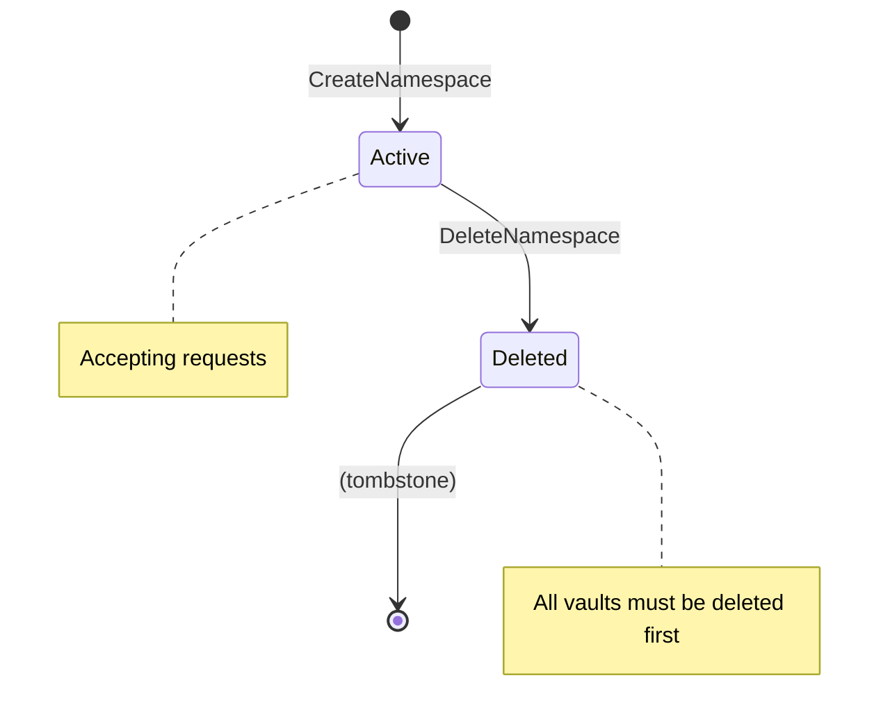
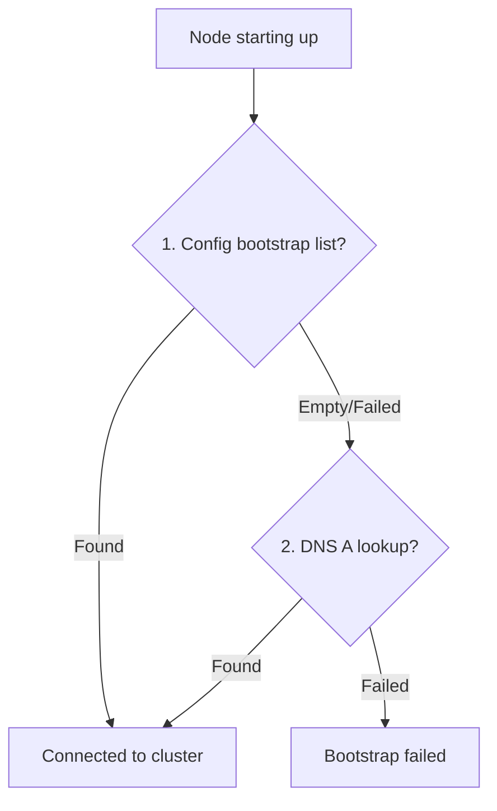

# InferaDB Ledger

Ledger is InferaDB's storage layer — a blockchain database for cryptographically verifiable auditing. Built in Rust, it exposes a gRPC API (HTTP/2 over TCP) and uses TCP for inter-node Raft consensus.

## Overview

Ledger uses a Raft-based replicated log with cryptographic block structure and materialized state indexes. The merkle-ized state tree includes indexes, enabling verifiable queries in addition to verifiable writes.

### Design Goals

1. **High Performance**: Sub-millisecond reads, <50ms writes
2. **Fault Isolation**: Chain-per-vault within isolated namespaces ensures failures don't cascade
3. **Cryptographic Auditability**: Every state can be proven against a merkle root
4. **Fearless Replication**: Raft consensus with self-verifying chain structure
5. **Operational Simplicity**: Snapshot recovery, zero-downtime migrations

### Terminology

Ledger uses specific terminology that aligns with InferaDB's Control and Engine services:

| Term                    | Definition                                                                                                                                                                                |
| ----------------------- | ----------------------------------------------------------------------------------------------------------------------------------------------------------------------------------------- |
| **Namespace**           | Ledger's storage unit. Each organization gets one namespace containing all its data (entities, vaults, relationships). Namespaces are isolated, with separate Raft consensus per shard.   |
| **Vault**               | A relationship store within a namespace. Organizations can have multiple vaults. Each vault maintains its own cryptographic chain (separate `state_root`, `previous_hash`, block height). |
| **Entity**              | Key-value data stored in a namespace (users, teams, clients, sessions). Entities support TTL, versioning, and conditional writes.                                                         |
| **Relationship**        | Authorization tuple stored in a vault: `(resource, relation, subject)`. Used by Engine for permission checks.                                                                             |
| **`_system` namespace** | Special namespace for global data: user accounts and namespace routing. Replicated to all nodes.                                                                                          |

**Hierarchy:**

```
_system namespace (global)
├── Users (global accounts)
└── Namespace routing table

org namespace (per-organization)
├── Organization metadata
├── Members, Teams, Clients
├── Vault A (relationships + grants) ─── separate chain
├── Vault B (relationships + grants) ─── separate chain
└── ...
```

### Table of Contents

- [Architecture](#architecture)
  - [Namespace and Vault Model](#namespace-and-vault-model)
  - [Network Protocol Architecture](#network-protocol-architecture)
  - [Block Structure](#block-structure)
  - [ID Generation Strategy](#id-generation-strategy)
  - [Operation Semantics](#operation-semantics)
  - [State Layer: Hybrid Storage](#state-layer-hybrid-storage)
  - [Write Amplification Analysis](#write-amplification-analysis)
  - [State Root Computation](#state-root-computation)
    - [Key Encoding](#key-encoding)
    - [Per-Vault Bucket Structure](#per-vault-bucket-structure)
    - [Determinism Requirements](#determinism-requirements)
  - [Multi-Vault Failure Isolation](#multi-vault-failure-isolation)
  - [Write Path](#write-path)
  - [Transaction Batching](#transaction-batching)
  - [Read Path](#read-path)
  - [Fault Tolerance & Recovery](#fault-tolerance--recovery)
  - [Historical Reads](#historical-reads)
  - [Namespace Lifecycle](#namespace-lifecycle)
  - [Vault Lifecycle](#vault-lifecycle)
  - [Performance Characteristics](#performance-characteristics)
  - [Scaling Architecture: Shard Groups](#scaling-architecture-shard-groups)
- [Discovery & Coordination](#discovery--coordination)
  - [System Namespace](#system-namespace-_system)
    - [Data Model](#data-model)
    - [Scaling Model](#scaling-model)
    - [Learner Staleness Handling](#learner-staleness-handling)
  - [Client Discovery Flow](#client-discovery-flow)
  - [Block Announcements](#block-announcements)
  - [Peer-to-Peer Properties](#peer-to-peer-properties)
  - [Bootstrap Discovery](#bootstrap-discovery)
  - [Node Join](#node-join)
  - [Node Leave](#node-leave)
  - [Membership Reconfiguration Safety](#membership-reconfiguration-safety)
  - [Namespace Routing](#namespace-routing)
  - [Failure Modes](#failure-modes)
- [Durability & Finality Model](#durability--finality-model)
- [Persistent Storage Architecture](#persistent-storage-architecture)
  - [Directory Layout](#directory-layout)
  - [Storage Backend: inferadb-ledger-store](#storage-backend-inferadb-ledger-store)
  - [Block Archive Format](#block-archive-format)
  - [Snapshot Format](#snapshot-format)
  - [Crash Recovery](#crash-recovery)
  - [File Locking](#file-locking)
  - [Storage Invariants](#storage-invariants)
- [Corruption Detection & Resolution](#corruption-detection--resolution)
- [Network Partition Handling](#network-partition-handling)
- [Control Data Storage](#control-data-storage)
  - [Namespace Data Model](#namespace-data-model)
  - [Entity Key Patterns](#entity-key-patterns)
  - [TTL and Expiration](#ttl-and-expiration)
  - [Garbage Collection](#garbage-collection)
  - [Cross-Namespace Operations](#cross-namespace-operations)
  - [Token Issuance Auditability](#token-issuance-auditability)
- [Client Idempotency & Retry Semantics](#client-idempotency--retry-semantics)
- [Vault Owner Verification Protocol](#vault-owner-verification-protocol)
- [Observability & Monitoring](#observability--monitoring)
- [Consistency Guarantees](#consistency-guarantees)
  - [Cross-Namespace Consistency](#cross-namespace-consistency)
- [Limitations & Trade-offs](#limitations--trade-offs)
- [Snapshot & Retention Policy](#snapshot--retention-policy)
- [Testing & Validation Strategy](#testing--validation-strategy)
- [System Invariants](#system-invariants)

---

## Architecture

### Namespace and Vault Model

Ledger organizes data into **namespaces** (one per organization) containing **vaults** (relationship stores). Each vault maintains its own cryptographic blockchain. For scalability, namespaces share Raft groups via shards (see [Shard Groups](#scaling-architecture-shard-groups)).

**What the chain provides:**

- Consensus and ordering (Raft, shared across namespaces in a shard)
- Replication and fault tolerance (Raft followers)
- Immutability and verification (per-vault cryptographic chain linking)
- Audit trail (chain IS the history)


**Isolation model:**

| Level     | Isolation                         | Shared                 |
| --------- | --------------------------------- | ---------------------- |
| Namespace | Entities, vaults, keys            | Shard (Raft consensus) |
| Vault     | Cryptographic chain, `state_root` | Namespace storage      |
| Shard     | Physical nodes                    | Cluster                |

Namespaces share physical nodes and Raft groups but maintain independent data. Vaults within a namespace share storage but maintain separate cryptographic chains for independent verification.

**Raft transport**: gRPC/HTTP2 over TCP. TCP's kernel implementation and hardware offload provide optimal latency for single-stream consensus.

### Network Protocol Architecture

InferaDB uses **gRPC/HTTP/2** for both client-facing APIs and inter-node Raft consensus. This decision was made after evaluating alternatives against our design goals.

#### Why gRPC/HTTP/2

| Factor                     | gRPC/HTTP/2                                  | Custom TCP Protocol                         |
| -------------------------- | -------------------------------------------- | ------------------------------------------- |
| **Development velocity**   | High (generated clients, rich tooling)       | Low (custom wire format, manual versioning) |
| **Operational complexity** | Low (standard load balancers, observability) | High (custom monitoring, debugging tools)   |
| **Performance**            | ~0.5ms per RPC overhead                      | ~0.1-0.2ms theoretical improvement          |
| **HTTP/2 multiplexing**    | Natural fit for batch operations             | Must implement manually                     |
| **TLS integration**        | Standard, well-audited                       | Custom implementation required              |

**Decision rationale**: At InferaDB's target scale (<50K ops/sec per cluster), the ~0.3ms per-request overhead of gRPC/HTTP/2 is negligible compared to consensus latency (~2-5ms) and disk I/O. The development velocity and operational simplicity far outweigh raw throughput gains from a custom protocol.

#### Serialization Strategy

The write path involves layered serialization:

```
Client Request
    ↓
[1] Proto → Internal Types (gRPC decode + type conversion)
    ↓
[2] Internal Types → LedgerRequest (already in-memory)
    ↓
[3] LedgerRequest → Postcard (Raft log serialization)
    ↓
[4] Postcard → Disk (LedgerDb B-tree write)
```

**Why postcard for storage**: Proto is optimized for wire transmission (extensible, schema-aware) while postcard is optimized for in-process speed (no schema overhead, minimal allocation, no_std compatible). Storing as postcard avoids proto parsing on every log replay.

**Measured overhead** (see serialization metrics in Observability):

- Proto decode: ~1-5μs per operation (varies with payload size)
- Postcard encode: ~2-10μs per Raft entry (varies with batch size)
- Total serialization: <1% of request latency at typical batch sizes

#### Alternatives Considered

**QUIC/HTTP/3**: Would add ~0.1ms initial connection latency savings but introduces complexity (UDP NAT traversal, less mature ecosystem). Not justified for persistent connections between cluster nodes.

**Custom binary protocol**: Would save ~0.3ms per request but requires:

- Custom framing, flow control, backpressure
- Version negotiation, backwards compatibility
- Custom TLS integration
- Custom load balancer support
- New debugging/tracing tooling

This is a net negative for systems targeting <100K ops/sec where developer and operator productivity dominates.

**gRPC-only storage (no postcard)**: Would eliminate one serialization layer but:

- Proto parsing is slower than postcard for repeated reads
- Proto schema evolution adds replay complexity
- Postcard's deterministic serialization simplifies snapshot verification

#### When to Reconsider

This decision should be revisited if:

- Serialization latency exceeds 5% of request latency (monitor `ledger_serialization_*` metrics)
- Target throughput exceeds 100K ops/sec per shard
- Network latency becomes the primary bottleneck (currently consensus dominates)

### Block Structure

Each vault maintains its own logical blockchain within a namespace. Physically, blocks are packed into `ShardBlock` entries for Raft efficiency (see [Shard Groups](#scaling-architecture-shard-groups)).

```rust
/// Per-vault block (logical view, extracted from ShardBlock for verification)
/// Implementation note: VaultBlock wraps BlockHeader (which excludes leader_id for
/// deterministic hashing) plus transactions. The leader_id is stored in ShardBlock
/// and populated when extracting VaultBlock via extract_vault_block().
struct VaultBlock {
    // Identity
    height: u64,
    namespace_id: NamespaceId,  // Owning namespace (organization)
    vault_id: VaultId,          // Vault within namespace

    // Chain linking (immutability)
    previous_hash: Hash,      // SHA-256 of previous vault block

    // Content
    transactions: Vec<Transaction>,
    tx_merkle_root: Hash,     // merkle_root(self.transactions) — this block's txs only

    // State commitment (verification)
    state_root: Hash,         // Vault state AFTER applying this block

    // Metadata
    timestamp: DateTime<Utc>,

    // Raft integration (from containing ShardBlock)
    leader_id: NodeId,        // Populated from ShardBlock during extraction
    term: u64,
    committed_index: u64,
}

struct Transaction {
    id: TxId,                 // Unique transaction ID
    client_id: ClientId,      // Identifies submitting client
    sequence: u64,            // Monotonic per-client (for idempotency)
    actor: String,            // Actor identifier for audit logging
    operations: Vec<Operation>,
    timestamp: DateTime<Utc>,
}

enum Operation {
    // Relationship operations (Engine)
    CreateRelationship { resource: String, relation: String, subject: String },
    DeleteRelationship { resource: String, relation: String, subject: String },

    // Entity operations (Control)
    SetEntity { key: String, value: Bytes, condition: Option<SetCondition>, expires_at: Option<u64> },
    DeleteEntity { key: String },
    ExpireEntity { key: String, expired_at: u64 },  // GC-initiated, distinct from delete
}

/// Conditional write conditions for optimistic locking.
enum SetCondition {
    MustNotExist,            // Key must not exist (create-only)
    MustExist,               // Key must exist (safe updates)
    VersionEquals(u64),      // Key version must equal value (optimistic locking)
    ValueEquals(Vec<u8>),    // Key value must equal bytes (exact state assertions)
}
```

### ID Generation Strategy

Ledger operates under strict **determinism requirements** for Raft consensus—all nodes must produce identical state from the same input log. This constrains how identifiers can be generated.

**Core principle**: Ledger uses **leader-assigned sequential IDs** for entities it manages. The leader assigns IDs during block construction; followers replay the same IDs from the Raft log. This is fully deterministic and self-contained—no external coordination required.

| ID Type       | Size     | Generated By  | Strategy                                             |
| ------------- | -------- | ------------- | ---------------------------------------------------- |
| `NamespaceId` | int64    | Ledger Leader | Sequential from `_meta:seq:namespace` (0 = \_system) |
| `VaultId`     | int64    | Ledger Leader | Sequential from `_meta:seq:vault`                    |
| `UserId`      | int64    | Ledger Leader | Sequential from `_meta:seq:user`                     |
| `UserEmailId` | int64    | Ledger Leader | Sequential from `_meta:seq:user_email`               |
| `ClientId`    | string   | Control       | Opaque API key identifier                            |
| `TxId`        | 16 bytes | Ledger Leader | UUID assigned during block creation                  |
| `NodeId`      | string   | Admin         | Configuration (hostname or UUID)                     |
| `ShardId`     | uint32   | Admin         | Sequential at shard creation                         |

**Sequence counter storage:**

Sequence counters are logically modeled as entities in `_system` namespace with these key patterns:

```
Key: "_meta:seq:namespace"    → next NamespaceId (int64), starts at 1 (0 = _system)
Key: "_meta:seq:vault"        → next VaultId (int64)
Key: "_meta:seq:user"         → next UserId (int64)
Key: "_meta:seq:user_email"   → next UserEmailId (int64)
Key: "_meta:seq:email_verify" → next TokenId (int64)
```

**Implementation note:** The current implementation stores these counters in an in-memory `SequenceCounters` struct within the Raft `AppliedState`, which is persisted as part of Raft snapshots. This provides the same guarantees (leader-assigned, deterministic replay, survives restarts) with lower per-allocation overhead than entity lookups.

**Reserved IDs:**

- `NamespaceId = 0` is reserved for `_system` (global namespace for users and routing)

**Leader ID assignment:**

```rust
impl Leader {
    /// Allocate the next ID for an entity type. Called during block construction.
    /// The increment is included in the same block, ensuring deterministic replay.
    fn allocate_id(&mut self, entity_type: &str) -> i64 {
        let key = format!("_meta:seq:{}", entity_type);
        let next_id = self.state.get(&key).map(|v| i64::from_le_bytes(v)).unwrap_or(1);

        // Include the increment in pending operations for this block
        self.pending_ops.push(SetEntity {
            key: key.clone(),
            value: (next_id + 1).to_le_bytes().to_vec(),
        });

        next_id
    }

    fn create_user(&mut self, name: String, email: String) -> User {
        let user_id = self.allocate_id("user");
        let email_id = self.allocate_id("user_email");

        // Both IDs and their counter increments are in the same block
        // Followers replay the block and see the same IDs
        User { id: user_id, name, /* ... */ }
    }
}
```

**Determinism guarantee:**

1. Leader allocates ID and increments counter atomically (same block)
2. Block is proposed to Raft with the assigned ID
3. Followers apply the block—they read the ID from the log, never generate
4. All nodes arrive at identical state

**All IDs are Ledger-assigned:**

Every entity ID in Ledger is a sequential int64 assigned by the leader. This provides a uniform, simple model with no external dependencies:

```rust
// All IDs are opaque integers assigned by Ledger
let namespace_id = ledger.create_namespace(config).await?;  // Returns NamespaceId(1)
let vault_id = ledger.create_vault(namespace_id, config).await?;  // Returns VaultId(1)
let user_id = ledger.create_user(user_data).await?;  // Returns UserId(1)

// Human-readable names are stored as entity attributes, not IDs
struct Namespace {
    id: NamespaceId,      // Sequential: 1, 2, 3, ...
    name: String,         // Human-readable: "acme_corp"
    // ...
}
```

### Operation Semantics

All operations are **idempotent** and resolved by **Raft total ordering**:

| Operation            | Pre-state  | Post-state | Return           |
| -------------------- | ---------- | ---------- | ---------------- |
| `CreateRelationship` | not exists | created    | `CREATED`        |
| `CreateRelationship` | exists     | no change  | `ALREADY_EXISTS` |
| `DeleteRelationship` | exists     | deleted    | `DELETED`        |
| `DeleteRelationship` | not exists | no change  | `NOT_FOUND`      |
| `SetEntity`          | any        | value set  | `OK`             |
| `DeleteEntity`       | exists     | deleted    | `DELETED`        |
| `DeleteEntity`       | not exists | no change  | `NOT_FOUND`      |
| `ExpireEntity`       | exists     | removed    | `EXPIRED`        |
| `ExpireEntity`       | not exists | no change  | `NOT_FOUND`      |

**Concurrent operation resolution:**

Raft provides deterministic total ordering. Concurrent operations from different clients serialize in Raft log order:

```
Client A: CREATE(user:alice, viewer, doc:1)  →  Raft index 100
Client B: DELETE(user:alice, viewer, doc:1)  →  Raft index 101

Result: Relationship does NOT exist (DELETE at 101 wins)
```

```
Client A: DELETE(user:alice, viewer, doc:1)  →  Raft index 100
Client B: CREATE(user:alice, viewer, doc:1)  →  Raft index 101

Result: Relationship EXISTS (CREATE at 101 wins)
```

**Security implications:**

The second scenario (DELETE then CREATE) can unexpectedly grant access. Mitigations:

1. **Check after write**: Read at the committed block height to confirm final state before acting on the result. This is the primary defense.

2. **Tombstone TTL**: Configure a cooldown period during which deleted relationships cannot be recreated. Prevents rapid DELETE→CREATE races at the cost of delayed re-grants.

**Fail-secure default:**

For authorization, prefer:

- Deny access on any ambiguity
- Engine should cache permission checks with block height
- On cache miss after a delete, re-check at current height
- Short TTL on permission caches (default: 1 second)

**Retry behavior:**

| Scenario                          | Client sees                | Correct action                  |
| --------------------------------- | -------------------------- | ------------------------------- |
| `CREATE` returns `ALREADY_EXISTS` | Relationship exists        | No retry needed, goal achieved  |
| `DELETE` returns `NOT_FOUND`      | Relationship doesn't exist | No retry needed, goal achieved  |
| Network timeout on `CREATE`       | Unknown                    | Retry with same sequence number |
| Network timeout on `DELETE`       | Unknown                    | Retry with same sequence number |

Retries with the same `(client_id, sequence)` return the original result (see [Client Idempotency](#client-idempotency--retry-semantics)).

### State Layer: Hybrid Storage

The state layer separates **state commitment** (merkleized, for verification) from **state storage** (non-merkleized, for fast queries), avoiding the severe write amplification of fully-merkleized indexes.


**What's merkleized:**

- `tx_merkle_root`: Merkle root of transactions in each block (proves tx inclusion)
- `state_root`: Commitment to state after applying block (proves state at height N)

**What's NOT merkleized per-write:**

- Individual index entries (stored in inferadb-ledger-store for O(1) lookup)
- Dual indexes for relationship traversal

**Verification approach:**

- **Transaction inclusion**: Standard merkle proof against `tx_merkle_root`
- **State verification**: Replay transactions from snapshot (within retention window; see [Retention Policy](#retention-policy))
- **On-demand proofs**: Compute merkle path when explicitly requested (not precomputed)

```rust
struct StateLayer {
    // Fast K/V storage for queries (inferadb-ledger-store)
    kv: Database,

    // Indexes for relationship traversal
    obj_index: Table<ObjectKey, Vec<SubjectId>>,
    subj_index: Table<SubjectKey, Vec<ObjectId>>,

    // State commitment (computed at block boundaries)
    state_root: Hash,
}

impl StateLayer {
    /// Fast query path (no proof)
    fn get(&self, key: &[u8]) -> Option<Value> {
        self.kv.get(key)
    }

    /// Apply block operations, compute new state_root
    fn apply_block(&mut self, block: &Block) -> Hash {
        for tx in &block.transactions {
            for op in &tx.operations {
                self.apply_operation(op);
            }
        }
        self.compute_state_root()
    }

    /// Compute state root via deterministic traversal
    fn compute_state_root(&self) -> Hash {
        // Hash all key-value pairs in deterministic order
        // This is O(n) but only computed once per block
        let mut hasher = StateHasher::new();
        for (key, value) in self.kv.iter() {
            hasher.update(key, value);
        }
        hasher.finalize()
    }
}
```

### Write Amplification Analysis

**Problem**: Fully-merkleized state creates severe write amplification for authorization workloads.

**Naive MPT approach** (what we avoid):

```
1 relationship tuple =
  1 relationship entry × O(log n) merkle nodes +
  1 obj_index update × O(log n) merkle nodes +
  1 subj_index update × O(log n) merkle nodes
  = 3 × 5 levels × 3 replicas × fsync
  = ~45 disk writes per tuple (for 1M keys)
```

**Hybrid approach** (what we use):

```
1 relationship tuple =
  3 K/V writes (relationship + 2 indexes) +
  1 state_root computation (amortized across block)
  = ~3 disk writes per tuple + O(1) amortized merkle cost
```

**Authorization relationship breakdown:**

Each relationship tuple (e.g., `document:123#viewer@user:alice`) requires:

| Write         | Key Pattern                           | Purpose                                  |
| ------------- | ------------------------------------- | ---------------------------------------- |
| Relationship  | `rel:{resource}#{relation}@{subject}` | Primary tuple storage                    |
| Object index  | `obj_idx:{resource}#{relation}`       | Forward lookup: "who can view doc:123?"  |
| Subject index | `subj_idx:{subject}`                  | Reverse lookup: "what can alice access?" |

**Batch optimization:**

| Pattern                         | Writes | Fsyncs       | Throughput       |
| ------------------------------- | ------ | ------------ | ---------------- |
| Single tuple (interactive)      | 3      | 1 (via Raft) | ~200 tx/sec      |
| N tuples to same resource       | 3N     | 1            | ~50K tuples/sec  |
| Bulk import (1000 tuples/block) | 3000   | 1            | ~100K tuples/sec |

Interactive single-tuple writes are bounded by Raft RTT (~3-5ms). Batch imports amortize consensus overhead for 500x higher throughput.

**Trade-offs:**

| Aspect              | Naive MPT      | Hybrid                 |
| ------------------- | -------------- | ---------------------- |
| Write amplification | 10-50x         | ~1x                    |
| Per-key proofs      | Instant        | Requires computation   |
| State verification  | O(log n) proof | Replay from snapshot\* |
| Query latency       | O(log n)       | O(1)                   |

\*Replay requires transaction bodies (Full mode or within Compacted retention window).

**Design rationale**: Authorization workloads are read-heavy (permission checks) with bursty writes (policy updates). Fast queries and low write amplification matter more than instant per-key proofs. Vault owners can request proofs on-demand or verify by replaying transactions within the retention window.

**References:**

- [QMDB](https://github.com/LayerZero-Labs/qmdb): Append-only log with O(1) merkleization
- [SeiDB](https://docs.sei.io/learn/seidb): Separates state commitment from state storage
- [Zanzibar](https://research.google/pubs/pub48190/): Uses temporal consistency, not merkle proofs

### State Root Computation

**When computed**: After applying all block transactions, before Raft commit. The leader includes `state_root` in the block header; followers verify their computed root matches.

**Computation strategy**: Per-vault incremental bucket hashing avoids O(n) full traversal.

#### Key Encoding

Storage keys encode vault isolation and bucket assignment for efficient range queries:

```
┌─────────────────────────────────────────────────────────────┐
│  vault_id   │  bucket_id  │         local_key               │
│  (8 bytes)  │  (1 byte)   │         (N bytes)               │
└─────────────────────────────────────────────────────────────┘
```

```rust
/// Encode a storage key with vault and bucket prefixes
fn encode_storage_key(vault_id: VaultId, local_key: &[u8]) -> Vec<u8> {
    let bucket_id = (seahash::hash(local_key) % 256) as u8;

    let mut key = Vec::with_capacity(9 + local_key.len());
    key.extend_from_slice(&vault_id.to_be_bytes());  // 8 bytes
    key.push(bucket_id);                              // 1 byte
    key.extend_from_slice(local_key);                 // N bytes
    key
}

/// Decode bucket_id and local_key from storage key
fn decode_storage_key(storage_key: &[u8]) -> (VaultId, u8, &[u8]) {
    let vault_id = VaultId::from_be_bytes(storage_key[0..8].try_into().unwrap());
    let bucket_id = storage_key[8];
    let local_key = &storage_key[9..];
    (vault_id, bucket_id, local_key)
}
```

**Hash function choice**: `seahash` for bucket assignment—fast (8 GB/s), deterministic, no external dependencies. SHA-256 remains the cryptographic hash for `state_root` and `bucket_roots`.

#### Per-Vault Bucket Structure

Each vault maintains independent bucket tracking. Vaults in the same shard share an inferadb-ledger-store database but compute separate `state_root` values.

```rust
struct ShardState {
    /// Shared K/V storage for all vaults in shard
    kv: Database,

    /// Per-vault commitment state
    vault_commitments: HashMap<VaultId, VaultCommitment>,
}

struct VaultCommitment {
    /// 256 bucket roots (SHA-256 each)
    bucket_roots: [Hash; 256],

    /// Buckets modified since last state_root computation
    dirty_buckets: BTreeSet<u8>,  // Ordered set for deterministic iteration
}

impl ShardState {
    /// Compute state_root for a single vault. O(k) where k = dirty keys.
    fn compute_vault_state_root(
        &mut self,
        vault_id: VaultId,
        dirty_keys: &[LocalKey]
    ) -> Hash {
        let commitment = self.vault_commitments
            .entry(vault_id)
            .or_insert_with(VaultCommitment::new);

        // Mark affected buckets
        for local_key in dirty_keys {
            let bucket_id = (seahash::hash(local_key) % 256) as u8;
            commitment.dirty_buckets.set(bucket_id as usize);
        }

        // Recompute only dirty bucket roots
        for bucket_id in commitment.dirty_buckets.iter() {
            commitment.bucket_roots[bucket_id] =
                self.hash_vault_bucket(vault_id, bucket_id as u8);
        }

        commitment.dirty_buckets.clear();

        // Final state_root = SHA-256 of concatenated bucket roots
        sha256_concat(&commitment.bucket_roots)
    }

    /// Hash all keys in a specific vault's bucket via range query.
    /// See "Cryptographic Hash Specifications" for normative encoding.
    fn hash_vault_bucket(&self, vault_id: VaultId, bucket_id: u8) -> Hash {
        // Construct range: [vault_id][bucket_id][0x00...] to [vault_id][bucket_id][0xFF...]
        let mut start = [0u8; 9];
        start[0..8].copy_from_slice(&vault_id.to_be_bytes());
        start[8] = bucket_id;

        let mut end = start;
        end[8] = bucket_id.wrapping_add(1);  // Next bucket (or wraps to 0 for bucket 255)

        let mut hasher = Sha256::new();
        let txn = self.kv.begin_read().unwrap();
        let table = txn.open_table(STATE_TABLE).unwrap();

        // Range query: all keys matching [vault_id][bucket_id][*]
        // For bucket 255, query to end of vault's keyspace
        let range = if bucket_id == 255 {
            let vault_end = [0u8; 9];
            // ... handle vault boundary
            table.range(start..)
                .take_while(|r| r.as_ref().map(|(k, _)| k.value()[0..8] == vault_id.to_be_bytes()).unwrap_or(false))
        } else {
            table.range(start..end)
        };

        for result in range {
            let (key, entry) = result.unwrap();
            // Hash full entry in deterministic order (see State Tree Leaf Hash spec)
            hasher.update(&(key.value().len() as u32).to_le_bytes());
            hasher.update(key.value());
            hasher.update(&(entry.value.len() as u32).to_le_bytes());
            hasher.update(&entry.value);
            hasher.update(&entry.expires_at.to_be_bytes());  // u64, 0 = never
            hasher.update(&entry.version.to_be_bytes());     // u64, block height
        }

        hasher.finalize().into()
    }
}
```

#### Complexity Analysis

| Scenario                   | Naive O(n)   | Bucket-based               |
| -------------------------- | ------------ | -------------------------- |
| 1M keys, 100 ops/block     | Hash 1M keys | Hash ~100 keys + 256 roots |
| 1M keys, 10K ops/block     | Hash 1M keys | Hash ~10K keys + 256 roots |
| Cold start (snapshot load) | Hash 1M keys | Hash 1M keys (unavoidable) |

**Vault isolation guarantee**: Updating Vault A's keys never touches Vault B's bucket roots. The `vault_id` prefix in storage keys ensures range queries stay within vault boundaries.

#### Determinism Requirements

State root computation must be identical on all nodes:

1. **Hash function**: seahash for bucket assignment, SHA-256 for roots
2. **Iteration order**: inferadb-ledger-store guarantees lexicographic key order within range
3. **Key-value encoding**: Length-prefixed (prevents ambiguous concatenation)
4. **Empty bucket**: Hash of empty input → `SHA-256("")`

**Raft integration sequence**:

```
1. Leader receives transactions
2. Leader applies transactions to state (tracks dirty keys)
3. Leader computes state_root via incremental bucket hashing
4. Leader constructs block with state_root
5. Leader proposes block to Raft (AppendEntries)
6. Followers replicate log entry
7. On commit: followers apply transactions, verify state_root
8. If state_root mismatch: follower halts and alerts (see Divergence Handling)
```

**Divergence handling**: If a follower computes a different `state_root` than the block header:

1. Follower halts processing for this vault (not the whole node)
2. Follower emits critical alert: `state_root_divergence{vault_id, height, expected, computed}`
3. Operator investigates: corruption, non-deterministic bug, or version mismatch
4. Resolution: Follower rebuilds state from snapshot + log replay, or is removed from Raft group

Divergence indicates a bug or corruption, not a consensus failure. The committing quorum is authoritative.

### Cryptographic Hash Specifications

This section provides normative, language-independent specifications for all cryptographic hashes. Multi-SDK verification requires identical computation across implementations.

**Hash algorithm**: SHA-256 for all cryptographic commitments. Outputs are 32 bytes, represented as `Hash` type.

#### Block Hash

The block hash commits to the header only (not transaction bodies). This enables header-only verification and efficient syncing.

```
block_hash = SHA-256(
    height              || # u64, big-endian (8 bytes)
    namespace_id        || # i64, big-endian (8 bytes)
    vault_id            || # i64, big-endian (8 bytes)
    previous_hash       || # 32 bytes (zero-hash for genesis)
    tx_merkle_root      || # 32 bytes
    state_root          || # 32 bytes
    timestamp_secs      || # i64, big-endian (8 bytes) - Unix epoch seconds
    timestamp_nanos     || # u32, big-endian (4 bytes) - nanosecond offset
    term                || # u64, big-endian (8 bytes)
    committed_index        # u64, big-endian (8 bytes)
)
# Total: 148 bytes fixed-size input
```

**Genesis block**: `previous_hash` is 32 zero bytes (`0x00...00`).

**Rationale**: Fixed-size encoding avoids length ambiguity. Big-endian ensures consistent byte order across platforms.

#### Transaction Hash

Transactions are hashed using a canonical binary encoding independent of protobuf wire format.

```
tx_hash = SHA-256(
    tx_id               || # 16 bytes (UUID)
    client_id_len       || # u32, little-endian
    client_id           || # UTF-8 bytes
    sequence            || # u64, big-endian
    actor_len           || # u32, little-endian
    actor               || # UTF-8 bytes
    op_count            || # u32, little-endian
    operations          || # Operation data hashed inline (see op_hash below)
    timestamp_secs      || # i64, big-endian
    timestamp_nanos        # u32, big-endian
)
```

**Operation hash** (for each operation in transaction):

```
op_hash = SHA-256(op_type || op_data)

# op_type: single byte
#   0x01 = CreateRelationship
#   0x02 = DeleteRelationship
#   0x03 = SetEntity
#   0x04 = DeleteEntity
#   0x05 = ExpireEntity

# op_data varies by type:

CreateRelationship:
    resource_len (u32 LE) || resource ||
    relation_len (u32 LE) || relation ||
    subject_len (u32 LE) || subject

DeleteRelationship:
    resource_len (u32 LE) || resource ||
    relation_len (u32 LE) || relation ||
    subject_len (u32 LE) || subject

SetEntity:
    key_len (u32 LE) || key || value_len (u32 LE) || value ||
    condition_type (u8) || condition_data || expires_at (u64 BE, 0 = never)

DeleteEntity:
    key_len (u32 LE) || key

ExpireEntity:
    key_len (u32 LE) || key || expired_at (u64 BE)
```

**Condition types** for SetEntity:

- `0x00` = None (no condition)
- `0x01` = MustNotExist (key must not exist; for create-only operations)
- `0x02` = MustExist (key must exist; for safe updates)
- `0x03` = VersionEquals (followed by u64 BE version; for optimistic locking)
- `0x04` = ValueEquals (followed by u32 LE length + bytes; for exact state assertions)

#### Transaction Merkle Tree

The `tx_merkle_root` is a binary Merkle tree over transaction hashes.

```
tx_merkle_root = merkle_root([tx_hash_0, tx_hash_1, ..., tx_hash_n])
```

**Tree construction** (standard binary Merkle tree):

1. Leaves are transaction hashes in block order
2. If odd number of nodes at a level, duplicate the last node
3. Parent = SHA-256(left_child || right_child)
4. Continue until single root

```
Example: 3 transactions [A, B, C]

Level 0 (leaves):  A    B    C    C'   (C duplicated)
                    \  /      \  /
Level 1:           AB          CC
                     \        /
Level 2 (root):      tx_merkle_root
```

**Empty block**: `tx_merkle_root` = SHA-256 of empty input (`SHA-256("")`).

#### State Tree Leaf Hash

Each key-value pair in a bucket contributes to the bucket root:

```
leaf_contribution = (
    key_len (u32 LE)    ||  # 4 bytes
    key                 ||  # Variable
    value_len (u32 LE)  ||  # 4 bytes
    value               ||  # Variable
    expires_at (u64 BE) ||  # 8 bytes (0 = never)
    version (u64 BE)        # 8 bytes (block height of last modification)
)
```

**Bucket root** = Incremental hash of all leaf contributions in lexicographic key order:

```rust
fn compute_bucket_root(entries: &[(Key, Value, ExpiresAt, Version)]) -> Hash {
    let mut hasher = Sha256::new();
    for (key, value, expires_at, version) in entries.iter().sorted_by_key(|e| &e.0) {
        hasher.update(&(key.len() as u32).to_le_bytes());
        hasher.update(key);
        hasher.update(&(value.len() as u32).to_le_bytes());
        hasher.update(value);
        hasher.update(&expires_at.to_be_bytes());
        hasher.update(&version.to_be_bytes());
    }
    hasher.finalize().into()
}
```

**Empty bucket**: SHA-256 of empty input.

**State root** = SHA-256 of concatenated bucket roots (256 × 32 bytes = 8192 bytes):

```
state_root = SHA-256(bucket_root[0] || bucket_root[1] || ... || bucket_root[255])
```

#### Merkle Proof Semantics

Merkle proofs for transaction inclusion use the `Direction` enum to specify sibling position:

```protobuf
enum Direction {
  DIRECTION_LEFT = 1;   // Sibling is on the LEFT
  DIRECTION_RIGHT = 2;  // Sibling is on the RIGHT
}
```

**Verification algorithm**:

```rust
fn verify_merkle_proof(leaf_hash: Hash, siblings: &[(Hash, Direction)], root: Hash) -> bool {
    let mut current = leaf_hash;
    for (sibling, direction) in siblings {
        current = match direction {
            Direction::Left  => sha256(sibling || current),  // Sibling LEFT of current
            Direction::Right => sha256(current || sibling),  // Sibling RIGHT of current
        };
    }
    current == root
}
```

**Direction semantics**: `Direction::Left` means the sibling hash is concatenated BEFORE the current hash. `Direction::Right` means the sibling is concatenated AFTER.

#### State Proof Structure

State proofs differ from transaction proofs because state uses bucket-based hashing, not a full Merkle tree.

**For entity existence proof**:

```
StateProof {
    key: bytes,
    value: bytes,
    expires_at: u64,
    version: u64,
    bucket_id: u8,
    bucket_root: Hash,           // Computed from bucket contents
    other_bucket_roots: [Hash; 255],  // All other bucket roots
}
```

**Verification**:

1. Verify `seahash(key) % 256 == bucket_id`
2. Verify `bucket_root` matches by hashing all bucket contents (requires full bucket)
3. Verify `state_root == SHA-256(bucket_roots[0..256])` with provided roots

**Trade-off**: State proofs require the full bucket contents (not O(log n) like Merkle trees). This is acceptable because:

- Buckets are small (~4K entries each for 1M total keys)
- State proofs are rare (verification usually done via trusted headers)
- Transaction inclusion proofs remain O(log n)

#### Verification Scope

Not all operations are cryptographically verifiable. The design explicitly trades range/completeness proofs for O(1) write performance.

| Operation               | Verifiable | Proof Type              | Notes                                                               |
| ----------------------- | ---------- | ----------------------- | ------------------------------------------------------------------- |
| Point read (single key) | ✓          | StateProof              | Full bucket verification                                            |
| Historical point read   | ✓          | StateProof + ChainProof | Proofs optional (`include_proof`); requires height within retention |
| Transaction inclusion   | ✓          | MerkleProof             | O(log n) proof against tx_merkle_root                               |
| Write committed         | ✓          | BlockHeader + TxProof   | Self-verifiable with optional proofs                                |
| List relationships      | ✗          | None                    | No range proofs; trust server completeness                          |
| List entities           | ✗          | None                    | No range proofs; trust server completeness                          |
| List resources          | ✗          | None                    | No range proofs; trust server completeness                          |
| Pagination completeness | ✗          | None                    | Cannot prove no results were omitted                                |

**Design rationale**: Authorization workloads prioritize fast permission checks over cryptographic completeness proofs. Vault owners who require verifiable list operations must:

1. Maintain their own state by subscribing to `WatchBlocks` and replaying transactions, or
2. Use point reads with known keys, which are fully verifiable

**Consistency levels**: Read operations support `ReadConsistency`:

- `EVENTUAL`: Read from any replica (default, fastest, may return stale data)
- `LINEARIZABLE`: Read from leader (strong consistency, higher latency)

List operations with `LINEARIZABLE` consistency ensure the result reflects all committed writes, but still cannot prove completeness.

### Multi-Vault Failure Isolation

Multiple vaults share a Raft group (shard). A `state_root` divergence in one vault must not cascade to other vaults in the same shard.

**Isolation boundaries:**

| Component                       | Shared | Independent |
| ------------------------------- | ------ | ----------- |
| Raft log (ordering, durability) | ✓      |             |
| ShardBlock delivery             | ✓      |             |
| VaultEntry application          |        | ✓           |
| State commitment (state_root)   |        | ✓           |
| Failure handling (vault health) |        | ✓           |

**Divergence handling:**

When a follower computes a `state_root` that differs from the block header:

1. Rollback uncommitted state for that vault only
2. Mark vault `Diverged { expected, computed, height }`
3. Emit `state_root_divergence{vault_id, shard_id}` alert
4. Continue processing remaining vaults in the block
5. Return `VAULT_UNAVAILABLE` for reads to diverged vault
6. Continue replicating Raft log; store but don't apply diverged vault's entries

```rust
#[derive(Debug, Clone, PartialEq)]
enum VaultHealth {
    Healthy,
    Diverged { expected: Hash, computed: Hash, at_height: u64 },
    Recovering { started_at: i64, attempt: u8 },  // Unix timestamp
}

impl Node {
    fn apply_shard_block(&mut self, block: &ShardBlock) -> ShardBlockResult {
        let mut results = Vec::with_capacity(block.vault_entries.len());

        for entry in &block.vault_entries {
            if !matches!(self.vault_health(&entry.vault_id), VaultHealth::Healthy) {
                results.push(VaultApplyResult::Skipped(entry.vault_id));
                continue;
            }

            let savepoint = self.state_db.savepoint()?;
            let computed = self.apply_vault_entry(entry)?;

            if computed == entry.state_root {
                savepoint.commit()?;
                results.push(VaultApplyResult::Success(entry.vault_id));
            } else {
                savepoint.rollback()?;
                self.set_vault_health(entry.vault_id, VaultHealth::Diverged {
                    expected: entry.state_root,
                    computed,
                    at_height: entry.vault_height,
                });
                self.trigger_auto_recovery(entry.vault_id);
                results.push(VaultApplyResult::Diverged(entry.vault_id));
            }
        }

        ShardBlockResult { shard_height: block.shard_height, vault_results: results }
    }
}
```

**Automatic recovery with circuit breaker:**

Diverged vaults recover automatically with bounded retries:

```rust
const MAX_RECOVERY_ATTEMPTS: u8 = 3;

impl Node {
    async fn auto_recover_vault(&mut self, vault_id: VaultId) {
        let attempt = match self.vault_health(&vault_id) {
            VaultHealth::Diverged { .. } => 1,
            VaultHealth::Recovering { attempt, .. } if attempt < MAX_RECOVERY_ATTEMPTS => attempt + 1,
            _ => return, // Max attempts reached, require manual intervention
        };

        self.set_vault_health(vault_id, VaultHealth::Recovering {
            started_at: Utc::now(),
            attempt,
        });

        match self.replay_vault_from_snapshot(vault_id).await {
            Ok(()) => self.set_vault_health(vault_id, VaultHealth::Healthy),
            Err(Error::DeterminismBug { .. }) => {
                // Divergence reproduced—escalate, don't retry
                self.emit_alert(Alert::DeterminismBug { vault_id });
            }
            Err(_) => {
                // Transient failure—schedule retry with backoff
                self.schedule_recovery_retry(vault_id, attempt);
            }
        }
    }

    async fn replay_vault_from_snapshot(&mut self, vault_id: VaultId) -> Result<()> {
        let snapshot = self.find_vault_snapshot(vault_id)?;
        self.reset_vault_state(vault_id, &snapshot)?;

        for height in (snapshot.vault_height + 1)..=self.shard_height() {
            let block = self.block_archive.read_block(height)?;
            if let Some(entry) = block.vault_entries.iter().find(|e| e.vault_id == vault_id) {
                let computed = self.apply_vault_entry(entry)?;
                if computed != entry.state_root {
                    return Err(Error::DeterminismBug { vault_id, height, expected: entry.state_root, computed });
                }
            }
        }
        Ok(())
    }
}
```

Recovery behavior (exponential backoff with base=5s, max=300s):

| Attempt | Backoff    | Action on Failure           |
| ------- | ---------- | --------------------------- |
| 1       | 5 seconds  | Retry                       |
| 2       | 10 seconds | Retry                       |
| 3       | 20 seconds | Require manual intervention |

Backoff formula: `base_delay × 2^(attempt-1)`, capped at 300 seconds.

After 3 failed attempts, the vault remains in `Recovering` state and emits `vault_recovery_exhausted{vault_id}`. Operators must investigate the root cause before manually triggering recovery via:

```bash
grpcurl -plaintext -d '{"namespace_id": {"id": X}, "vault_id": {"id": Y}, "force": true}' \
  localhost:50051 ledger.v1.AdminService/RecoverVault
```

**Determinism requirements:**

All `VaultEntry.apply()` code must be deterministic:

- No floating point, random values, or system time
- Sort iteration over unordered collections
- Serialize concurrent access

**Invariants:**

34. Vault divergence does not affect read availability of other vaults in the same shard
35. Vault divergence does not block writes to other vaults in the same shard
36. Vault recovery requires no shard-wide coordination
37. Determinism bugs surface during recovery replay

### Write Path


Write response includes:

- block_height: Which block contains this transaction
- tx_proof: Merkle proof that tx is in block (optional, for verification)

### Transaction Batching

Batching amortizes Raft consensus overhead across transactions, balancing throughput (larger batches) against latency (smaller batches).

**Authorization workload characteristics**:

| Metric              | Typical Value   | Implication                                                  |
| ------------------- | --------------- | ------------------------------------------------------------ |
| Read:write ratio    | 100:1 to 1000:1 | Writes are rare, optimize for low latency                    |
| Write burst size    | 10-1000 ops     | Policy updates come in batches (new employees, role changes) |
| Transaction size    | ~200 bytes      | Lightweight, validation cost is negligible                   |
| Latency sensitivity | High            | Security policies should propagate quickly                   |

**Adaptive batching strategy**:

```rust
struct BatchConfig {
    /// Maximum transactions per block
    max_batch_size: usize,        // Default: 100

    /// Maximum wait time for first transaction in batch
    batch_timeout: Duration,    // Default: 2ms

    /// Commit immediately when queue drains to zero
    eager_commit: bool,           // Default: true
}

impl Leader {
    async fn batch_loop(&mut self) {
        loop {
            // Wait for first transaction
            let first_tx = self.pending.recv().await;
            let deadline = Instant::now() + self.config.batch_timeout;

            let mut batch = vec![first_tx];

            // Collect more transactions until deadline or batch full
            while batch.len() < self.config.max_batch_size {
                let timeout = deadline.saturating_duration_since(Instant::now());

                match tokio::time::timeout(timeout, self.pending.recv()).await {
                    Ok(tx) => batch.push(tx),
                    Err(_) => break,  // Deadline reached
                }

                // Eager commit: if queue is empty, don't wait
                if self.config.eager_commit && self.pending.is_empty() {
                    break;
                }
            }

            self.commit_block(batch).await;
        }
    }
}
```

**Key behaviors**:

- **Eager commit**: When queue drains, commit immediately. Single-transaction blocks are acceptable for latency-sensitive workloads.
- **Burst absorption**: During policy update bursts, batches fill before timeout, maximizing throughput.
- **No artificial floor**: Unlike fixed 10ms batching, a single transaction can commit in <1ms (plus Raft RTT).

**Configuration per vault**:

```rust
struct VaultConfig {
    batching: BatchConfig,
    // ... other config
}

// High-throughput vault (batch processing)
let batch_vault = BatchConfig {
    max_batch_size: 500,
    batch_timeout: Duration::from_millis(20),
    eager_commit: false,
};

// Low-latency vault (interactive)
let interactive_vault = BatchConfig {
    max_batch_size: 50,
    batch_timeout: Duration::from_millis(2),
    eager_commit: true,
};
```

**Tuning guidance**:

| Workload              | max_batch_size | batch_timeout | eager_commit |
| --------------------- | -------------- | ------------- | ------------ |
| Interactive (default) | 100            | 2ms           | true         |
| Batch import          | 500            | 20ms          | false        |
| Real-time sync        | 10             | 1ms           | true         |

**Latency breakdown** (single transaction, eager commit):

```
Client → Leader:        ~0.5ms (network)
Raft AppendEntries:     ~1-2ms (quorum RTT)
State application:      ~0.1ms
State root computation: ~0.5ms (bucket-based)
Response:               ~0.5ms (network)
─────────────────────────────────
Total p50:              ~3-4ms
Total p99:              ~10-15ms
```

This meets the <50ms p99 target with margin.

### Read Path


Read options:

- Fast read: Just return value, no proof (default for permission checks)
- Verified read: Return value + merkle proof + block header (always includes proofs)
- Historical read: Read state at specific block height, proofs optional (see [Historical Reads](#historical-reads))
- List relationships: Query with optional filters (resource, relation, subject)
- List resources: Get all resources matching a type prefix

**VerifiedRead vs HistoricalRead**: Use `VerifiedRead(at_height)` when you need proofs for client-side verification. Use `HistoricalRead(include_proof=false)` for archival queries (audits, debugging) where proof generation adds unnecessary overhead.

#### Query Operations

The dual indexes enable efficient relationship queries:

```proto
// Query relationships with filters
rpc ListRelationships(ListRelationshipsRequest) returns (ListRelationshipsResponse);

// List resources by type prefix
rpc ListResources(ListResourcesRequest) returns (ListResourcesResponse);
```

**ListRelationships** uses the indexes based on provided filters:

| Filters Provided    | Index Used | Example                          |
| ------------------- | ---------- | -------------------------------- |
| resource only       | obj_index  | "Who can access doc:readme?"     |
| subject only        | subj_index | "What can user:alice access?"    |
| resource + relation | obj_index  | "Who are viewers of doc:readme?" |
| relation only       | Full scan  | Avoid in production              |
| None                | Full scan  | Avoid in production              |

**ListResources** uses type prefix matching on the obj_index:

```
ListResources(vault, "document") → ["document:1", "document:2", "document:readme"]
```

Both support pagination via `page_token` and `limit`, and historical reads via `at_height`.

#### Pagination Token Format

Page tokens are **opaque to clients**—base64-encoded, server-managed cursors. Clients should not parse or modify tokens.

**Internal structure** (implementation detail):

```rust
struct PageToken {
    version: u8,           // Token format version (for future changes)
    namespace_id: i64,     // Request context validation
    vault_id: i64,         // Request context validation
    last_key: Vec<u8>,     // Position: last key returned
    at_height: u64,        // Consistent reads: height when pagination started
    query_hash: [u8; 8],   // SeaHash of query params (prevents filter changes)
    hmac: [u8; 16],        // HMAC-SHA256 truncated (prevents tampering)
}
```

| Field          | Purpose                                                                |
| -------------- | ---------------------------------------------------------------------- |
| `version`      | Forward compatibility for token format changes                         |
| `namespace_id` | Validates token matches request; rejects cross-namespace reuse         |
| `vault_id`     | Validates token matches request; rejects cross-vault reuse             |
| `last_key`     | Resume position: first result after this key                           |
| `at_height`    | Consistent pagination: all pages read from same height                 |
| `query_hash`   | Detects filter changes mid-pagination (reject with `INVALID_ARGUMENT`) |
| `hmac`         | Prevents client tampering; keyed with node-local secret                |

**Encoding**: `base64(postcard::to_allocvec(PageToken))`

**Validation on each request**:

1. Decode and verify HMAC
2. Check `namespace_id` and `vault_id` match request
3. Check `query_hash` matches current query params
4. Resume from `last_key` at `at_height`

**Error cases**:

- Invalid/expired token: `INVALID_ARGUMENT` with message "invalid page token"
- Mismatched namespace/vault: `INVALID_ARGUMENT` with message "page token does not match request"
- Changed filters: `INVALID_ARGUMENT` with message "query parameters changed; start new pagination"

Vault owners verify responses locally:

```rust
struct VerifiedResponse {
    value: Value,
    block_height: u64,
    block_header: BlockHeader,  // Contains state_root
    merkle_proof: MerkleProof,  // Path from value to state_root
}

impl VerifiedResponse {
    fn verify(&self) -> bool {
        // 1. Verify merkle_proof leads to block_header.state_root
        // 2. Verify block_header.previous_hash chains to known block
        // (Client maintains trusted block headers)
    }
}
```

### Fault Tolerance & Recovery

Node failure (minority):

- Raft handles automatically
- Remaining nodes continue
- Failed node catches up via log replay

Node failure (majority):

- Vault becomes read-only (can't achieve quorum)
- Reads still work from any surviving replica
- Manual intervention to restore quorum

Corruption detection:

- Every read can optionally verify against merkle root
- Background integrity checks: replay chain, verify state roots match
- Any divergence is immediately detectable

Recovery from snapshot:

```rust
struct Snapshot {
    vault_id: VaultId,
    block_height: u64,
    block_hash: Hash,           // For verification
    state_root: Hash,           // Expected state root
    state_data: StateTreeData,  // Serialized state tree
}

impl Node {
    async fn recover_from_snapshot(&mut self, snapshot: Snapshot) {
        // 1. Load state tree from snapshot
        self.state = StateTree::from_snapshot(snapshot.state_data);

        // 2. Verify state root matches
        assert_eq!(self.state.root(), snapshot.state_root);

        // 3. Fetch blocks from snapshot.block_height to current
        let blocks = self.fetch_blocks_since(snapshot.block_height).await;

        // 4. Apply blocks, verify each state_root
        for block in blocks {
            self.state.apply(&block.transactions);
            assert_eq!(self.state.root(), block.state_root);
        }

        // 5. Join Raft group
        self.raft.join().await;
    }
}
```

### Historical Reads

Historical reads return state as it existed at a specific block height. Since the state tree stores only current state, historical reads require snapshot-based reconstruction.

**API options:**

| RPC                               | Proofs    | Use Case                                    |
| --------------------------------- | --------- | ------------------------------------------- |
| `VerifiedRead(at_height=H)`       | Always    | Client-side verification of historical data |
| `HistoricalRead(include_proof=T)` | If T=true | Archival queries with optional verification |
| `HistoricalRead(include_proof=F)` | None      | Audits, debugging, compliance (fastest)     |

For archival queries where proof generation adds latency (5-20ms hot, 100ms-10s cold), use `HistoricalRead(include_proof=false)`.

**Architecture:**


**Latency model:**

| Scenario                          | Latency   | Notes                                     |
| --------------------------------- | --------- | ----------------------------------------- |
| Current state                     | <1ms      | Direct state tree lookup                  |
| Height within hot snapshot range  | 5-20ms    | Load snapshot + replay 0-10K blocks       |
| Height within warm snapshot range | 100-500ms | S3 fetch + decompress + replay            |
| Height in cold archive            | 1-10s     | Glacier retrieval + replay                |
| No snapshot available             | O(blocks) | Full replay from genesis (emergency only) |

**Block replay cost:**

- ~10μs per block (apply transactions to in-memory state tree)
- 10,000 blocks = ~100ms replay
- Snapshots every 10K blocks keeps worst-case replay bounded

**Implementation:**

```rust
async fn historical_read(vault_id: VaultId, key: &str, at_height: u64) -> Option<Entity> {
    // 1. Find nearest snapshot at or before at_height
    let snapshot = find_snapshot_for_height(vault_id, at_height)?;

    // 2. Load snapshot into memory (may fetch from S3/Glacier)
    let mut state = load_snapshot(snapshot).await;

    // 3. Fetch blocks from snapshot.height+1 to at_height
    let blocks = fetch_blocks(vault_id, snapshot.block_height + 1, at_height).await;

    // 4. Replay transactions to reconstruct state at at_height
    for block in blocks {
        state.apply(&block.transactions);
    }

    // 5. Get entity from reconstructed state
    let entity = state.get(key)?;

    // 6. Filter by expiration (compare against BLOCK timestamp, not current time)
    // See "TTL and Expiration" section for detailed semantics
    let block = blocks.last().unwrap_or(&snapshot);
    if let Some(expires_at) = entity.expires_at {
        if block.timestamp >= expires_at {
            return None;  // Was expired at this historical point
        }
    }

    Some(entity)
}
```

**Optimization: Hot snapshot caching**

- Keep last 3 snapshots decompressed in memory
- Queries within hot range require no disk I/O for snapshot loading
- LRU eviction when memory pressure

**Optional time-travel index** (for frequent audit queries):

- Stores `(key, block_height, value)` tuples for high-frequency audit targets
- Opt-in per vault (storage overhead ~10x for indexed keys)

#### Height Unavailability

A requested height becomes unavailable when:

1. **Pruned**: Block is outside retention window (Compacted mode only)
2. **Not yet committed**: Height > current tip
3. **Snapshot gap**: No snapshot exists before height and genesis is pruned

**Error handling:**

| Condition     | Error                    | gRPC Status           | Recovery                                     |
| ------------- | ------------------------ | --------------------- | -------------------------------------------- |
| Height > tip  | `at_height` out of range | `INVALID_ARGUMENT`    | Use `GetTip()` to find current height        |
| Height pruned | `HEIGHT_UNAVAILABLE`     | `FAILED_PRECONDITION` | Use more recent height or re-sync from tip   |
| Snapshot gap  | `HEIGHT_UNAVAILABLE`     | `FAILED_PRECONDITION` | Contact operator; may need archive retrieval |

**Pagination recovery:**

When a paginated query's `at_height` becomes unavailable mid-pagination:

```rust
// Client pattern: paginated historical query with recovery
async fn list_all_entities(vault: VaultId, at_height: u64) -> Result<Vec<Entity>> {
    let mut results = Vec::new();
    let mut page_token = None;

    loop {
        match client.list_entities(vault, at_height, page_token).await {
            Ok(resp) => {
                results.extend(resp.entities);
                if resp.next_page_token.is_empty() {
                    return Ok(results);
                }
                page_token = Some(resp.next_page_token);
            }
            Err(e) if e.code() == Code::FailedPrecondition => {
                // Height became unavailable mid-pagination
                // Options:
                // 1. Restart at current tip (may have different data)
                // 2. Fail and notify user
                // 3. Use cached partial results (application-specific)
                return Err(HeightUnavailableError::MidPagination {
                    original_height: at_height,
                    partial_results: results,
                });
            }
            Err(e) => return Err(e.into()),
        }
    }
}
```

**Operator guidance:**

- Configure retention window > expected pagination duration
- Default: 10,000 blocks (~8 hours at 3s/block) provides ample margin
- For long-running queries, clients should use `WatchBlocks` to maintain local state

### Namespace Lifecycle



**Creation:**

```rust
async fn create_namespace(name: String, shard_id: Option<ShardId>) -> NamespaceId {
    // 1. Leader assigns next sequential NamespaceId
    let namespace_id = state.sequences.next_namespace();

    // 2. Assign to specified shard or default shard 0
    let assigned_shard = shard_id.unwrap_or(ShardId(0));

    // 3. Create NamespaceMeta and persist
    let meta = NamespaceMeta {
        namespace_id,
        name,
        shard_id: assigned_shard,
        deleted: false,
    };

    // 4. Write to _system namespace for routing
    state_layer.set_namespace_registry(namespace_id, NamespaceRegistry { ... });

    namespace_id
}
```

**Deletion:**

```rust
async fn delete_namespace(namespace_id: NamespaceId) -> Result<(), Error> {
    // 1. Verify no active vaults exist
    let has_vaults = state.vaults.iter().any(|((ns, _), v)|
        *ns == namespace_id && !v.deleted);

    if has_vaults {
        return Err(Error::NamespaceHasActiveVaults);
    }

    // 2. Mark as deleted (tombstone)
    if let Some(ns) = state.namespaces.get_mut(&namespace_id) {
        ns.deleted = true;
    }

    Ok(())
}
```

**Current implementation status:**

| Feature                     | Status            | Notes                             |
| --------------------------- | ----------------- | --------------------------------- |
| Create with explicit shard  | ✓ Implemented     | `CreateNamespace(name, shard_id)` |
| Load-based shard assignment | ✗ Not implemented | Defaults to shard 0               |
| Namespace migration         | ✗ Not implemented | Planned for future                |
| Suspension/billing hold     | ✗ Not implemented | Planned for future                |
| Deletion cascade            | Partial           | Requires manual vault deletion    |

**Design note**: The `NamespaceStatus` enum defines five states (Active, Migrating, Suspended, Deleting, Deleted) for future extensibility. Currently, only Active and Deleted are used. The internal model uses a simple `deleted: bool` flag rather than the full enum.

### Vault Lifecycle

Creation:

```rust
async fn create_vault(vault_id: VaultId, replication_factor: u8) {
    // 1. Select nodes for this vault's Raft group
    let nodes = scheduler.select_nodes(replication_factor);

    // 2. Initialize genesis block
    let genesis = Block {
        height: 0,
        vault_id,
        previous_hash: Hash::zero(),
        transactions: vec![],
        tx_merkle_root: Hash::empty_tree(),
        state_root: Hash::empty_tree(),
        timestamp: Utc::now(),
        leader_id: nodes[0],
        term: 0,
        committed_index: 0,
    };

    // 3. Bootstrap Raft group on selected nodes
    for node in nodes {
        node.bootstrap_vault(vault_id, genesis.clone()).await;
    }
}
```

Migration (moving vault to different nodes):

1. Add new node to Raft group (catches up via log/snapshot)
2. Once caught up, promote to voter
3. Remove old node from group
4. Zero-downtime, no data movement needed (Raft handles it)

Deletion:

- Mark vault as deleted (metadata operation)
- After retention period: garbage collect chain + state, or archive to cold storage for compliance

### Performance Characteristics

| Operation                      | Latency   | Bottleneck                           |
| ------------------------------ | --------- | ------------------------------------ |
| Read (no proof)                | <1ms      | State tree lookup                    |
| Read (with proof)              | 1-5ms     | Merkle proof generation              |
| Write (single)                 | 10-50ms   | Raft consensus round-trip            |
| Write (batched)                | 10-50ms   | Same, amortized across batch         |
| Historical read (hot snapshot) | 5-20ms    | Snapshot load + block replay (0-10K) |
| Historical read (warm)         | 100-500ms | S3 fetch + decompress + replay       |
| Historical read (cold)         | 1-10s     | Glacier retrieval + replay           |

Scaling dimensions:

- More vaults: Linear scaling (independent chains)
- Larger vaults: State tree depth grows logarithmically
- More writes: Batching amortizes consensus cost
- More reads: Add followers (reads can go to any replica)

### Performance Targets

**Target metrics** (3-node Raft cluster, 1M keys in state tree, same datacenter):

| Metric             | Target          | Measurement                    | Rationale                           |
| ------------------ | --------------- | ------------------------------ | ----------------------------------- |
| Read (p50)         | <0.5ms          | Single key, no proof, follower | inferadb-ledger-store lookup + gRPC |
| Read (p99)         | <2ms            | Single key, no proof, follower | Tail latency from GC/compaction     |
| Read + proof (p99) | <10ms           | With merkle proof generation   | Bucket-based O(k) proof             |
| Write (p50)        | <10ms           | Single tx, quorum commit       | Raft RTT + fsync                    |
| Write (p99)        | <50ms           | Single tx, quorum commit       | Includes state_root computation     |
| Write throughput   | 5,000 tx/sec    | Batched, sustained             | 100 tx/batch × 50 batches/sec       |
| Read throughput    | 100,000 req/sec | Per node, batched              | Follower reads scale horizontally   |

**Why these targets are achievable:**

- **Read p99 <2ms**: Follower reads bypass Raft consensus. inferadb-ledger-store B+ tree lookup is O(log n). etcd achieves ~2ms p99 for serializable reads.
- **Write p99 <50ms**: Aggressive for blockchain but achievable because:
  - Bucket-based state root: O(k) where k = dirty keys, not O(n) full tree
  - Single Raft RTT: ~1-2ms same datacenter
  - NVMe fsync: <1ms with power-loss protection
  - Batching amortizes merkle cost across transactions
- **Throughput 5K tx/sec**: Batched transactions amortize Raft consensus overhead

**Multi-region targets** (cross-region, ~50ms RTT):

| Metric      | Target | Notes                      |
| ----------- | ------ | -------------------------- |
| Read (p99)  | <5ms   | Follower reads still local |
| Write (p99) | <150ms | Dominated by network RTT   |

**Methodology**:

- Use [criterion](https://github.com/bheisler/criterion.rs) for micro-benchmarks
- Use custom load generator for system benchmarks
- Measure with tracing disabled (production mode)
- Warm up caches before measurement
- Report p50, p95, p99, p99.9 percentiles

**Authorization benchmark targets:**

| Benchmark                 | Pattern                         | Target     | Notes                 |
| ------------------------- | ------------------------------- | ---------- | --------------------- |
| Permission check (direct) | `doc:X#viewer@user:Y` lookup    | p99 <2ms   | Single index lookup   |
| Permission check (expand) | Group membership expansion      | p99 <10ms  | Multiple index hops   |
| ListObjects               | All docs user can access (1000) | p99 <50ms  | Fanout query          |
| Bulk relationship write   | 1000 tuples to same resource    | p99 <100ms | Batched, single block |
| Watch latency             | Write → subscriber notification | p99 <100ms | Includes Raft commit  |

### Scaling Architecture: Shard Groups

A naive 1:1 namespace-to-Raft mapping doesn't scale:

| Namespaces | Replicas | Raft State Machines | Heartbeat Traffic (150ms) |
| ---------- | -------- | ------------------- | ------------------------- |
| 1,000      | 3        | 3,000               | ~20K msgs/sec             |
| 10,000     | 3        | 30,000              | ~200K msgs/sec            |
| 100,000    | 3        | 300,000             | ~2M msgs/sec              |

**Solution: Namespace Shard Groups**

Multiple namespaces share a single Raft group. Within each namespace, vaults maintain independent cryptographic chains:


**What's shared (per shard group):**

- Raft consensus (single leader election, heartbeat, log)
- Physical replication
- Snapshot coordination

**What's independent (per vault within any namespace):**

- Cryptographic chain (height, previous_hash, state_root)
- State tree and indexes
- Merkle proofs and verification

**Block structure with shard groups:**

```rust
struct ShardBlock {
    shard_id: ShardId,
    shard_height: u64,           // Monotonic per shard
    previous_shard_hash: Hash,   // Shard-level chain linking

    vault_entries: Vec<VaultEntry>,

    timestamp: DateTime<Utc>,
    leader_id: NodeId,
    term: u64,
    committed_index: u64,
}

struct VaultEntry {
    namespace_id: NamespaceId,   // Owning namespace (organization)
    vault_id: VaultId,           // Vault within namespace
    vault_height: u64,           // Per-vault height (continues across shard blocks)
    previous_vault_hash: Hash,   // Per-vault chain linking

    transactions: Vec<Transaction>,
    tx_merkle_root: Hash,        // merkle_root(self.transactions) — per-vault, NOT per-shard
    state_root: Hash,            // Vault state after applying self.transactions
}
```

**Merkle root scope**: Each VaultEntry computes `tx_merkle_root` from its own transactions only. Clients verify transaction inclusion without accessing other namespaces' or vaults' data.

```rust
impl VaultEntry {
    fn compute_tx_merkle_root(&self) -> Hash {
        // Binary merkle tree of transaction hashes
        let tx_hashes: Vec<Hash> = self.transactions
            .iter()
            .map(|tx| sha256(serialize(tx)))
            .collect();
        merkle_root(&tx_hashes)
    }
}
```

**Physical storage model:**

```
┌───────────────────────────────────────────────────────────────────────────────────┐
│                              ShardBlock (on disk)                                 │
├───────────────────────────────────────────────────────────────────────────────────┤
│  shard_id │ shard_height │ previous_shard_hash │ term │ timestamp                 │
├───────────────────────────────────────────────────────────────────────────────────┤
│  VaultEntry[0]: ns_acme/prod   │ height=100 │ txs... │ tx_merkle │ state          │
│  VaultEntry[1]: ns_acme/dev    │ height=50  │ txs... │ tx_merkle │ state          │
│  VaultEntry[2]: ns_startup/main │ height=75 │ txs... │ tx_merkle │ state          │
└───────────────────────────────────────────────────────────────────────────────────┘
```

- **Stored**: ShardBlocks only (single write path, Raft-aligned)
- **Extracted**: VaultBlocks on-demand via O(1) offset lookup (index maps (namespace_id, vault_id) → byte offset)
- **Served to clients**: VaultBlock (no shard context exposed)

```rust
impl ShardBlock {
    /// Extract standalone VaultBlock for client verification.
    /// O(1) via pre-computed offset index; no shard context needed.
    fn extract_vault_block(
        &self,
        namespace_id: NamespaceId,
        vault_id: VaultId,
    ) -> Option<VaultBlock> {
        self.vault_entries
            .iter()
            .find(|e| e.namespace_id == namespace_id && e.vault_id == vault_id)
            .map(|entry| VaultBlock {
                namespace_id: entry.namespace_id,
                vault_id: entry.vault_id,
                height: entry.vault_height,
                previous_hash: entry.previous_vault_hash,
                transactions: entry.transactions.clone(),
                tx_merkle_root: entry.tx_merkle_root,
                state_root: entry.state_root,
                timestamp: self.timestamp,
                leader_id: self.leader_id,
                term: self.term,
                committed_index: self.committed_index,
            })
    }
}
```

**Verification semantics:**

- Clients verify per-vault chains using `previous_vault_hash` → independent of shard/namespace structure
- Shard blocks provide ordering and replication; clients never see ShardBlock directly
- Each vault's chain is extractable and independently verifiable

**Scaling with shard groups:**

| Namespaces | Vaults (avg 3/ns) | Vaults/Shard | Shard Groups | Raft Machines | Heartbeats |
| ---------- | ----------------- | ------------ | ------------ | ------------- | ---------- |
| 1,000      | 3,000             | 100          | 30           | 90            | ~600/sec   |
| 10,000     | 30,000            | 100          | 300          | 900           | ~6K/sec    |
| 100,000    | 300,000           | 1,000        | 300          | 900           | ~6K/sec    |

**Shard assignment:**

- New namespaces assigned to shard with lowest load
- All vaults within a namespace reside on the same shard (locality)
- Namespaces can migrate between shards (coordinated via `_system`)
- High-traffic namespaces can be promoted to dedicated shards

**Trade-offs vs dedicated Raft per namespace:**

| Aspect           | Dedicated Raft | Shard Groups         |
| ---------------- | -------------- | -------------------- |
| Raft overhead    | O(namespaces)  | O(namespaces / N)    |
| Fault isolation  | Physical       | Logical              |
| Noisy neighbor   | None           | Possible (mitigated) |
| Verification     | Same           | Same                 |
| Operational cost | High           | Low                  |
| Vault locality   | N/A            | Guaranteed           |

**Noisy neighbor mitigation:**

- Per-namespace rate limiting at shard leader
- Promote high-throughput namespaces to dedicated shards
- Shard rebalancing when load skews

---

## Discovery & Coordination

A dedicated `_system` Raft group serves as the authoritative service registry, replicated to all nodes. Production precedent: TiKV, CockroachDB, etcd.

**Properties:**

- O(1) lookups from local cache
- Strongly consistent (Raft consensus)
- No additional dependencies beyond Raft
- WireGuard provides all necessary security

### Architecture


**Why this works**: Namespace routing already exists in Raft state machines—make it directly queryable instead of syncing to a separate registry.

### System Namespace (`_system`)

The `_system` namespace serves two purposes:

1. **Global user storage**: User accounts exist globally, independent of organizations
2. **Namespace routing**: Maps namespace IDs to shards for request routing

#### Data Model

```rust
/// _system namespace stores global entities and routing
struct SystemState {
    /// Global user accounts (key: user:{id})
    users: HashMap<UserId, User>,

    /// User email addresses (key: user_email:{id})
    /// Users can have multiple emails; one must be primary
    user_emails: HashMap<EmailId, UserEmail>,

    /// Global email uniqueness index (key: _idx:email:{email} → email_id)
    email_index: HashMap<String, EmailId>,

    /// Namespace → shard routing (key: ns:{namespace_id})
    namespaces: HashMap<NamespaceId, NamespaceRegistry>,

    /// Cluster node membership (key: node:{id})
    nodes: HashMap<NodeId, NodeInfo>,

    /// Version for cache invalidation
    version: u64,
}

enum UserStatus {
    Active,      // User can authenticate
    PendingOrg,  // Pending organization creation (saga in progress)
    Suspended,   // User cannot authenticate
    Deleting,    // Deletion cascade in progress
    Deleted,     // Tombstone for audit
}

struct User {
    id: UserId,
    name: String,
    primary_email_id: EmailId,      // References UserEmail.id
    status: UserStatus,             // Lifecycle state
    // Namespace access derived from membership records (member:{id} in each org namespace)
    created_at: DateTime<Utc>,
    updated_at: DateTime<Utc>,
}

/// User email address (separate entity, not embedded in User)
struct UserEmail {
    id: EmailId,                    // Sequential ID from Ledger leader
    user_id: UserId,
    email: String,                  // Normalized to lowercase
    verified: bool,                 // Whether email has been verified
    primary: bool,                  // Whether this is the user's primary email
    created_at: DateTime<Utc>,
    verified_at: Option<DateTime<Utc>>,
}

/// Email verification token (stored with TTL)
struct EmailVerificationToken {
    id: TokenId,
    user_email_id: EmailId,
    token: String,                  // 64-char hex (32 random bytes)
    created_at: DateTime<Utc>,
    expires_at: DateTime<Utc>,      // 24 hours after creation
    used_at: Option<DateTime<Utc>>,
}

/// Namespace lifecycle states (extensible enum)
/// Note: Currently only Active and Deleted are implemented.
/// Other states are reserved for future features.
enum NamespaceStatus {
    Active,     // Accepting requests (implemented)
    Migrating,  // Being migrated to another shard (reserved)
    Suspended,  // Billing or policy suspension (reserved)
    Deleting,   // Deletion in progress (reserved)
    Deleted,    // Tombstone (implemented)
}

struct NamespaceRegistry {
    namespace_id: NamespaceId,
    name: String,                // Human-readable name
    shard_id: ShardId,           // Which shard hosts this namespace
    member_nodes: Vec<NodeId>,   // Nodes in the shard
    status: NamespaceStatus,     // Lifecycle state
    config_version: u64,         // For cache invalidation
    created_at: DateTime<Utc>,
}

enum NodeRole {
    Voter,   // Participates in Raft elections (max 5 per cluster)
    Learner, // Replicates data but doesn't vote (for scaling)
}

struct NodeInfo {
    node_id: NodeId,
    addresses: Vec<SocketAddr>,  // WireGuard IPs
    grpc_port: u16,
    role: NodeRole,              // Voter or Learner
    last_heartbeat: DateTime<Utc>,
    joined_at: DateTime<Utc>,    // For voter election ordering
}
```

**Key patterns in `_system`:**

| Key Pattern                       | Value                  | Purpose                          |
| --------------------------------- | ---------------------- | -------------------------------- |
| `user:{id}`                       | User entity            | Global user account              |
| `user_email:{id}`                 | UserEmail entity       | Email address record             |
| `_idx:email:{email}`              | email_id               | Global email uniqueness + lookup |
| `_idx:user_emails:{user_id}`      | [email_id, ...]        | List user's emails (single read) |
| `email_verify:{id}`               | EmailVerificationToken | Verification token (TTL: 24h)    |
| `_idx:email_verify:token:{token}` | token_id               | Token lookup by value (TTL: 24h) |
| `_meta:seq:namespace`             | next_id (int64)        | NamespaceId sequence counter     |
| `_meta:seq:vault`                 | next_id (int64)        | VaultId sequence counter         |
| `_meta:seq:user`                  | next_id (int64)        | UserId sequence counter          |
| `_meta:seq:user_email`            | next_id (int64)        | UserEmailId sequence counter     |
| `_meta:seq:email_verify`          | next_id (int64)        | TokenId sequence counter         |
| `ns:{namespace_id}`               | NamespaceRegistry      | Routing table entry              |
| `node:{id}`                       | NodeInfo               | Cluster membership               |

**Multi-email design rationale:**

- Users can have multiple email addresses (work, personal, etc.)
- Primary email is a reference on `User` (`primary_email_id`), not a flag on `UserEmail`—single source of truth avoids inconsistency
- Primary email must be verified before being set as primary
- **Primary email cannot be deleted**—must reassign primary to another verified email first (prevents dangling reference)
- Global email uniqueness prevents account conflicts
- Separate `UserEmail` entity avoids User record bloat and simplifies index maintenance

**What does NOT live in `_system`:**

- Organization entities (live in their own namespace)
- Org membership (lives in org namespace)
- Teams, clients, vaults (live in org namespace)

**Scaling model:**

Raft quorum size limits voter count. Large clusters use a fixed voter set with learners:

| Cluster Size | Voters | Learners | Quorum  |
| ------------ | ------ | -------- | ------- |
| 1-5 nodes    | all    | 0        | (n/2)+1 |
| 6-10 nodes   | 5      | rest     | 3       |
| 11+ nodes    | 5      | rest     | 3       |

```rust
const SYSTEM_VOTER_COUNT: usize = 5;

#[derive(Clone, Copy)]
enum SystemRole {
    Voter,    // Participates in consensus, always has authoritative state
    Learner,  // Receives replication stream, state may lag
}

impl Node {
    fn determine_system_role(&self, cluster_size: usize) -> SystemRole {
        if cluster_size <= SYSTEM_VOTER_COUNT {
            SystemRole::Voter
        } else if self.is_system_voter_elected() {
            SystemRole::Voter
        } else {
            SystemRole::Learner
        }
    }
}
```

**Voter election**: When cluster exceeds 5 nodes, the 5 oldest nodes (by join time) become voters. On voter departure, next-oldest learner promotes.

**Learner staleness handling:**

Learners receive `_system` updates via Raft replication but may lag during network issues:

```rust
struct SystemConfig {
    /// Maximum age before learner considers cache stale
    learner_cache_ttl: Duration,  // Default: 5s

    /// Interval for learner to poll voter for freshness check
    learner_refresh_interval: Duration,  // Default: 5s
}

impl Node {
    async fn get_namespace_registry(&self, namespace_id: &NamespaceId) -> Result<NamespaceRegistry> {
        match self.system_role {
            SystemRole::Voter => {
                // Voter state is authoritative
                self.system_state.namespaces.get(namespace_id)
                    .cloned()
                    .ok_or(Error::NamespaceNotFound)
            }
            SystemRole::Learner => {
                let cache_age = self.system_cache.last_updated.elapsed();

                if cache_age > self.config.learner_cache_ttl {
                    // Stale: query a voter directly
                    self.refresh_from_voter().await?;
                }

                self.system_cache.namespaces.get(namespace_id)
                    .cloned()
                    .ok_or(Error::NamespaceNotFound)
            }
        }
    }

    async fn refresh_from_voter(&mut self) -> Result<()> {
        let voter = self.pick_random_voter()?;
        let fresh_state = voter.get_system_state().await?;

        if fresh_state.version > self.system_cache.version {
            self.system_cache = fresh_state;
        }

        Ok(())
    }
}
```

**Consistency guarantees by role:**

| Role                  | Local Query       | Consistency        | Latency    |
| --------------------- | ----------------- | ------------------ | ---------- |
| Voter                 | Always valid      | Linearizable       | O(1)       |
| Learner (fresh cache) | Valid             | Eventual (≤5s lag) | O(1)       |
| Learner (stale cache) | Fallback to voter | Linearizable       | O(network) |

**Properties:**

- Fixed 5-voter ceiling ensures bounded quorum latency
- Learners serve 99%+ of discovery queries from local cache
- Stale learners transparently fall back to voter queries
- No separate DHT or gossip infrastructure needed

### Client Discovery Flow

```rust
impl Client {
    async fn bootstrap(config: &ClientConfig) -> Result<Self> {
        // Try bootstrap nodes from config
        for addr in &config.bootstrap_nodes {
            if let Ok(conn) = try_connect(addr).await {
                // Any node can serve system state
                let system = conn.get_system_state().await?;
                return Ok(Client {
                    conn,
                    system_cache: system,
                    cache_version: system.version,
                });
            }
        }

        // Fallback: cached nodes from previous session
        if let Some(cached) = config.load_cached_nodes() {
            for node in cached.nodes.values() {
                if let Ok(conn) = try_connect(&node.addresses[0]).await {
                    let system = conn.get_system_state().await?;
                    return Ok(Client { conn, system_cache: system, .. });
                }
            }
        }

        Err(ClusterUnavailable)
    }

    async fn route_to_vault(&mut self, vault_id: &VaultId) -> Result<VaultConn> {
        // Refresh cache if stale
        let current_version = self.conn.get_system_version().await?;
        if current_version > self.cache_version {
            self.system_cache = self.conn.get_system_state().await?;
            self.cache_version = current_version;
        }

        // O(1) local lookup
        let registry = self.system_cache.vaults.get(vault_id)
            .ok_or(VaultNotFound)?;

        self.connect_to_vault_members(registry).await
    }
}
```

### Block Announcements

Clients subscribe to block updates via `WatchBlocks` gRPC streaming:

```rust
// WatchBlocks is part of ReadService (see ledger.proto)
// Returns lightweight announcements; clients fetch full blocks via GetBlock if needed
```

**Current implementation**: `WatchBlocks` supports historical block replay only. When a client subscribes with `start_height`, all committed blocks from that height forward are streamed until the current tip. Real-time push notifications for newly committed blocks are not yet implemented.

**Subscription pattern:**

```rust
// Replay all blocks from height 1 to current tip
let stream = client.watch_blocks(WatchBlocksRequest {
    vault_id,
    start_height: 1,
}).await?;

// For incremental sync: track last processed height, replay from there
// Note: Stream ends at current tip; re-subscribe to catch new blocks
```

`start_height` must be >= 1 (no magic values). For full replay from genesis, use `start_height = 1`.

### Peer-to-Peer Properties

Fully decentralized:

- **No privileged nodes**: Any node can serve discovery queries, bootstrap new nodes, or become `_system` leader
- **Bootstrap nodes are entry points, not authorities**: After joining, nodes discover all peers
- **Dynamic peer list**: Nodes cache peers from `_system` state in memory (disk persistence not yet implemented)
- **Symmetric roles**: All nodes participate equally in `_system` consensus

### Bootstrap Discovery

Nodes discover initial peers through multiple mechanisms:



> **Note**: Peer cache persistence is planned but not yet implemented. Currently, nodes must use config bootstrap addresses or DNS discovery on every startup.

#### DNS A Records

DNS A record lookups enable dynamic peer discovery, optimized for Kubernetes headless Services:

```
; Zone file example (traditional DNS)
ledger.infra.example.com. 300 IN A 192.168.1.101
ledger.infra.example.com. 300 IN A 192.168.1.102
ledger.infra.example.com. 300 IN A 192.168.1.103

; Kubernetes headless Service (automatic)
; ledger.inferadb.svc.cluster.local returns A records for all pods
```

**Resolution:**

```rust
struct BootstrapConfig {
    /// DNS domain or file path for peer discovery (auto-detected).
    /// - Contains `/` or `\` or ends with `.json` → file path
    /// - Otherwise → DNS domain for A record lookup
    peers: Option<String>,

    /// Port to use with discovered IPs
    listen_port: u16,
}

async fn resolve_bootstrap_peers(config: &BootstrapConfig) -> Vec<SocketAddr> {
    let Some(peers_value) = &config.peers else {
        return Vec::new();
    };

    let mut peers = Vec::new();

    if is_file_path(peers_value) {
        // File-based discovery (static peers)
        if let Ok(cached) = load_peers_from_file(peers_value) {
            peers.extend(cached);
        }
    } else {
        // DNS-based discovery (dynamic, K8s-native)
        if let Ok(ips) = dns_lookup(peers_value).await {
            for ip in ips {
                peers.push(SocketAddr::new(ip, config.listen_port));
            }
        }
    }

    // Shuffle for load distribution
    peers.shuffle(&mut thread_rng());
    peers.dedup();
    peers
}

fn is_file_path(value: &str) -> bool {
    value.contains('/') || value.contains('\\') || value.ends_with(".json")
}
```

**Benefits:**

- Native Kubernetes integration via headless Services
- Simpler DNS configuration (standard A records)
- Update bootstrap nodes via DNS without client reconfiguration
- TTL-based caching reduces DNS load
- Works with split-horizon DNS for different environments

#### Peer Exchange Protocol

Nodes share peer information for faster discovery and resilience:

```proto
// See SystemDiscoveryService in ledger.proto for full definition
service SystemDiscoveryService {
    rpc GetPeers(GetPeersRequest) returns (GetPeersResponse);
    rpc AnnouncePeer(AnnouncePeerRequest) returns (AnnouncePeerResponse);
    rpc GetSystemState(GetSystemStateRequest) returns (GetSystemStateResponse);
}
```

**Peer exchange behavior:**

```
On connection to any node:
  1. Call GetPeers() to fetch known peers
  2. Merge with local peer cache
  3. Persist updated cache to disk

Periodic refresh (every 5 minutes):
  1. Select random subset of known peers
  2. Call GetPeers() on each
  3. Merge responses, update cache
  4. Prune peers not seen in >1 hour

On _system state change:
  1. Broadcast AnnouncePeer() to connected nodes
  2. Propagates faster than waiting for refresh
```

**Properties:**

- **Compatible with \_system**: GetPeers returns subset of SystemState
- **Lightweight**: Doesn't require full Raft membership to participate
- **Protocol extensible**: New nodes can discover cluster before joining `_system`
- **Byzantine-tolerant for bootstrap**: Queries multiple nodes, compares results

### Node Join

```
New Node Startup:
  1. Resolve bootstrap peers (cached → DNS A lookup)
  2. Connect to ANY reachable peer
  3. Call GetPeers() to discover more nodes
  4. Request _system Raft membership (AddNode)
  5. Existing nodes vote on membership change
  6. Once accepted, node receives full _system log
  7. Node persists peer list locally (survives restarts)

Namespace Assignment:
  1. Control creates namespace via CreateNamespace(name) → returns leader-assigned NamespaceId
  2. _system assigns namespace to shard with lowest load
  3. Shard leader initializes namespace state
  4. Shard leader updates _system with NamespaceRegistry
```

### Node Leave

**Graceful departure:**

```
  1. Node announces intention to leave via LeaveCluster RPC
  2. _system leader proposes RemoveNode to Raft
  3. Node is removed from _system membership
  4. Shard Raft groups handle the departure:
     - If node was shard member, Raft reconfigures
     - If node was shard leader, triggers election
  5. Other nodes update cached peer lists
```

**Unexpected departure** (crash, network loss):

```
  1. _system leader detects missing heartbeats (default: 30s timeout)
  2. Leader proposes RemoveNode after timeout
  3. Node marked as unavailable in _system state
  4. Vault Raft groups detect member failure, continue with remaining quorum
  5. If departed node returns, it must rejoin as new member
```

### Membership Reconfiguration Safety

Raft membership changes can break consensus if mishandled. Ledger uses Openraft's joint consensus with additional safety constraints.

#### Joint Consensus

Openraft implements the Raft joint consensus protocol (Section 6 of the Raft paper):

```
Configuration change: [A, B, C] → [A, B, D]

1. Leader proposes C_old,new = [{A,B,C}, {A,B,D}] (joint config)
2. Joint config committed when majority of BOTH old AND new configs agree
3. Leader proposes C_new = [A,B,D] (final config)
4. Final config committed, old config members can be safely removed
```

**Why joint consensus**: Single-step membership changes can create disjoint majorities during leader failures. Joint consensus ensures at most one valid configuration can achieve quorum at any point.

#### Serialization of Membership Changes

```rust
impl VaultManager {
    /// Add a node to a vault's Raft group
    async fn add_vault_member(&self, vault_id: VaultId, node_id: NodeId) -> Result<()> {
        // 1. Acquire vault-level membership lock (prevents concurrent changes)
        let _guard = self.membership_locks.lock(vault_id).await;

        // 2. Add as learner first (receives log but can't vote)
        self.raft.add_learner(node_id, node_info, blocking=true).await?;

        // 3. Wait for learner to catch up
        self.wait_for_log_sync(node_id).await?;

        // 4. Promote to voter via joint consensus
        self.raft.change_membership(
            new_members.add(node_id),
            retain_learners=false
        ).await?;

        Ok(())
    }

    /// Remove a node from a vault's Raft group
    async fn remove_vault_member(&self, vault_id: VaultId, node_id: NodeId) -> Result<()> {
        let _guard = self.membership_locks.lock(vault_id).await;

        // Single change_membership call triggers joint consensus
        self.raft.change_membership(
            current_members.remove(node_id),
            retain_learners=false
        ).await?;

        Ok(())
    }
}
```

**Key behaviors**:

- `change_membership()` is **blocking**: Returns only after joint consensus completes
- Vault-level lock prevents concurrent membership changes to the same vault
- Learner-first pattern ensures new node is caught up before gaining vote

#### Leader Election Safety

After a leader election, the new leader must commit a no-op entry before processing membership changes:

```rust
impl RaftLeader {
    async fn on_become_leader(&mut self) {
        // Commit no-op to establish leader's commit index
        // This ensures we know which entries from previous terms are committed
        self.raft.client_write(LogEntry::NoOp).await?;

        // Now safe to process membership changes
        self.membership_changes_enabled = true;
    }
}
```

**Why this matters**: A new leader may have uncommitted log entries from previous terms. The no-op entry, once committed, guarantees all prior entries are also committed—preventing membership changes from referencing uncommitted configurations.

Openraft implements this automatically via its leader initialization sequence.

#### Safety Constraints

| Constraint                                 | Enforcement                            |
| ------------------------------------------ | -------------------------------------- |
| No concurrent membership changes per shard | Shard-level mutex                      |
| Learner must sync before promotion         | `wait_for_log_sync()` check            |
| No-op after leader election                | Openraft built-in                      |
| Joint consensus required                   | Openraft-only mode                     |
| Minimum quorum maintained                  | Reject changes that would break quorum |

**Quorum protection**:

```rust
fn validate_membership_change(current: &[NodeId], proposed: &[NodeId]) -> Result<()> {
    let current_quorum = (current.len() / 2) + 1;
    let proposed_quorum = (proposed.len() / 2) + 1;

    // Can't remove nodes if it would break quorum
    if proposed.len() < current_quorum {
        return Err(MembershipError::WouldBreakQuorum);
    }

    // Can't add more than one node at a time (safety heuristic)
    let added = proposed.len().saturating_sub(current.len());
    if added > 1 {
        return Err(MembershipError::TooManyAdditions);
    }

    Ok(())
}
```

#### Reconfiguration Test Scenarios

Simulation tests must verify these edge cases:

| Scenario                                      | Expected Behavior                               |
| --------------------------------------------- | ----------------------------------------------- |
| Node added during leader failover             | New leader completes or aborts the change       |
| Cascading failures during migration           | Joint consensus ensures consistency             |
| Network partition during joint config         | Minority side cannot commit; majority continues |
| Leader crash after joint commit, before final | New leader completes transition                 |
| Concurrent add/remove requests                | Second request waits for first to complete      |
| Adding a crashed node                         | Learner sync times out, operation fails         |

```rust
// Simulation test example
#[test]
fn test_membership_change_during_leader_failure() {
    let sim = Simulation::new(seed: 42);
    let cluster = sim.create_cluster(nodes: 3);

    // Start adding node D to [A, B, C]
    let add_future = cluster.add_member(node_d);

    // Crash leader after joint config proposed but before final commit
    sim.inject_fault(Fault::NodeCrash { node: cluster.leader() });

    // New leader should complete the membership change
    sim.run_until(add_future.is_complete());

    assert!(cluster.members().contains(&node_d));
    assert!(cluster.is_consistent());
}
```

### Namespace Routing

Clients route requests to the correct shard by looking up namespace → shard mappings in `_system`. Control handles this internally; Engine never queries `_system` directly.


**Routing lookup**:

```rust
// Control's internal routing
async fn route_to_namespace(&self, namespace_id: &NamespaceId) -> Result<ShardConnection> {
    // 1. Check local cache
    if let Some(cached) = self.cache.get(namespace_id) {
        if !cached.is_stale() {
            return Ok(cached.connection.clone());
        }
    }

    // 2. Query _system for shard assignment
    let registry: NamespaceRegistry = self.system
        .get(&format!("ns:{}", namespace_id))
        .await?;

    // 3. Connect to shard leader
    let conn = self.connect_to_shard(registry.shard_id).await?;
    self.cache.insert(namespace_id.clone(), conn.clone());
    Ok(conn)
}
```

### Failure Modes

| Scenario                    | Behavior                                                      |
| --------------------------- | ------------------------------------------------------------- |
| All bootstrap nodes down    | Control uses cached peer list from previous session           |
| Namespace shard unknown     | Query any node's `_system` state for routing                  |
| Network partition           | Majority partition continues; minority becomes read-only      |
| Node crashes                | Removed from `_system` after 30s heartbeat timeout            |
| Node gracefully leaves      | Immediately removed from `_system`, Raft reconfigures         |
| `_system` leader fails      | Raft elects new leader automatically (<500ms)                 |
| Majority of nodes fail      | Cluster halts until quorum restored (safety over liveness)    |
| Namespace shard unavailable | Requests for that namespace fail; other namespaces unaffected |

---

## Durability & Finality Model

### Write Durability Levels

Writes progress through these stages:

1. **Received**: Leader accepts transaction into pending queue
2. **Replicated**: Raft log entry replicated to quorum (2f+1 nodes)
3. **Committed**: Raft marks entry as committed
4. **Applied**: Block constructed, state tree updated, state_root computed
5. **Persisted**: Block written to disk with fsync

**Client guarantee**: WriteResponse returns after stage 4 (Applied). Data is durable once replicated to quorum—individual node failures cannot lose committed data.

### Block Finality

A block is **final** when:

- Committed in the Raft log (quorum acknowledged)
- Applied to the state tree
- state_root computed and included in the block header

**Reorg safety**: Raft guarantees committed entries are never removed. Unlike proof-of-work blockchains, no reorg risk—once committed, a block is permanent.

### Write-Ahead Log (WAL)

Each node maintains a WAL for Raft log entries:

- Entries fsync'd before acknowledging to leader
- WAL truncated after snapshotting
- Recovery replays WAL from last snapshot

---

## Persistent Storage Architecture

This section documents the file system layout, storage backends, and data organization for Ledger nodes.

### Directory Layout

Each node uses a single data directory with databases per concern:

```
/var/lib/ledger/
├── node.toml                    # Node configuration (optional)
├── node_id                      # Persisted Snowflake node identity
├── state.db                     # State machine (entities, relationships, metadata)
├── blocks.db                    # Block archive (VaultBlocks)
├── raft.db                      # Raft log entries and vote state
└── snapshots/                   # State snapshots for recovery
    ├── 000001000.snap           # Snapshot at height 1000
    └── 000002000.snap           # Snapshot at height 2000
```

**Key design decisions:**

| Decision              | Rationale                                                         |
| --------------------- | ----------------------------------------------------------------- |
| Flat directory layout | Simple deployment; all databases at same level                    |
| Separate databases    | Raft log is append-heavy; state is random-access heavy            |
| Single block archive  | B+ tree storage with height-indexed lookup; no segment management |
| Snapshots by height   | Predictable naming; simple retention policy                       |

### Storage Backend: inferadb-ledger-store

inferadb-ledger-store is our custom B+ tree storage engine providing ACID transactions with MVCC. Each node uses three inferadb-ledger-store databases:

**raft.db** — Raft log storage:

```rust
// Tables in log.db
const LOG_ENTRIES: TableDefinition<u64, &[u8]> = TableDefinition::new("log");
const LOG_META: TableDefinition<&str, &[u8]> = TableDefinition::new("meta");

struct LedgerDbLogStorage {
    db: Database,
}

impl RaftLogStorage<TypeConfig> for LedgerDbLogStorage {
    async fn get_log_state(&mut self) -> Result<LogState<TypeConfig>> {
        let txn = self.db.begin_read()?;
        let table = txn.open_table(LOG_META)?;

        let last_log_id = table.get("last_log_id")?
            .map(|v| deserialize(&v))
            .transpose()?;
        let last_purged = table.get("last_purged")?
            .map(|v| deserialize(&v))
            .transpose()?;

        Ok(LogState { last_log_id, last_purged_log_id: last_purged })
    }

    async fn save_vote(&mut self, vote: &Vote<NodeId>) -> Result<()> {
        let txn = self.db.begin_write()?;
        {
            let mut table = txn.open_table(LOG_META)?;
            table.insert("vote", serialize(vote)?)?;
        }
        txn.commit()?;  // fsync
        Ok(())
    }

    async fn append(&mut self, entries: &[Entry<TypeConfig>]) -> Result<()> {
        let txn = self.db.begin_write()?;
        {
            let mut log = txn.open_table(LOG_ENTRIES)?;
            let mut meta = txn.open_table(LOG_META)?;

            for entry in entries {
                log.insert(entry.log_id.index, serialize(entry)?)?;
            }

            if let Some(last) = entries.last() {
                meta.insert("last_log_id", serialize(&last.log_id)?)?;
            }
        }
        txn.commit()?;  // fsync
        Ok(())
    }

    async fn truncate(&mut self, log_id: LogId<NodeId>) -> Result<()> {
        let txn = self.db.begin_write()?;
        {
            let mut log = txn.open_table(LOG_ENTRIES)?;
            // Remove entries > log_id.index
            let to_remove: Vec<_> = log.range(log_id.index + 1..)?
                .map(|r| r.map(|(k, _)| k.value()))
                .collect::<Result<_, _>>()?;

            for idx in to_remove {
                log.remove(idx)?;
            }
        }
        txn.commit()?;
        Ok(())
    }

    async fn purge(&mut self, log_id: LogId<NodeId>) -> Result<()> {
        let txn = self.db.begin_write()?;
        {
            let mut log = txn.open_table(LOG_ENTRIES)?;
            let mut meta = txn.open_table(LOG_META)?;

            // Remove entries <= log_id.index
            let to_remove: Vec<_> = log.range(..=log_id.index)?
                .map(|r| r.map(|(k, _)| k.value()))
                .collect::<Result<_, _>>()?;

            for idx in to_remove {
                log.remove(idx)?;
            }

            meta.insert("last_purged", serialize(&log_id)?)?;
        }
        txn.commit()?;
        Ok(())
    }
}
```

**state.db** — State machine storage:

```rust
// B+ tree tables in state.db (per shard, contains all vaults)
const RELATIONSHIPS: TableDefinition<&[u8], &[u8]> = TableDefinition::new("rel");
const ENTITIES: TableDefinition<&[u8], &[u8]> = TableDefinition::new("ent");
const OBJ_INDEX: TableDefinition<&[u8], &[u8]> = TableDefinition::new("obj_idx");
const SUBJ_INDEX: TableDefinition<&[u8], &[u8]> = TableDefinition::new("subj_idx");
const VAULT_META: TableDefinition<&[u8], &[u8]> = TableDefinition::new("vault_meta");

// Key format: vault_id (8 bytes) + key bytes
fn make_key(vault_id: VaultId, key: &[u8]) -> Vec<u8> {
    let mut k = vault_id.to_be_bytes().to_vec();
    k.extend_from_slice(key);
    k
}
```

**Per-shard isolation**: All vaults in a shard share a single inferadb-ledger-store database. Keys are prefixed with `vault_id` for isolation. This reduces file handle count and enables cross-vault operations within a shard if needed.

### Block Archive Format

Blocks are stored in a B+ tree database (`blocks.db`) for efficient height-indexed lookup:

```rust
/// Block archive uses inferadb-ledger-store for primary storage.
struct BlockArchive<B: StorageBackend> {
    db: Arc<Database<B>>,
}

impl<B: StorageBackend> BlockArchive<B> {
    /// Append a block to the archive.
    pub fn append_block(&self, block: ShardBlock) -> Result<(), BlockArchiveError> {
        let mut txn = self.db.begin_write().context(TransactionSnafu)?;
        let data = bincode::serialize(&block).context(SerializationSnafu)?;
        txn.insert::<Blocks>(block.shard_height, &data).context(InsertSnafu)?;

        // Update vault block index for O(1) vault height lookups
        for entry in &block.vault_entries {
            let key = VaultBlockIndexKey::new(
                entry.namespace_id,
                entry.vault_id,
                entry.vault_height,
            );
            txn.insert::<VaultBlockIndex>(key.to_bytes(), block.shard_height)
                .context(InsertSnafu)?;
        }

        txn.commit().context(CommitSnafu)?;
        Ok(())
    }

    /// Read a block by shard height.
    pub fn read_block(&self, shard_height: u64) -> Result<Option<ShardBlock>, BlockArchiveError> {
        let txn = self.db.begin_read().context(TransactionSnafu)?;
        let data = txn.get::<Blocks>(shard_height).context(ReadSnafu)?;
        match data {
            Some(bytes) => {
                let block = bincode::deserialize(&bytes).context(DeserializationSnafu)?;
                Ok(Some(block))
            }
            None => Ok(None),
        }
    }

    /// Look up shard height for a vault block.
    pub fn get_shard_height(
        &self,
        namespace_id: i64,
        vault_id: i64,
        vault_height: u64,
    ) -> Result<Option<u64>, BlockArchiveError> {
        let txn = self.db.begin_read().context(TransactionSnafu)?;
        let key = VaultBlockIndexKey::new(namespace_id, vault_id, vault_height);
        txn.get::<VaultBlockIndex>(key.to_bytes()).context(ReadSnafu)
    }
}
```

**Storage tables:**

| Table             | Key Format                                  | Value                 |
| ----------------- | ------------------------------------------- | --------------------- |
| `blocks`          | `shard_height: u64`                         | Serialized ShardBlock |
| `vault_block_idx` | `(namespace_id, vault_id, vault_height)` BE | `shard_height: u64`   |

### Snapshot Format

Snapshots serialize state at a point-in-time for fast recovery:

```rust
struct SnapshotFile {
    header: SnapshotHeader,
    state_data: CompressedStateData,
}

struct SnapshotHeader {
    magic: [u8; 4],           // "LSNP"
    version: u32,             // Format version (v2 adds chain verification)
    shard_id: ShardId,
    shard_height: u64,
    vault_states: Vec<VaultSnapshotMeta>,
    checksum: [u8; 32],       // SHA-256 of state_data

    // Chain verification linkage (v2+)
    genesis_hash: Hash,                        // Links snapshot chain to genesis
    previous_snapshot_height: Option<u64>,     // Height of prior snapshot
    previous_snapshot_hash: Option<Hash>,      // Hash of prior snapshot
    chain_commitment: ChainCommitment,         // Accumulated header hashes
}

struct VaultSnapshotMeta {
    vault_id: VaultId,
    vault_height: u64,
    state_root: Hash,
    key_count: u64,
    bucket_roots: Vec<Hash>,  // All 256 bucket roots for verification
}

// Snapshot naming: {shard_height:09}.snap
// Example: 000001000.snap for height 1000
```

**Compression**: State data uses zstd compression (typically 3-5x ratio for authorization data).

### Crash Recovery

Recovery follows a deterministic sequence:

```rust
impl Node {
    async fn recover(&mut self) -> Result<()> {
        // 1. Load node identity
        let node_id = self.load_or_create_node_id()?;

        // 2. Open databases
        let state_db = Database::open(self.data_dir.join("state.db"))?;
        let blocks_db = Database::open(self.data_dir.join("blocks.db"))?;
        let raft_storage = RaftLogStore::open(self.data_dir.join("raft.db"))?;

        // 3. Recover Raft state
        let vote = raft_storage.read_vote().await?;
        let log_state = raft_storage.get_log_state().await?;

        // 4. Find latest valid snapshot
        let snapshot = self.find_latest_snapshot()?;

        // 5. Load state from snapshot
        let mut state = if let Some(snap) = snapshot {
            StateTree::from_snapshot(&snap)?
        } else {
            StateTree::empty()
        };

        // 6. Replay committed log entries after snapshot
        let start_index = snapshot.map(|s| s.height + 1).unwrap_or(0);
        for entry in raft_storage.read_range(start_index..)? {
            if entry.log_id.index <= log_state.last_purged_log_id.index {
                continue;  // Already in snapshot
            }
            state.apply(&entry.payload)?;
        }

        // 7. Verify state root matches last committed block
        let last_block = self.block_archive.read_block(log_state.last_log_id.index)?;
        for vault_entry in &last_block.vault_entries {
            let computed = state.compute_state_root(vault_entry.vault_id)?;
            if computed != vault_entry.state_root {
                return Err(Error::StateRootMismatch {
                    vault_id: vault_entry.vault_id,
                    expected: vault_entry.state_root,
                    computed,
                });
            }
        }

        // 8. Initialize Raft and join cluster
        self.start_raft(raft_storage, state).await?;

        Ok(())
    }
}
```

**Recovery guarantees:**

| Failure Mode        | Recovery Action                                                |
| ------------------- | -------------------------------------------------------------- |
| Clean shutdown      | Replay from last snapshot + committed log                      |
| Crash during write  | Incomplete inferadb-ledger-store txn rolled back automatically |
| Corrupted snapshot  | Skip to older snapshot, replay more log                        |
| Corrupted log entry | Fetch from peer, or rebuild from snapshot                      |
| Missing block       | Fetch from peer (block archive is replicated)                  |

### File Locking

Each node exclusively locks its data directory to prevent concurrent access:

```rust
impl Node {
    fn acquire_lock(data_dir: &Path) -> Result<FileLock> {
        let lock_path = data_dir.join(".lock");
        let file = File::create(&lock_path)?;

        file.try_lock_exclusive()
            .map_err(|_| Error::DataDirectoryLocked)?;

        Ok(FileLock { file, path: lock_path })
    }
}
```

### Storage Invariants

30. **Raft log durability**: Log entries are fsync'd before Raft acknowledgment
31. **State consistency**: `state.db` reflects all applied log entries up to `applied_index`
32. **Block archive append-only**: Segment files are never modified after creation (only new segments appended)
33. **Snapshot validity**: Snapshot `state_root` matches block header at `shard_height`

---

## Corruption Detection & Resolution

### Storage Layer Distinction

Three storage layers with different retention semantics:

| Layer             | Contents                                  | Truncatable?                               | Purpose                    |
| ----------------- | ----------------------------------------- | ------------------------------------------ | -------------------------- |
| **Raft WAL**      | Uncommitted/recent log entries            | Yes, after snapshot                        | Consensus, leader catch-up |
| **Block Archive** | Committed blocks (headers + transactions) | Headers: never; Transactions: configurable | Verification, audit        |
| **State Layer**   | Materialized K/V indexes                  | Rebuilt from chain                         | Fast queries               |

**Critical distinction**: Raft WAL truncation does not affect the Block Archive. After commit, blocks move from WAL to permanent storage. The WAL can then be truncated without losing verification capability.

### Block Retention Modes

```rust
enum BlockRetentionPolicy {
    /// Keep all blocks with full transactions indefinitely (compliance mode)
    Full,

    /// After snapshot, keep only headers for blocks older than threshold
    Compacted {
        full_retention_blocks: u64,  // e.g., 10,000 blocks
    },
}
```

| Mode      | Transaction Bodies      | Use Case                                              |
| --------- | ----------------------- | ----------------------------------------------------- |
| Full      | Kept indefinitely       | SOC 2, HIPAA compliance requiring full audit trail    |
| Compacted | Removed after threshold | High-volume workloads prioritizing storage efficiency |

In Compacted mode, block headers (including `state_root` and `tx_merkle_root`) are always preserved, enabling chain verification without full transaction replay.

### Detection Methods

**Continuous verification**:

- Every read can optionally verify against state_root
- Background task verifies chain and state_roots (method depends on retention mode)

**Hash chain verification**:

- Each block's previous_hash must match the prior block's hash
- Chain break indicates corruption or tampering
- Always possible since headers are never truncated

**State root divergence**:

- After applying block N, all replicas must have identical state_root
- Divergence indicates corruption in state tree or transaction application

### Detection Algorithm

The integrity check adapts to the retention mode:

```rust
async fn integrity_check(&self, mode: BlockRetentionPolicy) -> IntegrityReport {
    let mut report = IntegrityReport::new();

    // 1. Verify chain linking (always possible - headers preserved)
    for height in 1..=self.chain.tip_height() {
        let header = self.chain.get_header(height)?;
        let prev = self.chain.get_header(height - 1)?;
        if header.previous_hash != prev.hash() {
            report.chain_break(height);
        }
    }

    // 2. Verify state based on retention mode
    match mode {
        BlockRetentionPolicy::Full => {
            // Full replay from genesis
            let mut state = StateTree::empty();
            for height in 0..=self.chain.tip_height() {
                let block = self.chain.get_full(height)?;
                state.apply(&block.transactions);
                if state.root() != block.state_root {
                    report.state_divergence(height);
                }
            }
        }
        BlockRetentionPolicy::Compacted { .. } => {
            // Replay from most recent snapshot
            let snapshot = self.snapshots.latest()?;

            // Verify snapshot links to genesis
            self.verify_snapshot_chain(&snapshot, &mut report);

            // Verify state from snapshot to tip
            let mut state = StateTree::from_snapshot(&snapshot.state_data);
            if state.root() != snapshot.state_root {
                report.snapshot_corruption(snapshot.block_height);
                return report;
            }

            for height in (snapshot.block_height + 1)..=self.chain.tip_height() {
                let block = self.chain.get_full(height)?;
                state.apply(&block.transactions);
                if state.root() != block.state_root {
                    report.state_divergence(height);
                }
            }
        }
    }

    report
}
```

### Resolution Strategy

| Corruption Type     | Detection                       | Resolution                             |
| ------------------- | ------------------------------- | -------------------------------------- |
| Chain hash break    | previous_hash mismatch          | Re-fetch blocks from healthy replica   |
| State divergence    | state_root mismatch after apply | Rebuild state tree from chain          |
| Partial block       | Incomplete block data           | Re-fetch from quorum                   |
| Snapshot corruption | state_root mismatch on load     | Discard snapshot, use older or rebuild |

**Authoritative source**: Quorum determines truth. A corrupted node is outvoted and must resync.

---

## Network Partition Handling

### Trust Model

Ledger operates in a trusted environment:

- All nodes on a private WireGuard network
- Network presence implies trust
- Crash Fault Tolerance (CFT) via Raft—no Byzantine Fault Tolerance required

### Partition Scenarios

**Majority partition** (leader + quorum reachable):

- Continues normal operation
- Minority nodes become read-only (stale data)

**Minority partition** (leader unreachable):

- Vault becomes unavailable for writes
- Reads return stale data with warning
- No split-brain: minority cannot elect new leader

**Symmetric partition** (no quorum achievable):

- All writes fail
- Reads return stale data
- Manual intervention required

### Partition Healing

When partitions heal:

1. Minority nodes discover they're behind via Raft heartbeats
2. Leader sends missing log entries
3. Followers apply entries and converge to leader's state
4. Once state_roots match, full operation resumes

**Consistency guarantee**: Raft prevents accepting writes without quorum—no divergent writes can occur.

---

## Control Data Storage

Ledger serves as the unified storage layer for both Engine (authorization relationships) and Control (users, organizations, sessions). This replaces FoundationDB as Control's storage backend.

### Namespace Data Model

Data is distributed across two namespace types:

**`_system` namespace** (global):

| Key Pattern               | Entity            | Purpose                   |
| ------------------------- | ----------------- | ------------------------- |
| `user:{id}`               | User              | Global user account       |
| `_idx:user:email:{email}` | user_id           | Email lookup + uniqueness |
| `ns:{namespace_id}`       | NamespaceRegistry | Routing table             |
| `node:{id}`               | NodeInfo          | Cluster membership        |

**Organization namespace** (per-org):

| Key Pattern                        | Entity             | Purpose                   |
| ---------------------------------- | ------------------ | ------------------------- |
| `_meta`                            | Organization       | Org settings (name, tier) |
| `member:{id}`                      | OrganizationMember | User membership in org    |
| `_idx:member:user:{user_id}`       | member_id          | User's membership lookup  |
| `team:{id}`                        | Team               | Team entity               |
| `team_member:{id}`                 | TeamMember         | Team membership           |
| `_idx:team_members:{team_id}`      | [member_id, ...]   | List team's members       |
| `team_perm:{id}`                   | TeamPermission     | Delegated permission      |
| `_idx:team_perms:{team_id}`        | [perm_id, ...]     | List team's permissions   |
| `client:{id}`                      | Client             | OAuth2/API client         |
| `client_cert:{id}`                 | ClientCertificate  | Client certificate        |
| `session:{token}`                  | Session            | User session (TTL)        |
| `vault:{vault_id}:_meta`           | Vault              | Vault metadata            |
| `vault:{vault_id}:grant:user:{id}` | VaultUserGrant     | Direct vault access       |
| `vault:{vault_id}:grant:team:{id}` | VaultTeamGrant     | Team vault access         |
| `vault:{vault_id}:rel:...`         | Relationship       | Authorization tuples      |

**Namespace structure diagram:**

```
_system namespace (namespace_id = 0, global, all nodes)
├── user:1 → {name: "Alice", primary_email_id: 1, ...}
├── user:2 → {name: "Bob", primary_email_id: 3, ...}
├── user_email:1 → {user_id: 1, email: "alice@example.com", verified_at: ...}
├── user_email:2 → {user_id: 1, email: "alice@work.com", verified_at: ...}
├── user_email:3 → {user_id: 2, email: "bob@example.com", verified_at: null}
├── _idx:email:alice@example.com → 1
├── _idx:email:alice@work.com → 2
├── _idx:email:bob@example.com → 3
├── _idx:user_emails:1 → [1, 2]
├── _idx:user_emails:2 → [3]
├── _meta:seq:namespace → 3
├── _meta:seq:vault → 2
├── _meta:seq:user → 3
├── _meta:seq:user_email → 4
├── ns:1 → {name: "Acme Corp", shard_id: 1, member_nodes: [A, B, C]}
├── ns:2 → {name: "Startup Inc", shard_id: 2, member_nodes: [D, E, F]}
└── node:A → {addresses: [...], grpc_port: 9000}

namespace 1 (Acme Corp, org-scoped, shard 1)
├── _meta → {name: "Acme Corp", tier: "pro", created_at: ...}
├── member:100 → {user_id: 1, role: "owner"}
├── member:101 → {user_id: 2, role: "member"}
├── _idx:member:user:1 → 100
├── _idx:member:user:2 → 101
├── team:200 → {name: "Engineering", description: "..."}
├── team_member:300 → {team_id: 200, user_id: 2, manager: false}
├── _idx:team_members:200 → [300]
├── client:400 → {name: "CI Pipeline", org_id: ...}
├── vault:1:_meta → {name: "Production", description: "Production vault"}
├── vault:1:grant:user:500 → {user_id: 1, role: "admin"}
├── vault:1:grant:team:501 → {team_id: 200, role: "writer"}
└── vault:1:rel:doc:readme#viewer@user:alice → {}
```

### Entity Key Patterns

Control data uses convention-based key prefixes within each namespace:

**In `_system` (namespace_id = 0):**

| Entity Type       | Key Pattern               | Example                        |
| ----------------- | ------------------------- | ------------------------------ |
| User              | `user:{id}`               | `user:1`                       |
| User email        | `user_email:{id}`         | `user_email:1`                 |
| Email index       | `_idx:email:{email}`      | `_idx:email:alice@example.com` |
| Namespace routing | `ns:{namespace_id}`       | `ns:1`                         |
| Sequence counter  | `_meta:seq:{entity_type}` | `_meta:seq:user`               |

**In organization namespace:**

| Entity Type    | Key Pattern                        | Example                               |
| -------------- | ---------------------------------- | ------------------------------------- |
| Org metadata   | `_meta`                            | `_meta`                               |
| Member         | `member:{id}`                      | `member:100`                          |
| Team           | `team:{id}`                        | `team:200`                            |
| Client         | `client:{id}`                      | `client:400`                          |
| Session        | `session:{token}`                  | `session:abc123`                      |
| Vault metadata | `vault:{vault_id}:_meta`           | `vault:1:_meta`                       |
| User grant     | `vault:{vault_id}:grant:user:{id}` | `vault:1:grant:user:500`              |
| Team grant     | `vault:{vault_id}:grant:team:{id}` | `vault:1:grant:team:501`              |
| Relationship   | `vault:{vault_id}:rel:{tuple}`     | `vault:1:rel:doc:1#viewer@user:alice` |

> **Implementation status**: Organization namespace control entities (member, team, client, session, vault grants) are designed but not yet implemented. Currently, only the core entity/relationship storage and `_system` namespace patterns are operational. Vault metadata (`vault:{id}:_meta`) and relationships (`vault:{id}:rel:...`) work, but access control enforcement via grants requires additional implementation.

**Index maintenance**: Entities and their indexes must be created/deleted atomically in the same transaction. This prevents orphaned indexes (index pointing to non-existent entity) and orphaned entities (entity without required indexes).

```rust
// Create user with email index - ATOMIC
batch_write(NamespaceId::System, vec![
    SetEntity { key: "user:789", value: user_json, expires_at: None },
    SetEntity { key: "_idx:email:alice@example.com", value: b"789", expires_at: None },
]);

// Delete user with email index - ATOMIC
batch_write(NamespaceId::System, vec![
    DeleteEntity { key: "user:789" },
    DeleteEntity { key: "_idx:email:alice@example.com" },
    DeleteEntity { key: "user_email:1" },  // All related emails
    DeleteEntity { key: "user_email:2" },
]);
```

**Index invariants**:

| Rule                                     | Enforcement                                     |
| ---------------------------------------- | ----------------------------------------------- |
| Entity + indexes created atomically      | Single BatchWrite transaction                   |
| Entity + indexes deleted atomically      | Single BatchWrite transaction                   |
| Index TTL matches entity TTL             | Same `expires_at` value in both SetEntity calls |
| Uniqueness indexes use conditional write | `SetCondition::NotExists` on index key          |

**Why not entity-embedded index tracking**: Storing `_indexes: ["_idx:email:..."]` on each entity adds storage overhead and requires read-modify-write on every index change. The atomic transaction pattern is simpler and equally safe.

**Index value patterns**:

| Relationship | Index Pattern                     | Value           | Example                              |
| ------------ | --------------------------------- | --------------- | ------------------------------------ |
| 1:1 lookup   | `_idx:{type}:{lookup_key}`        | entity_id       | `_idx:email:alice@example.com` → `1` |
| 1:many list  | `_idx:{parent_type}s:{parent_id}` | [child_id, ...] | `_idx:user_emails:1` → `[1, 2]`      |

**Why list values for 1:many**: Single read to fetch all children vs prefix scan. The read-modify-write cost for updates is acceptable when:

- Reads are frequent, writes are rare (listing emails vs adding emails)
- List size is bounded (max ~10 emails per user, ~100 members per team)

For unbounded 1:many relationships (e.g., all documents a user can access), use prefix scan instead.

### TTL and Expiration

Entities support time-based expiration for ephemeral data:

```proto
message SetEntity {
  string key = 1;
  bytes value = 2;
  optional uint64 expires_at = 3;  // Unix epoch seconds; 0 = never
}
```

**Expiration semantics**:

| Behavior         | Description                                                        |
| ---------------- | ------------------------------------------------------------------ |
| Read filtering   | `Read` and `ListEntities` return null/skip if `now > expires_at`   |
| State inclusion  | Expired entities remain in state tree until GC                     |
| state_root       | Includes expired entities (until GC removes them)                  |
| Historical reads | Check `block.timestamp > expires_at`, not current time (see below) |

**Historical read expiration**: Server-side enforcement using block timestamp (not current time). This ensures consistent behavior across all clients—the server filters expired entities before returning results.

```rust
async fn historical_read(vault_id: VaultId, key: &str, at_height: u64) -> Option<Entity> {
    let block = get_block(vault_id, at_height)?;
    let entity = state_at_height(vault_id, at_height).get(key)?;

    // Critical: compare against BLOCK timestamp, not current time
    if let Some(expires_at) = entity.expires_at {
        if block.timestamp >= expires_at {
            return None;  // Was expired at this historical point
        }
    }

    Some(entity)
}
```

Example timeline:

```
T0:   SetEntity(session:abc, expires_at=T1)  →  Block height 100
T0.5: Block height 105 (timestamp < T1)
T1:   Session expires logically
T1.5: Block height 110 (timestamp > T1)
T4:   GC runs, ExpireEntity(session:abc)    →  Block height 150

Historical reads:
- at_height=105 → returns session (block.timestamp < expires_at)
- at_height=110 → returns null (block.timestamp >= expires_at)
- at_height=150 → returns null (entity removed from state)
```

**Why lazy expiration?** Automatic state changes would break the "state_root = f(block N)" invariant. Instead, expiration is a read-time filter; removal is a committed operation.

### Garbage Collection

The leader periodically garbage-collects expired entities using a distinct operation type:

```rust
// Runs every 60 seconds on leader
async fn garbage_collect_expired(&self, vault_id: VaultId) {
    let now = current_epoch_seconds();
    let expired = self.list_entities(ListEntitiesRequest {
        vault_id,
        key_prefix: "",           // All keys
        include_expired: true,    // Include expired
        limit: 1000,
    }).await;

    let to_expire: Vec<_> = expired.entities
        .iter()
        .filter(|e| e.expires_at > 0 && e.expires_at < now)
        .collect();

    if !to_expire.is_empty() {
        // Internal API: system operations specify actor directly
        // (Public WriteRequest does not expose actor - it's derived from auth context)
        self.write_internal(
            vault_id,
            to_expire.iter()
                .map(|e| ExpireEntity { key: e.key.clone(), expired_at: e.expires_at })
                .collect(),
            "system:gc",  // Server-assigned actor for GC operations
        ).await;
    }
}
```

**ExpireEntity vs DeleteEntity**: Distinct operations for audit trail compliance.

| Operation      | Actor        | Audit Meaning                |
| -------------- | ------------ | ---------------------------- |
| `DeleteEntity` | user/service | Intentional removal by user  |
| `ExpireEntity` | system:gc    | Automatic removal due to TTL |

Both remove the entity from state, but the audit log distinguishes cause:

```rust
// Audit query: "Was session revoked or did it expire?"
fn analyze_session_removal(key: &str, audit_log: &[Transaction]) -> RemovalCause {
    for tx in audit_log {
        for op in &tx.operations {
            match op {
                Operation::DeleteEntity { key: k } if k == key => {
                    return RemovalCause::UserDeleted { actor: tx.actor.clone() };
                }
                Operation::ExpireEntity { key: k, expired_at } if k == key => {
                    return RemovalCause::Expired { at: *expired_at };
                }
                _ => {}
            }
        }
    }
    RemovalCause::NotFound
}
```

**GC properties**:

- Runs only on leader (followers skip)
- Batched removals (max 1000 per cycle)
- Creates normal committed transactions
- Uses `ExpireEntity` operation (distinct from user deletion)
- Actor recorded as `system:gc` for audit trail
- Expired entities queryable with `include_expired: true` until GC runs

### Cross-Namespace Orphan Cleanup

Entities in org namespaces can reference entities in `_system` (e.g., `member.user_id` → `User`). When a User is deleted, membership records become orphaned. A periodic consistency job cleans these up.

```rust
// Runs hourly on _system leader
async fn cleanup_orphaned_memberships(&self) {
    // Get all deleted user IDs from _system
    let deleted_users: HashSet<UserId> = self.list_entities(ListEntitiesRequest {
        namespace_id: NamespaceId::SYSTEM,
        key_prefix: "user:",
        include_expired: false,
    }).await
        .entities
        .iter()
        .filter(|e| decode_user(e).deleted_at.is_some())
        .map(|e| decode_user(e).id)
        .collect();

    // For each org namespace, find and remove orphaned memberships
    for ns in self.list_namespaces().await {
        let members = self.list_entities(ListEntitiesRequest {
            namespace_id: ns.id,
            key_prefix: "member:",
            include_expired: false,
        }).await;

        let orphaned: Vec<_> = members.entities
            .iter()
            .filter(|m| deleted_users.contains(&decode_member(m).user_id))
            .collect();

        if !orphaned.is_empty() {
            // Internal API: system operations specify actor directly
            self.write_internal(
                ns.id,
                None,  // No vault_id for namespace-level entities
                orphaned.iter()
                    .flat_map(|m| vec![
                        DeleteEntity { key: m.key.clone() },
                        DeleteEntity { key: format!("_idx:member:user:{}", decode_member(m).user_id) },
                    ])
                    .collect(),
                "system:orphan_cleanup",
            ).await;
        }
    }
}
```

**Orphan cleanup properties**:

| Property   | Value                                    |
| ---------- | ---------------------------------------- |
| Frequency  | Hourly                                   |
| Scope      | All org namespaces                       |
| Trigger    | User soft-delete (`deleted_at` set)      |
| Actor      | `system:orphan_cleanup`                  |
| Idempotent | Yes (deleting non-existent key is no-op) |

**Why eventual cleanup vs cascading delete**: Cross-namespace atomic deletes would require distributed transactions. Eventual cleanup is simpler, and orphaned memberships are harmless in the interim (user can't authenticate, so membership grants nothing).

### Vault Structure for Multi-Tenancy

Each organization has a dedicated vault containing:

```
vault:org_123/
├── Relationships
│   ├── doc:readme#viewer@user:alice
│   ├── folder:root#owner@user:bob
│   └── ...
└── Entities
    ├── user:789              (Alice's user record)
    ├── user:790              (Bob's user record)
    ├── team:123:1            (Engineering team)
    ├── client:456            (API client)
    ├── session:abc123        (Active session, TTL 24h)
    ├── _idx:user:email:alice@example.com
    └── ...
```

Cross-org entities (global users, system config) live in the `_system` vault.

### Actor Metadata

Every transaction includes a **server-assigned** `actor` field for audit attribution:

```rust
// Server derives actor from authenticated context - clients cannot specify it
fn assign_actor(auth_context: &AuthContext) -> String {
    match auth_context {
        AuthContext::Session { user_id, .. } => format!("user:{}", user_id),
        AuthContext::ApiKey { client_id, .. } => format!("client:{}", client_id),
        AuthContext::System { component } => format!("system:{}", component),
    }
}
```

| Actor Format    | Example              | Derived From                       |
| --------------- | -------------------- | ---------------------------------- |
| `user:{id}`     | `user:789`           | Session token (authenticated user) |
| `client:{id}`   | `client:api_key_abc` | API key authentication             |
| `system:{name}` | `system:gc`          | Internal system operation          |

**Security**: Clients cannot specify actor—it's always derived from the authenticated request context. This prevents impersonation attacks where a malicious client claims to be a different user.

**Audit query**:

```
Query: "Who modified doc:readme?"

1. ListRelationships(resource="doc:readme")
   → Block 1000: CreateRelationship, actor="user:789"
   → Block 1050: DeleteRelationship, actor="client:456"

2. Resolve actors: Read("user:789"), Read("client:456")
   → user:789 = {"name": "Alice Smith", "email": "alice@example.com"}
   → client:456 = {"name": "CI Pipeline", "org": "org:123"}

3. Result: Complete audit trail with human-readable attribution
```

### Query Patterns

| Query                     | RPC                                                     | Key Pattern                   |
| ------------------------- | ------------------------------------------------------- | ----------------------------- |
| Get user by ID            | `Read(key="user:789")`                                  | Exact key                     |
| Get user by email         | `Read(key="_idx:user:email:...")` → `Read(result)`      | Index lookup                  |
| List org users            | `ListEntities(prefix="user:")`                          | Prefix scan                   |
| List active sessions      | `ListEntities(prefix="session:")`                       | Prefix scan (filters expired) |
| List all sessions (admin) | `ListEntities(prefix="session:", include_expired=true)` | Include expired               |

### Conditional Writes (Compare-and-Set)

SetEntity supports optional conditions for atomic compare-and-set operations:

```proto
message SetEntity {
  string key = 1;
  bytes value = 2;
  optional uint64 expires_at = 3;
  optional SetCondition condition = 4;  // CAS condition
}

message SetCondition {
  oneof condition {
    bool not_exists = 1;     // Only set if key doesn't exist
    uint64 version = 2;      // Only set if version matches
    bytes value_equals = 3;  // Only set if current value matches
    bool must_exist = 4;     // Only set if key exists (safe updates)
  }
}
```

| Condition      | Use Case                                         | Error Code         |
| -------------- | ------------------------------------------------ | ------------------ |
| `not_exists`   | Create-only operations, unique constraints       | `KEY_EXISTS`       |
| `must_exist`   | Safe updates requiring key to exist              | `KEY_NOT_FOUND`    |
| `version`      | Optimistic locking, concurrent update protection | `VERSION_MISMATCH` |
| `value_equals` | Exact state assertions                           | `VALUE_MISMATCH`   |

**Error response structure:**

```proto
message WriteError {
  WriteErrorCode code = 1;    // Specific failure reason
  string key = 2;             // Which key's condition failed
  uint64 current_version = 3; // Actual version (for retry)
  bytes current_value = 4;    // Actual value (if small)
  string message = 5;         // Human-readable description
}
```

This enables smart retry logic:

```rust
match write_response.result {
    WriteResult::Success(s) => Ok(s.block_height),
    WriteResult::Error(e) if e.code == VERSION_MISMATCH => {
        // Retry with current version
        retry_with_version(e.current_version)
    }
    WriteResult::Error(e) if e.code == KEY_EXISTS => {
        // Key already created, maybe read existing
        Err(AlreadyExists(e.key))
    }
    WriteResult::Error(e) => Err(WriteError(e)),
}
```

#### Error Handling Boundary

Ledger uses a two-tier error strategy:

| Layer               | Mechanism                    | When Used                                   |
| ------------------- | ---------------------------- | ------------------------------------------- |
| **Transport/Auth**  | gRPC status codes            | Network, auth, validation, availability     |
| **Domain-specific** | `WriteError`/`ReadErrorCode` | Conditional write failures, sequence errors |

**gRPC status codes** (transport and authorization):

| Status                | Meaning                            | Examples                           |
| --------------------- | ---------------------------------- | ---------------------------------- |
| `UNAUTHENTICATED`     | Missing or invalid credentials     | Bad API key, expired session       |
| `PERMISSION_DENIED`   | Valid auth but insufficient access | Write to read-only vault           |
| `INVALID_ARGUMENT`    | Malformed request                  | Invalid key format, bad page_token |
| `NOT_FOUND`           | Resource doesn't exist             | Unknown namespace_id, vault_id     |
| `UNAVAILABLE`         | Temporary failure                  | Leader election, node down         |
| `RESOURCE_EXHAUSTED`  | Rate limit or quota                | Too many requests                  |
| `FAILED_PRECONDITION` | Operation precondition failed      | Height unavailable (pruned)        |

**Response-level errors** (domain-specific):

| Error Type      | Codes                                                                                                    | Purpose                   |
| --------------- | -------------------------------------------------------------------------------------------------------- | ------------------------- |
| `WriteError`    | `KEY_EXISTS`, `KEY_NOT_FOUND`, `VERSION_MISMATCH`, `VALUE_MISMATCH`, `ALREADY_COMMITTED`, `SEQUENCE_GAP` | CAS failures, idempotency |
| `ReadErrorCode` | `HEIGHT_UNAVAILABLE`                                                                                     | Historical read failures  |

**Rationale**: gRPC status codes handle failures before the request reaches domain logic. Response-level errors convey actionable domain state (current version, committed tx_id) that clients need for intelligent retry.

**Version tracking**: Each entity stores version (block height when last modified) embedded in the value for single-read latency:

```rust
/// Physical storage format for entities
struct StoredEntity {
    version: u64,       // Block height of last modification (8 bytes)
    expires_at: u64,    // Expiration timestamp, 0 = never (8 bytes)
    value: Vec<u8>,     // User-provided value
}

impl StoredEntity {
    fn encode(&self) -> Vec<u8> {
        let mut buf = Vec::with_capacity(16 + self.value.len());
        buf.extend_from_slice(&self.version.to_le_bytes());
        buf.extend_from_slice(&self.expires_at.to_le_bytes());
        buf.extend_from_slice(&self.value);
        buf
    }

    fn decode(bytes: &[u8]) -> Self {
        StoredEntity {
            version: u64::from_le_bytes(bytes[0..8].try_into().unwrap()),
            expires_at: u64::from_le_bytes(bytes[8..16].try_into().unwrap()),
            value: bytes[16..].to_vec(),
        }
    }
}
```

**Storage overhead**: 16 bytes per entity (version + expires_at). For typical 100-500 byte entities, this is 3-16% overhead—acceptable for single-read latency.

| Alternative       | Overhead | Reads | Why Not                                 |
| ----------------- | -------- | ----- | --------------------------------------- |
| Embedded (chosen) | 16B      | 1     | —                                       |
| Separate table    | 0B       | 2     | Doubles read latency, complex atomicity |
| Compressed varint | 2-10B    | 1     | Marginal savings, decode complexity     |

Version enables conditional writes for optimistic concurrency control.

### Batch Write Semantics

`BatchWriteRequest` provides atomic multi-write operations:

| Property              | Guarantee                                                         |
| --------------------- | ----------------------------------------------------------------- |
| **Atomicity**         | All-or-nothing—if ANY write's condition fails, entire batch fails |
| **Ordering**          | Writes applied in array order (`writes[0]` before `writes[1]`)    |
| **Single block**      | All writes committed in same block (shared `block_height`)        |
| **Failure isolation** | On failure, no writes applied—vault state unchanged               |

#### Batch Sequencing Rules

Batches use batch-level idempotency, not per-write sequencing:

| Constraint    | Requirement                                                          |
| ------------- | -------------------------------------------------------------------- |
| **Client ID** | Single `client_id` per batch (set at batch level, not per-write)     |
| **Sequence**  | Batch has single sequence number (all writes share it)               |
| **Scope**     | All writes must target same scope (all with vault_id OR all without) |

**Sequencing behavior:**

```
batch.sequence == last_committed_seq + 1  // Valid batch
batch.sequence <= last_committed_seq      // ALREADY_COMMITTED (duplicate)
batch.sequence > last_committed_seq + 1   // SEQUENCE_GAP

On success:
  last_committed_seq = batch.sequence     // Single increment per batch

On failure (CAS, sequence error):
  last_committed_seq unchanged            // No sequence consumed
```

**Rationale**: Per-write sequencing within a batch creates ambiguity (which sequence failed?) and complexity (multiple client_ids with interleaved sequences). A single batch sequence treats the batch as an indivisible unit for idempotency—retry the entire batch with the same sequence.

**Why not per-write sequences?**

| Approach             | Pros                                             | Cons                                                 |
| -------------------- | ------------------------------------------------ | ---------------------------------------------------- |
| Batch-level (chosen) | Simple, clear retry semantics, matches atomicity | Multiple ops = single idempotency key                |
| Per-write            | Fine-grained tracking                            | Complex failure handling, ambiguous on partial retry |

Clients needing per-operation idempotency should use separate `WriteRequest` calls.

**Use cases**:

- Entity + index created/deleted atomically
- Multi-key transactions requiring consistent state
- Ordered operations where later writes depend on earlier writes' effects

**Example: Unique email constraint**

```rust
// Create user only if email index doesn't exist (enforces uniqueness)
ledger.batch_write(BatchWriteRequest {
    vault_id,
    writes: vec![WriteRequest {
        operations: vec![
            SetEntity {
                key: format!("_idx:user:email:{}", email),
                value: user_id.as_bytes().to_vec(),
                condition: Some(SetCondition::NotExists(true)),  // Fails if email taken
            },
            SetEntity {
                key: format!("user:{}", user_id),
                value: serialize(&user),
                condition: None,
            },
        ],
    }],
}).await?;
```

**Failure handling**: If a conditional write fails with `FAILED_PRECONDITION`, the condition was not met—read current state and retry or return error to caller.

### Bulk Delete (clear_range)

Ledger provides prefix queries but not native range delete. Bulk delete requires two operations:

```rust
async fn clear_range(
    ledger: &LedgerClient,
    vault_id: VaultId,
    key_prefix: &str,
) -> Result<usize> {
    let mut deleted = 0;
    let mut page_token = String::new();

    loop {
        let entities = ledger.list_entities(ListEntitiesRequest {
            vault_id,
            key_prefix: key_prefix.into(),
            include_expired: true,  // Delete expired too
            limit: 1000,
            page_token,
        }).await?;

        if entities.entities.is_empty() {
            break;
        }

        let ops: Vec<_> = entities.entities
            .iter()
            .map(|e| DeleteEntity { key: e.key.clone() })
            .collect();

        ledger.batch_write(BatchWriteRequest {
            vault_id,
            writes: vec![WriteRequest { operations: ops, .. }],
        }).await?;

        deleted += entities.entities.len();
        page_token = entities.next_page_token;

        if page_token.is_empty() {
            break;
        }
    }

    Ok(deleted)
}
```

**Trade-off**: This is less efficient than native range delete (O(n) vs O(1)) but preserves auditability—each deletion is recorded in the blockchain.

### Performance Considerations

| Operation                  | Latency | Notes                      |
| -------------------------- | ------- | -------------------------- |
| Entity read                | <5ms    | Direct key lookup          |
| Index lookup               | <10ms   | Two reads (index + entity) |
| Session validation         | <5ms    | Single read, TTL check     |
| ListEntities (100 results) | <20ms   | Prefix scan                |
| GC cycle (1000 deletions)  | <100ms  | Batched, runs on leader    |

**Session-heavy workloads**: Sessions use TTL and are read-heavy. Follower reads provide horizontal read scaling. GC runs periodically to clean expired sessions without impacting read latency.

---

## Client Idempotency & Retry Semantics

### Transaction Identification

Each transaction includes:

```rust
struct Transaction {
    id: TxId,              // Globally unique transaction ID
    client_id: ClientId,   // Identifies the submitting client
    sequence: u64,         // Strictly monotonic per-client sequence number
    operations: Vec<Operation>,
    timestamp: DateTime<Utc>,
    actor: String,         // Server-assigned from auth context (see Actor Metadata)
}
```

### Sequence Tracking Architecture

The leader maintains two-tier tracking per client:

```rust
/// Persistent state (survives leader failover)
/// Stored in AppliedState, replicated via Raft
struct PersistentClientState {
    last_committed_seq: u64,  // Only the sequence number is persisted
}

/// In-memory cache (lost on failover)
/// TinyLFU cache with TTL eviction
struct IdempotencyCache {
    entries: moka::Cache<ClientKey, CachedResult>,  // max 10,000 entries, 5-minute TTL
}

struct CachedResult {
    sequence: u64,
    response: WriteSuccess,  // Full response for replay
}
```

**Sequence validation rules:**

| Condition                       | Response                     | Rationale                              |
| ------------------------------- | ---------------------------- | -------------------------------------- |
| `seq <= last_committed_seq`     | Return cached `WriteSuccess` | Duplicate/retry                        |
| `seq == last_committed_seq + 1` | Process transaction          | Expected next                          |
| `seq > last_committed_seq + 1`  | Reject with `SEQUENCE_GAP`   | Gap indicates client bug or lost state |

**Duplicate handling (`seq <= last_committed_seq`):**

1. If response is in cache → return cached `WriteSuccess` (identical to original)
2. If cache miss (TTL expired or leader failover) → process as new write with same sequence

**Important**: The in-memory cache does NOT survive leader failover. After failover:

- Sequence tracking is preserved (persisted via Raft)
- Retry of a committed transaction may succeed as a "new" write
- The new write is logically idempotent (same client_id + sequence creates same-shaped response)
- Client receives a new `tx_id` (not the original)

**Gap handling (`seq > last_committed_seq + 1`):**

Return `WriteError` with:

- `code = SEQUENCE_GAP`
- `last_committed_sequence` = server's last committed sequence for this client
- Client should call `GetClientState` to recover, then resume from `last_committed_sequence + 1`

**Why no time-based window:**

- Window expiry creates double-write risk (client crashes, restarts after window, retries)
- Persistent tracking uses O(clients) storage, not O(transactions × window)
- Eliminates all window-related edge cases

### Retry Behavior

| Scenario             | Client Action                           | Server Response                                            |
| -------------------- | --------------------------------------- | ---------------------------------------------------------- |
| Network timeout      | Retry with same `(client_id, sequence)` | Cached `WriteSuccess` if in cache, else new `WriteSuccess` |
| `SEQUENCE_GAP` error | Call `GetClientState`, resume sequence  | Reject until client uses correct next sequence             |
| Success              | Increment sequence for next write       | N/A                                                        |

**At-least-once delivery guarantee**: The server returns cached responses when available, providing effectively idempotent behavior during normal operation. After cache expiry or leader failover, retries succeed as new writes but produce logically equivalent results (same data written).

**Failover behavior**: Clients should be prepared to receive different `tx_id` values when retrying after leader failover. The operation outcome is idempotent (same state change), even though the transaction identifiers differ.

### Sequence Number Rules

**Client requirements:**

1. Persist `last_used_sequence` to durable storage before sending
2. Increment by exactly 1 for each new transaction
3. Reuse sequence number only for retries of the same transaction
4. On restart, resume from persisted sequence

**Server guarantees:**

1. Reject gaps (`sequence > last_committed_seq + 1`) to catch client bugs early
2. Persist `last_committed_seq` as part of vault state (survives leader failover)
3. Return cached responses when available (within cache TTL on same leader)

**Note**: Duplicates (`sequence <= last_committed_seq`) return cached responses when in cache, or succeed as new writes after cache expiry. The strict duplicate rejection model is relaxed for operational simplicity—idempotency is achieved through write semantics rather than strict deduplication.

### Client Recovery

If a client loses its sequence state:

```proto
// Part of ReadService (see ledger.proto)
rpc GetClientState(GetClientStateRequest) returns (GetClientStateResponse);
```

Client resumes from `last_committed_sequence + 1`.

**Namespace-level vs vault-level tracking:**

Client state is tracked at two levels, matching write scope:

| Write Scope         | GetClientState call                          | Use Case                                |
| ------------------- | -------------------------------------------- | --------------------------------------- |
| Namespace entities  | `GetClientState(ns_id, client_id)`           | Control writing users, sessions, orgs   |
| Vault relationships | `GetClientState(ns_id, vault_id, client_id)` | App writing authorization relationships |

When `vault_id` is omitted, client state tracks namespace-level entity writes. When `vault_id` is provided, client state tracks vault-level writes (relationships + vault entities). A single client can have separate sequence streams for each scope.

### Sequence Wrap-around

Sequence numbers are `u64` (18 quintillion values). At 1M tx/sec sustained:

- Wrap-around time: ~584,942 years

No wrap-around handling required. If a sequence approaches `u64::MAX`, the client should rotate to a new `client_id`.

---

## Vault Owner Verification Protocol

### Verification Model

Vault owners verify any state on demand:

1. Request verified read from any replica
2. Receive value + merkle proof + block header
3. Verify proof independently without trusting the node

### Verification Flow


### Proof Structure

```rust
struct VerifiedReadResponse {
    value: Option<Value>,
    block_height: u64,
    block_header: BlockHeader,
    merkle_proof: MerkleProof,      // Siblings from leaf to state_root
    chain_proof: Option<ChainProof>, // Block headers back to trusted checkpoint
}

struct MerkleProof {
    leaf_hash: Hash,
    siblings: Vec<(Hash, Direction)>, // Siblings at each level
}

struct ChainProof {
    headers: Vec<BlockHeader>, // Chain of headers to trusted checkpoint
}
```

### Client-Side Verification

```rust
impl VerifiedReadResponse {
    fn verify(&self, trusted_checkpoint: &BlockHeader) -> VerifyResult {
        // 1. Verify merkle proof leads to state_root
        let computed_root = self.merkle_proof.compute_root();
        if computed_root != self.block_header.state_root {
            return VerifyResult::InvalidMerkleProof;
        }

        // 2. Verify chain proof links to trusted checkpoint
        if let Some(chain_proof) = &self.chain_proof {
            if !chain_proof.verify_chain_to(trusted_checkpoint) {
                return VerifyResult::InvalidChainProof;
            }
        }

        VerifyResult::Valid
    }
}
```

### Trusted Checkpoints

Vault owners maintain trusted block headers:

- Genesis block (known at vault creation)
- Periodic checkpoints (e.g., every 1000 blocks)
- Recent headers from verified reads

Vault owners verify state without downloading the entire chain.

---

## Observability & Monitoring

### Metrics

**Consensus metrics**:

- `raft_term`: Current Raft term
- `raft_commit_index`: Highest committed log index
- `raft_apply_index`: Highest applied log index
- `raft_leader`: Whether this node is leader
- `raft_replication_lag_blocks`: How far followers are behind

**Chain metrics**:

- `chain_height`: Current block height
- `chain_tip_age_seconds`: Time since last block
- `blocks_per_second`: Block production rate

**State metrics**:

- `state_tree_keys`: Number of keys in state tree
- `state_root_computation_ms`: Time to compute state_root (bucket-based)
- `dirty_buckets_per_block`: Buckets modified per block (efficiency indicator)
- `merkle_proof_generation_ms`: Proof generation latency

**Batching metrics**:

- `batch_size`: Transactions per block (histogram)
- `batch_wait_ms`: Time first transaction waited before commit
- `eager_commits_total`: Blocks committed due to queue drain
- `timeout_commits_total`: Blocks committed due to deadline

**Serialization metrics** (see [Network Protocol Architecture](#network-protocol-architecture)):

- `ledger_serialization_proto_decode_seconds`: Proto → internal type conversion latency
- `ledger_serialization_postcard_encode_seconds`: Internal types → Raft log serialization
- `ledger_serialization_postcard_decode_seconds`: Raft log → internal types deserialization
- `ledger_serialization_bytes`: Payload size histogram by direction and entry type

These metrics help identify if serialization becomes a bottleneck. At typical workloads, serialization should be <1% of request latency.

**Operation metrics**:

- `read_latency_ms`: Read operation latency (p50, p95, p99)
- `write_latency_ms`: Write operation latency (client-observed, includes batch wait)
- `write_raft_latency_ms`: Raft consensus latency (excludes batch wait)
- `reads_per_second`: Read throughput
- `writes_per_second`: Write throughput

### Health Checks

```rust
enum HealthStatus {
    Healthy,           // Leader or up-to-date follower
    Degraded,          // Follower behind by > threshold
    Unavailable,       // Cannot reach quorum
}

async fn health_check(&self) -> HealthStatus {
    if !self.raft.can_reach_quorum() {
        return HealthStatus::Unavailable;
    }
    if self.raft.replication_lag() > THRESHOLD {
        return HealthStatus::Degraded;
    }
    HealthStatus::Healthy
}
```

### Alerting Conditions

| Condition                      | Severity | Action                                     |
| ------------------------------ | -------- | ------------------------------------------ |
| No leader for vault            | Critical | Page on-call                               |
| Replication lag > 100 blocks   | Warning  | Investigate node health                    |
| State root divergence detected | Critical | Halt replica, page on-call, investigate    |
| Disk usage > 80%               | Warning  | Plan capacity expansion                    |
| state_root computation > 100ms | Warning  | Review bucket distribution, consider split |

---

## Consistency Guarantees

### Raft Properties

Ledger inherits Raft's consistency guarantees:

- **Leader completeness**: Committed entries are present in all future leaders' logs
- **State machine safety**: All nodes apply the same operations in the same order
- **Linearizability**: Writes appear atomic at some point between request and response

### Read Consistency

| Read Type     | Consistency           | Use Case                      |
| ------------- | --------------------- | ----------------------------- |
| Leader read   | Linearizable          | Strong consistency required   |
| Follower read | Eventually consistent | High throughput, staleness OK |
| Verified read | Linearizable + proven | Audit, compliance             |

**Default**: Reads go to any replica. Clients requiring strict consistency should read from leader or use verified reads.

### Cross-Namespace Consistency

Namespaces are fully isolated—no cross-namespace transactions within Ledger. Operations spanning namespaces use the **saga pattern** with eventual consistency.

**Design principle**: Each namespace's chain is the source of truth for its data. Cross-namespace operations are coordinated through background jobs, not blocking transactions.

#### Saga Pattern: User + Organization Creation

Creating a new organization with its first owner requires writes to both `_system` (user) and the new namespace (membership).

```
┌─────────────────────────────────────────────────────────────────────────┐
│                    Create Organization Saga                             │
├─────────────────────────────────────────────────────────────────────────┤
│  Step 1: Create user in _system (if not exists)                         │
│          user:123 → {name: "Alice", email: "alice@acme.com"}            │
│          Status: PENDING_ORG                                            │
│                                                                         │
│  Step 2: Create namespace ns_org_456                                    │
│          _meta → {name: "Acme Corp", created_by: 123}                   │
│          member:123 → {user_id: 123, role: "owner"}                     │
│                                                                         │
│  Step 3: Update user status in _system                                  │
│          user:123.status → ACTIVE                                       │
│          user:123.orgs += org_456                                       │
└─────────────────────────────────────────────────────────────────────────┘
```

**Failure handling**:

| Failure Point | Recovery Action                                          |
| ------------- | -------------------------------------------------------- |
| After Step 1  | Background job retries Step 2, or marks user for cleanup |
| After Step 2  | Background job completes Step 3                          |
| Step 2 fails  | Rollback: mark user as FAILED, cleanup job deletes       |

**Implementation pattern**:

```rust
enum SagaState {
    UserCreated { user_id: UserId },
    NamespaceCreated { user_id: UserId, namespace_id: NamespaceId },
    Completed,
    Failed { step: u8, error: String },
}

struct CreateOrgSaga {
    id: SagaId,
    state: SagaState,
    created_at: DateTime<Utc>,
    retries: u8,
}
```

Sagas are stored in `_system` namespace under `saga:{saga_id}` keys.

**Saga recovery mechanism:**

| Aspect          | Design                                                                         |
| --------------- | ------------------------------------------------------------------------------ |
| Storage         | `saga:{saga_id}` in `_system` namespace with full state serialized             |
| Ownership       | Leader-only execution (avoids distributed coordination complexity)             |
| Detection       | Leader polls `saga:*` keys on startup and periodically (every 30s)             |
| Filter          | Incomplete = `state != Completed && state != Failed && state != Compensated`   |
| Leader failover | New leader discovers incomplete sagas on next poll cycle                       |
| Idempotency     | Each saga step is idempotent; re-execution on failover is safe                 |
| Retry policy    | Exponential backoff: 1s, 2s, 4s, ... up to 5 min; max 10 retries then `Failed` |
| Distributed?    | No—single leader executes all sagas (sufficient for expected volume)           |

**Worker crash recovery**: If the leader crashes mid-saga:

1. Raft elects new leader
2. New leader's saga worker polls `_system` for incomplete sagas
3. Saga resumes from last persisted state (steps are idempotent)
4. No saga coordinator state outside `_system`—all state is in the namespace

#### Saga Pattern: User Deletion Cascade

Deleting a user requires removing memberships from all organizations they belong to.

```
┌─────────────────────────────────────────────────────────────────────────┐
│                    Delete User Saga                                     │
├─────────────────────────────────────────────────────────────────────────┤
│  Step 1: Mark user as DELETING in _system                               │
│          user:123.status → DELETING                                     │
│          (User can no longer authenticate)                              │
│                                                                         │
│  Step 2: For each org in user.orgs (background, parallel):              │
│          ns_org_456: delete member:123                                  │
│          ns_org_789: delete member:123                                  │
│          (Eventual consistency - may take seconds to minutes)           │
│                                                                         │
│  Step 3: Delete user from _system                                       │
│          delete user:123                                                │
│          delete _idx:user:email:alice@acme.com                          │
└─────────────────────────────────────────────────────────────────────────┘
```

**Consistency guarantees**:

- User cannot authenticate after Step 1 completes
- Membership records are eventually removed (Step 2 is idempotent)
- Any remaining orphaned memberships cleaned up by hourly job (see [Cross-Namespace Orphan Cleanup](#cross-namespace-orphan-cleanup))

#### Saga Pattern: Team Deletion

Deleting a team requires removing all team memberships and team permissions.

```
┌─────────────────────────────────────────────────────────────────────────┐
│                    Delete Team Saga                                     │
├─────────────────────────────────────────────────────────────────────────┤
│  All operations in single namespace - ATOMIC via BatchWrite             │
│                                                                         │
│  delete team:200                                                        │
│  delete team_member:300                                                 │
│  delete team_member:301                                                 │
│  delete team_perm:400                                                   │
│  delete team_perm:401                                                   │
│  delete _idx:team_members:200                                           │
│  delete _idx:team_perms:200                                             │
└─────────────────────────────────────────────────────────────────────────┘
```

**Team deletion is simpler than user deletion**: All team-related entities live in the same org namespace, so atomic deletion via BatchWrite is possible. No saga coordination needed.

**Pre-deletion query**:

```rust
// Find all entities to delete
let team_members = list_entities(prefix: "team_member:")
    .filter(|tm| tm.team_id == team_id);
let team_perms = list_entities(prefix: "team_perm:")
    .filter(|tp| tp.team_id == team_id);

batch_write(vec![
    DeleteEntity { key: format!("team:{}", team_id) },
    // ... all team_members
    // ... all team_perms
    // ... all indexes
]);
```

#### Saga Pattern: Grant Token Issuance

When Engine issues an access token for a vault, the issuance is recorded in the vault's chain for auditability.

```
┌─────────────────────────────────────────────────────────────────────────┐
│                    Token Issuance Flow                                  │
├─────────────────────────────────────────────────────────────────────────┤
│  1. Engine requests token for user:123 on vault:prod                    │
│                                                                         │
│  2. Control verifies:                                                   │
│     - User exists in _system                                            │
│     - Membership exists in ns_org_456                                   │
│     - Grant exists: vault:prod:grant:user:123                           │
│                                                                         │
│  3. Control writes to vault chain:                                      │
│     vault:prod:token:abc123 → {                                         │
│       user_id: 123,                                                     │
│       issued_at: "2024-01-15T10:30:00Z",                                │
│       expires_at: "2024-01-15T11:30:00Z",                               │
│       scopes: ["read", "write"],                                        │
│       request_context: {ip: "10.0.0.1", user_agent: "..."}              │
│     }                                                                   │
│                                                                         │
│  4. Control returns signed token to Engine                              │
└─────────────────────────────────────────────────────────────────────────┘
```

**Auditability**:

- Every token issuance is recorded in the vault's immutable chain
- Audit queries can list all tokens ever issued for a vault
- Token verification can include proof of issuance (merkle proof)
- Revocation is recorded as separate transaction (soft delete)

```rust
struct TokenIssuance {
    token_id: TokenId,
    user_id: UserId,
    vault_id: VaultId,
    issued_at: DateTime<Utc>,
    expires_at: DateTime<Utc>,
    scopes: Vec<Scope>,
    request_context: RequestContext,
}

struct TokenRevocation {
    token_id: TokenId,
    revoked_at: DateTime<Utc>,
    reason: RevocationReason,
    revoked_by: UserId,
}
```

#### Cross-Namespace Read Patterns

For queries that span namespaces (e.g., "list all orgs for user X"), Control performs fan-out reads:

```rust
async fn list_user_orgs(user_id: UserId) -> Vec<OrgSummary> {
    // 1. Get user from _system
    let user = system.get(format!("user:{}", user_id))?;

    // 2. Fan-out to each org namespace (parallel)
    let futures: Vec<_> = user.org_ids
        .iter()
        .map(|org_id| async move {
            let ns = format!("ns_org_{}", org_id);
            ledger.get(&ns, "_meta").await
        })
        .collect();

    // 3. Gather results (eventual consistency - some may be stale)
    join_all(futures).await
}
```

**Staleness window**: Cross-namespace reads may see data up to a few seconds stale. This is acceptable for:

- Dashboard views
- Permission checks (cached anyway)
- Audit logs (append-only)

---

## Limitations & Trade-offs

### Known Limitations

**Scaling limits**:

| Dimension        | Recommended Max | Hard Limit        | Bottleneck                    |
| ---------------- | --------------- | ----------------- | ----------------------------- |
| Vaults per shard | 1,000           | 10,000            | Shard block size, memory      |
| Shard groups     | 10,000          | ~100,000          | Cluster coordination overhead |
| Total vaults     | 10M             | ~100M             | `_system` registry size       |
| Keys per vault   | 10M             | ~100M             | State tree memory             |
| Transactions/sec | 5,000 per shard | ~50,000 per shard | Raft throughput               |

**Single leader bottleneck**:

- Each shard has one leader for writes
- Under high contention, leader CPU/network becomes bottleneck
- Mitigation: Spread vaults across shards, promote hot vaults to dedicated shards

**Hot key contention**:

- Writes to same key serialize through Raft
- Similar to Hyperledger Fabric's MVCC conflicts
- Mitigation: Application-level sharding or batching

**Merkle proof size**:

- Size grows logarithmically with state tree size
- ~1KB per proof for 1M keys, ~1.5KB for 1B keys
- Bulk verification uses proof aggregation

### Index Verification Trade-off

- Indexes (obj_index, subj_index) are non-merkleized for O(1) queries
- Individual index entries cannot be proven with instant merkle proofs
- Verification requires replaying transactions from a trusted snapshot
- Trade-off: Fast queries (~0.5ms) for computed verification (~5-20ms)
- Rationale: Authorization workloads prioritize read latency over proof latency

### Not Supported

- Cross-vault transactions (by design)
- Byzantine fault tolerance (trusted network assumption)
- Sub-millisecond writes (consensus overhead)
- Infinite retention (storage costs)
- Instant per-key merkle proofs (hybrid storage trade-off)

---

## Snapshot & Retention Policy

### Snapshot Strategy

**Triggering**:

| Trigger    | Status            | Description                                 |
| ---------- | ----------------- | ------------------------------------------- |
| Manual     | ✓ Implemented     | On-demand via `AdminService.CreateSnapshot` |
| Time-based | ✗ Not implemented | Planned: Every 1 hour (configurable)        |
| Size-based | ✗ Not implemented | Planned: Every 10,000 blocks                |

**Current behavior**: Snapshots are created manually or internally by OpenRaft for replication. Automatic periodic snapshotting is not yet implemented. Configuration fields `snapshot_interval` and `snapshot_threshold` exist but are not actively used.

**Contents**:

```rust
struct Snapshot {
    vault_id: VaultId,
    block_height: u64,
    block_hash: Hash,
    state_root: Hash,
    state_data: CompressedStateTree,
    created_at: DateTime<Utc>,

    // Chain verification linkage (enables verification after block compaction)
    genesis_hash: Hash,                      // Links to genesis block
    previous_snapshot_height: Option<u64>,   // Snapshot chain
    previous_snapshot_hash: Option<Hash>,    // Snapshot chain integrity
    chain_commitment: ChainCommitment,       // Accumulated proof
}

/// Proves snapshot's lineage without requiring full block replay
struct ChainCommitment {
    /// Hash of all block headers from previous snapshot to this height
    accumulated_header_hash: Hash,

    /// Merkle root of state_roots in range (proves state evolution)
    state_root_accumulator: Hash,

    /// Range this commitment covers
    from_height: u64,  // 0 or previous_snapshot_height + 1
    to_height: u64,    // This snapshot's height
}
```

`ChainCommitment` enables verification continuity: even with transaction bodies compacted, the chain of `state_root` values proves state evolved through valid transitions. Each snapshot links to the previous, forming a verifiable chain back to genesis.

**ChainCommitment computation algorithm:**

```rust
fn compute_chain_commitment(
    blocks: &[BlockHeader],  // blocks[0].height = from_height
    from_height: u64,
    to_height: u64,
) -> ChainCommitment {
    // accumulated_header_hash: Sequential hash chain (not merkle tree)
    // Ensures header ordering is preserved and any tampering invalidates chain
    let mut header_acc = Hash::zero();
    for header in blocks {
        header_acc = sha256(header_acc || header.hash());
    }

    // state_root_accumulator: Merkle tree over state_roots
    // Enables O(log n) proofs that a specific state_root was in the range
    let state_roots: Vec<Hash> = blocks.iter().map(|b| b.state_root).collect();
    let state_acc = merkle_root(&state_roots);

    ChainCommitment {
        accumulated_header_hash: header_acc,
        state_root_accumulator: state_acc,
        from_height,
        to_height,
    }
}
```

**Verification**: Given a trusted snapshot at height N and a new snapshot at height M, verify by:

1. Fetch block headers N+1..M from any source (even untrusted)
2. Recompute `ChainCommitment` locally
3. Compare against snapshot's embedded commitment

**Storage tiers**:

- Hot: Last 3 snapshots on local SSD
- Warm: Last 30 days on object storage
- Cold: Older snapshots archived (optional)

### Retention Policy

| Data Type          | Full Mode         | Compacted Mode             | Notes                                   |
| ------------------ | ----------------- | -------------------------- | --------------------------------------- |
| Block headers      | Indefinite        | Indefinite                 | Required for chain verification         |
| Transaction bodies | Indefinite        | Until compaction threshold | Controls storage vs. verifiability      |
| State snapshots    | 30 days           | Indefinite                 | Compacted mode relies on snapshot chain |
| Raft WAL           | Until snapshotted | Until snapshotted          | Consensus only, not verification        |
| Deleted vault data | 90 days           | 90 days                    | Compliance hold before GC               |

**Compacted mode behavior**: After creating a snapshot at height N, transaction bodies for blocks before N - `full_retention_blocks` are removed. Block headers (including `state_root`, `tx_merkle_root`, `previous_hash`) are always preserved.

### Archival

For compliance requirements:

- Chains export to S3 Glacier or equivalent immutable storage
- Archived chains remain verifiable (hash linking preserved)

**State reconstruction depends on retention mode:**

| Mode      | State Reconstruction                                   | Verification Capability                        |
| --------- | ------------------------------------------------------ | ---------------------------------------------- |
| Full      | Replay transactions from genesis                       | Full derivation from chain                     |
| Compacted | Load nearest snapshot + replay within retention window | Chain integrity + snapshot-anchored derivation |

In Compacted mode after transaction bodies are removed:

- ✓ Chain integrity verifiable (header hash links)
- ✓ Transaction inclusion provable (if client provides tx body + merkle proof)
- ✓ Historical reads within snapshot coverage
- ✗ State derivation from genesis (transactions gone)

For auditors requiring full derivation capability, use Full retention mode or export chains before compaction.

---

## Testing & Validation Strategy

### Correctness Testing

**Raft consensus**:

- Verify quorum calculations
- Test leader election under node failures
- Validate log replication ordering

**Chain integrity**:

- Verify hash chain linking
- Test that modifying a block invalidates descendants
- Validate merkle proof generation and verification

**State consistency**:

- After applying block N, all replicas have identical state_root
- Replaying chain from genesis produces same final state

### Performance Testing

**Baseline targets** (same datacenter):

- Read (no proof): p99 < 2ms
- Read (with proof): p99 < 10ms
- Write (single): p99 < 50ms
- Write (batched 100): p99 < 100ms

**Load testing**:

- Sustained throughput: 10,000 reads/sec, 1,000 writes/sec per vault
- Mixed workloads: 90% reads, 10% writes
- Hot key scenarios: measure degradation

### Fault Injection

**Node failures**:

- Kill leader, verify failover < 500ms
- Kill minority, verify continued operation
- Kill majority, verify graceful degradation to read-only

**Corruption injection**:

- Flip bits in stored blocks, verify detection
- Corrupt state tree, verify merkle proof fails
- Inject invalid transactions, verify rejection

### Integration Testing

**Engine integration**:

- Relationship CRUD operations
- Watch API block streaming
- Historical queries at specific block heights

**Control integration**:

- Entity lifecycle operations
- Session/token operations
- Multi-tenant isolation verification

### Testing Strategy: Phased Approach

FoundationDB-style deterministic simulation requires substantial custom infrastructure. We implement testing in phases, with each phase providing value independently:


### Phase 1: Unit & Property Testing

**Tools**: `proptest`, standard Rust testing

```rust
// Property: Raft log replay produces same state
proptest! {
    fn state_determinism(ops: Vec<Operation>) {
        let state1 = replay_operations(&ops);
        let state2 = replay_operations(&ops);
        assert_eq!(state1.root(), state2.root());
    }
}

// Property: Merkle proofs are valid
proptest! {
    fn merkle_proof_validity(tree: StateTree, key: String) {
        let proof = tree.prove(&key);
        assert!(verify_proof(&proof, tree.root()));
    }
}
```

**Coverage targets**:

- State tree operations: 100%
- Block construction: 100%
- Merkle proof generation/verification: 100%
- Sequence number validation: 100%

### Phase 2: In-Process Integration

**Tools**: In-memory network, mock storage

```rust
#[tokio::test]
async fn three_node_cluster_basic_operations() {
    let cluster = TestCluster::new(3).await;

    // Write and verify replication
    let response = cluster.leader().write(create_relationship(...)).await;
    assert!(response.is_ok());

    // Verify all followers have the block
    for follower in cluster.followers() {
        let block = follower.get_block(response.block_height).await;
        assert_eq!(block.state_root, response.state_root);
    }
}
```

**Test scenarios**:

- Basic CRUD across replicas
- Leader failover and election
- Snapshot creation and recovery
- Client sequence number handling

### Phase 3: Chaos Testing

**Tools**: `turmoil` (Tokio simulation), `toxiproxy`, Docker

[Turmoil](https://github.com/tokio-rs/turmoil) provides deterministic network simulation for Tokio:

```rust
use turmoil::Builder;

#[test]
fn network_partition_during_write() {
    let mut sim = Builder::new().build();

    sim.host("node1", || async { run_node("node1").await });
    sim.host("node2", || async { run_node("node2").await });
    sim.host("node3", || async { run_node("node3").await });

    // Partition node1 from others
    sim.partition("node1", "node2");
    sim.partition("node1", "node3");

    // Verify: node1 cannot commit, nodes 2+3 elect new leader
    sim.run();
}
```

**Jepsen-style consistency checking**:

```rust
// After chaos, verify linearizability
fn verify_consistency(history: &[Operation]) -> Result<(), ConsistencyViolation> {
    // Check: Every read returns the last committed write
    // Check: No committed writes are lost
    // Check: All replicas converge to same state
}
```

**Fault scenarios**:

| Fault             | Tool      | Verification                    |
| ----------------- | --------- | ------------------------------- |
| Network partition | turmoil   | Leader election, no split-brain |
| Node crash        | SIGKILL   | Failover < 500ms                |
| Network delay     | toxiproxy | Timeout handling                |
| Disk full         | mock      | Graceful degradation            |
| Bit flip          | inject    | Merkle detection                |

### Phase 4: Deterministic Simulation

Full deterministic simulation requires abstracting all non-determinism:

```rust
/// All time/randomness/IO goes through this trait
trait SimulationRuntime: Clone + Send + Sync + 'static {
    fn now(&self) -> Instant;
    fn sleep(&self, duration: Duration) -> impl Future<Output = ()>;
    fn random(&self) -> u64;

    // Network simulation
    fn send(&self, to: NodeId, msg: Message) -> impl Future<Output = Result<(), Error>>;
    fn recv(&self) -> impl Future<Output = Message>;

    // Storage simulation
    fn write(&self, key: &[u8], value: &[u8]) -> impl Future<Output = Result<(), Error>>;
    fn read(&self, key: &[u8]) -> impl Future<Output = Result<Vec<u8>, Error>>;
}

/// Production runtime
struct TokioRuntime;

/// Test runtime with fault injection
struct SimRuntime {
    seed: u64,
    clock: SimulatedClock,
    network: SimulatedNetwork,
    storage: SimulatedStorage,
    faults: Vec<ScheduledFault>,
}
```

**Implementation requirements**:

- All code must use `Runtime` trait (no direct `tokio::time::sleep`)
- Discipline in avoiding hidden non-determinism (HashMap iteration order, etc.)
- Custom network simulator with message ordering control

**Prerequisites for Phase 4**:

- Phases 1-3 stable
- Rare edge-case bugs are the primary remaining risk

**Alternative**: `loom` for concurrency testing of critical sections without full simulation.

### Test Priority Matrix

| Test Type       | Cost      | Bug Coverage        | When to Run  |
| --------------- | --------- | ------------------- | ------------ |
| Unit + Property | Low       | Logic errors        | Every commit |
| Integration     | Medium    | Protocol errors     | Every PR     |
| Chaos (turmoil) | Medium    | Fault handling      | Nightly      |
| Chaos (Docker)  | High      | Real network issues | Weekly       |
| Simulation      | Very High | Rare edge cases     | Pre-release  |

---

## System Invariants

### Safety Invariants

1. **Commitment permanence**: Committed blocks cannot be removed or modified
2. **State determinism**: Replaying identical transactions produces identical state_root
3. **Chain continuity**: Every block (except genesis) links to its predecessor via previous_hash
4. **Quorum requirement**: Commits require 2f+1 node acknowledgment

### Liveness Invariants

5. **Progress under minority failure**: Fewer than f+1 failures → writes continue
6. **Eventual convergence**: After partition heals, all replicas converge to same state
7. **Leader availability**: New leader elected within election timeout after leader failure

### Integrity Invariants

8. **Merkle soundness**: Invalid values cannot produce valid proofs
9. **Hash chain integrity**: Modifying any block invalidates all subsequent blocks
10. **Transaction atomicity**: All operations in a transaction apply together or not at all
11. **State determinism**: Identical transactions on identical state produce identical state_root; divergence halts the replica

### Operational Invariants

12. **Snapshot consistency**: Loading snapshot + applying subsequent blocks produces current state_root
13. **Historical accessibility**: Any committed block is readable with verifiable proofs
14. **Replication durability**: After Raft commit, data exists on quorum

### Reconfiguration Invariants

15. **Joint consensus atomicity**: Membership changes use joint consensus; no single-step reconfiguration
16. **Serialized membership changes**: At most one membership change in progress per shard
17. **No-op commit on election**: New leaders commit no-op before accepting membership changes

### Verification Invariants

18. **Block header permanence**: Block headers (`state_root`, `previous_hash`) are never deleted
19. **Snapshot chain continuity**: Every snapshot links to genesis via `genesis_hash` and `chain_commitment`
20. **Verifiability preservation**: Integrity check succeeds regardless of transaction body compaction

### Shard Group Invariants

21. **Vault chain independence**: Each vault's chain is independently verifiable regardless of shard assignment
22. **Shard membership consistency**: Namespace-to-shard mapping in `_system` matches actual shard state
23. **Cross-shard isolation**: Transactions in one shard cannot affect state in another shard

### Idempotency Invariants

24. **Sequence monotonicity**: For any client, committed sequences are strictly increasing (no gaps, no duplicates)
25. **Duplicate rejection**: A sequence ≤ `last_committed_seq` never creates a new transaction
26. **Sequence persistence**: `last_committed_seq` per client survives leader failover (part of vault state)

### Operation Semantics Invariants

27. **Operation idempotency**: Replaying the same operation produces identical state (CREATE on existing = no-op, DELETE on missing = no-op)
28. **Raft ordering finality**: Operation order determined by Raft log index; no reordering after commit
29. **Deterministic conflict resolution**: Given same initial state and operation sequence, all replicas produce identical final state
