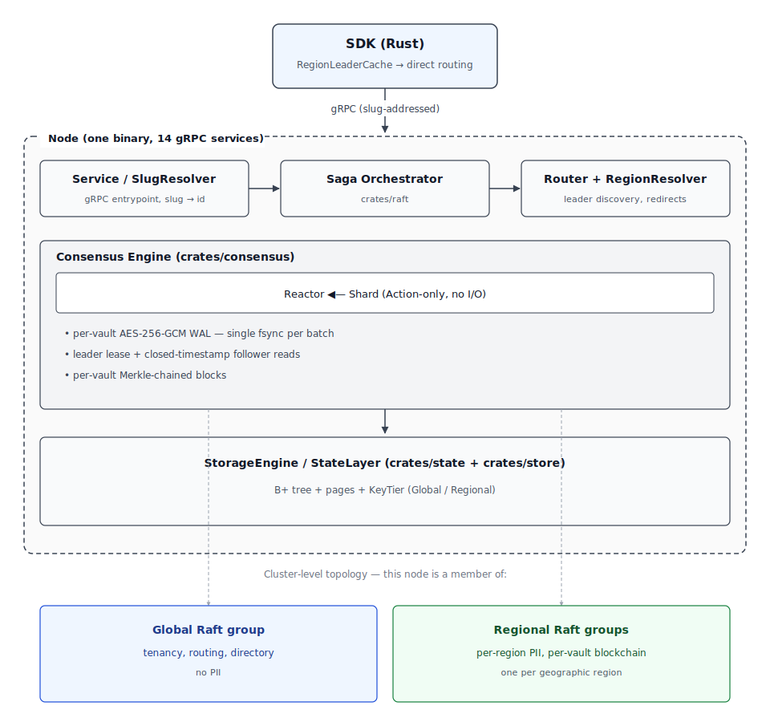

<div align="center">
    <p><a href="https://inferadb.com"></a></p>
    <h1>InferaDB Ledger</h1>
    <p>
        <a href="https://discord.gg/inferadb"></a>
        <a href="#license"></a>
        <a href="https://github.com/inferadb/ledger/actions"></a>
        <a href="https://crates.io/crates/inferadb-ledger-sdk"></a>
        <a href="https://docs.rs/inferadb-ledger-sdk"></a>
    </p>
    <p><b>Blockchain storage for cryptographically verifiable authorization.</b></p>
</div>

> [!IMPORTANT]
> Under active development. Not production-ready.

**[InferaDB](https://inferadb.com) Ledger is a distributed authorization database that produces a cryptographic proof for every permission check.** Every write commits to an append-only per-tenant blockchain; every read returns a Merkle proof clients can verify independently. Use it when "who had access to what, when" must be tamper-proof and provable — compliance, financial-grade authz, audit-logged permission systems.

Under the hood: custom multi-shard Raft consensus, per-vault AES-256-GCM WAL encryption, and sub-millisecond reads from B+ tree indexes. Ledger is the storage layer behind [InferaDB Engine](https://github.com/inferadb/engine) and [InferaDB Control](https://github.com/inferadb/control).

- [Features](#features)
- [Architecture at a glance](#architecture-at-a-glance)
- [Where Ledger fits in InferaDB](#where-ledger-fits-in-inferadb)
- [Quick Start](#quick-start)
- [Configuration](#configuration)
- [Contributing](#contributing)
- [Using AI Assistants](#using-ai-assistants)
- [Documentation](#documentation)
- [Community](#community)
- [License](#license)

## Features

- **Tamper-Proof Authorization History** — Every permission change is committed to a per-vault blockchain with consensus-verified block hashes. Not even database administrators can retroactively alter who had access to what, when.
- **Client-Side Proof Verification** — Clients receive Merkle proofs with every read and can verify authorization decisions independently, without trusting the server. Proofs are pre-computed during apply for near-instant verified reads.
- **Custom Consensus Engine** — Purpose-built multi-shard Raft engine with an event-driven reactor, pipelined replication, zero-copy rkyv serialization, and batched I/O across shards. Single WAL fsync on the consensus critical path.
- **Data Residency** — Pin authorization data to geographic regions. Nodes only join Raft groups for their assigned region, keeping data within jurisdictional boundaries. Automatic region shard creation and membership management.
- **Tenant Isolation** — Per-organization, per-vault security boundaries with per-vault WAL frame encryption (AES-256-GCM). Each vault maintains its own blockchain — one tenant's data can never leak into another's.
- **Immediate Consistency** — Raft consensus ensures permission changes are visible cluster-wide before the write returns. Closed timestamps enable zero-hop follower reads for bounded-staleness queries.
- **Sub-Millisecond Reads** — B+ tree indexes serve lookups without touching the Merkle layer. Leader lease reads at ~50ns, follower closed-timestamp reads at ~100ns.

## Architecture at a glance

<p align="center">
  
</p>

A multi-shard Raft cluster; one Global group owns directory and routing, per-region groups own PII-bearing state. The SDK uses redirect-only routing — cross-region traffic returns `NotLeader` + `LeaderHint` and the SDK reconnects directly. Full detail in [DESIGN.md](DESIGN.md).

## Where Ledger fits in InferaDB

Ledger is the storage component of [InferaDB](https://inferadb.com), a platform for cryptographically verifiable authorization. Most users don't run Ledger directly — they run the higher-level components that sit on top of it:

| Component                                               | What it does                                                                                 |
| ------------------------------------------------------- | -------------------------------------------------------------------------------------------- |
| [InferaDB Engine](https://github.com/inferadb/engine)   | Evaluates authorization decisions; the API surface applications call.                        |
| [InferaDB Control](https://github.com/inferadb/control) | Management plane, admin console, policy authoring.                                           |
| **InferaDB Ledger** (this repo)                         | Storage, consensus, per-tenant blockchain, Merkle proofs — the layer the other two build on. |

Run Ledger directly when you need cryptographic authorization history but want to build your own policy engine or control plane on top. Otherwise, start with the [InferaDB product documentation](https://inferadb.com), which covers the full platform including how Engine and Control use Ledger underneath.

## Quick Start

**Install:**

```bash
# Build from source (requires Rust 1.92+)
cargo +1.92 install --locked --path crates/server

# Or grab a prebuilt binary from Releases
# https://github.com/inferadb/ledger/releases
```

For Kubernetes, Docker Compose, or systemd deployments, see the [deployment guide](docs/how-to/deployment.md).

**Start a node:**

```bash
inferadb-ledger --listen 0.0.0.0:50051 --data /var/lib/ledger
```

**Bootstrap the cluster (once, from any machine):**

```bash
inferadb-ledger init --host node1:50051
```

**Add more nodes:**

```bash
inferadb-ledger \
  --listen 0.0.0.0:50051 \
  --data /var/lib/ledger \
  --join node1:50051
```

Nodes discover each other via `--join` seed addresses. The cluster manages membership automatically — new nodes are added as learners and promoted to voters once caught up. On restart, only `--data` is required; peer addresses are read from persisted Raft membership state.

**Data residency (regulated regions):**

```bash
inferadb-ledger \
  --listen 0.0.0.0:50051 \
  --data /var/lib/ledger \
  --join node1:50051 \
  --region ie-east-dublin
```

See the [deployment guide](docs/how-to/deployment.md) for multi-node setup, Kubernetes, adding/removing nodes, backup, and recovery.

## Configuration

| CLI           | Purpose                                                                                               | Default         |
| ------------- | ----------------------------------------------------------------------------------------------------- | --------------- |
| `--data`      | Persistent [storage](docs/architecture/durability.md) (WAL, state, snapshots)                           | _(ephemeral)_   |
| `--listen`    | TCP address for gRPC API                                                                              | _(none)_        |
| `--socket`    | Unix domain socket path for gRPC API                                                                  | _(none)_        |
| `--join`      | Seed addresses for [cluster discovery](docs/how-to/deployment.md#adding-a-node) (comma-separated) | _(none)_        |
| `--region`    | Geographic data residency [region](docs/how-to/deployment.md)                                     | `global`        |
| `--advertise` | Address advertised to peers ([details](docs/how-to/deployment.md#advertise-address))              | _(auto-detect)_ |

At least one of `--listen` or `--socket` must be specified. On restart, only `--data` is required. All other flags are persisted on first boot and ignored on subsequent starts.

See [Configuration Reference](docs/how-to/deployment.md#configuration-reference) for environment variables and all options including metrics, batching, and tuning.

## Contributing

### Prerequisites

- Rust 1.92+
- [mise](https://mise.jdx.dev/) for synchronized development tooling
- [just](https://github.com/casey/just) for convenient development commands

### Build and Test

```bash
git clone https://github.com/inferadb/ledger.git
cd ledger

# Install development tools
mise trust && mise install

# Build
just build

# Run tests
just test
```

## Using AI Assistants

Claude Code, Codex, and Cursor users: this repository ships rich agent context.

- **[CLAUDE.md](CLAUDE.md)** (symlinked as `AGENTS.md`) — 14 non-negotiable golden rules covering proto codegen, storage keys, PII data residency, error handling, consensus I/O boundaries, and test hygiene.
- **Per-crate `CLAUDE.md`** — each crate's `CLAUDE.md` extends the root rules with crate-specific invariants.
- **Seven audit agents** under `.claude/agents/` fire proactively on matching file changes.
- **Nine task skills** under `.claude/skills/` (`/add-new-entity`, `/add-storage-key`, `/new-rpc`, etc.) encode project-specific workflows.
- **Hooks** in `.claude/settings.json` block unsafe operations (editing generated code, running `git commit` from an agent) and auto-run `cargo fmt` + `cargo check` after edits.

Read [CONTRIBUTING.md → Using AI Assistants](CONTRIBUTING.md#using-ai-assistants) for detail.

## Documentation

**Evaluate:**

- [Technical White Paper](WHITEPAPER.md) — How Ledger works, benchmarks, fit analysis.

**Build with Ledger:**

- [SDK crate docs](https://docs.rs/inferadb-ledger-sdk) — Rust client reference.
- [FAQ](docs/faq.md) — Operational questions and quick answers.

**Operate Ledger:**

- [Deployment guide](docs/how-to/deployment.md) — Multi-node setup, Kubernetes, adding/removing nodes, backup, recovery.
- [Dashboards](docs/dashboards/) — Prometheus + Grafana references.

**Contribute to Ledger:**

- [Technical Design Document](DESIGN.md) — Authoritative specification; explains architectural reasoning.
- [CONTRIBUTING.md](CONTRIBUTING.md) — First-PR guide, conventions, troubleshooting.
- [CLAUDE.md](CLAUDE.md) — Golden rules and agentic guardrails.
- [docs/testing/](docs/testing/) — Fuzz, property, and simulation testing.

## Community

- [Discord](https://discord.gg/inferadb) — questions, discussions, announcements.
- [open@inferadb.com](mailto:open@inferadb.com) — general inquiries.
- [security@inferadb.com](mailto:security@inferadb.com) — responsible disclosure.

## License

Dual-licensed under [MIT](LICENSE-MIT) or [Apache 2.0](LICENSE-APACHE).
