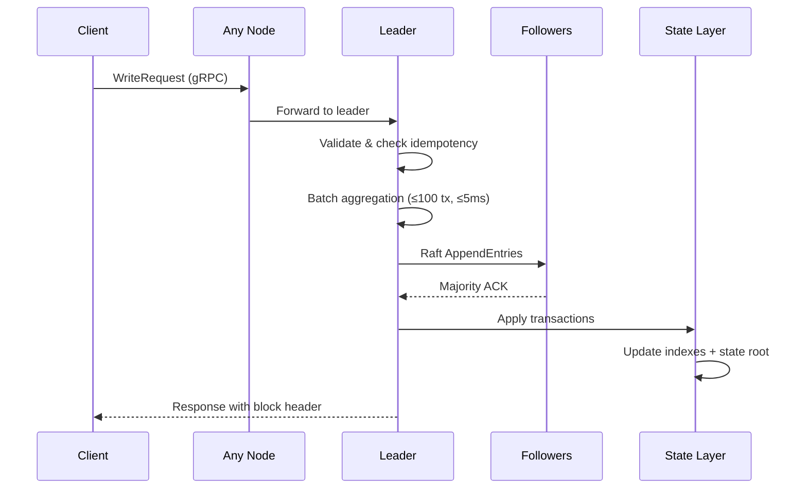
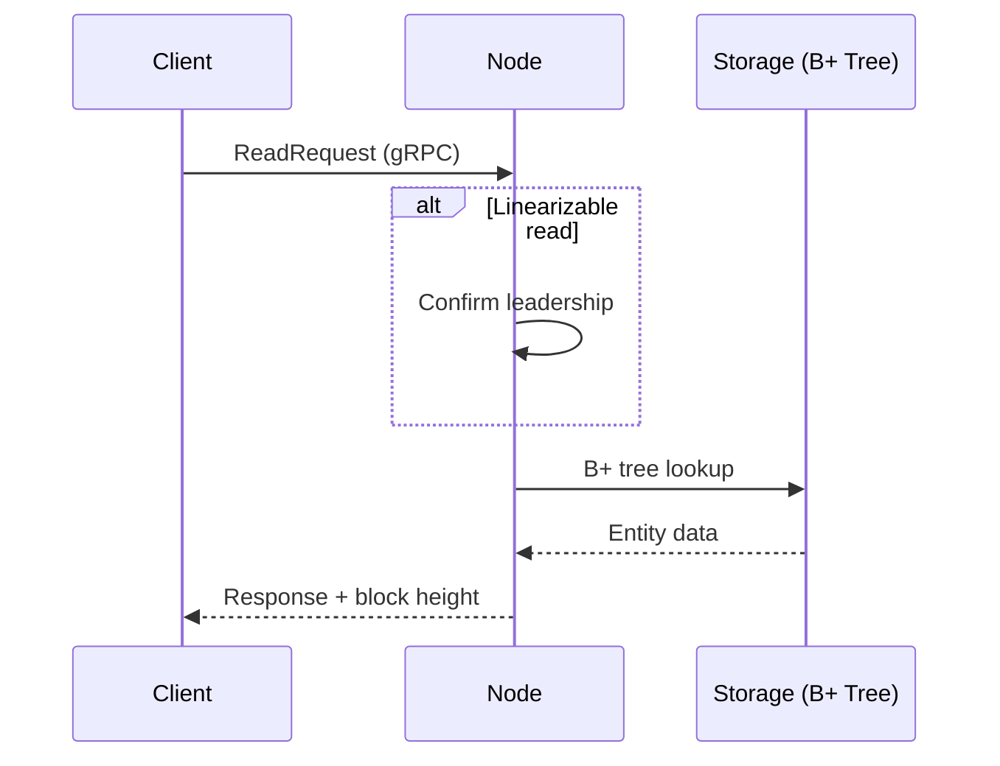
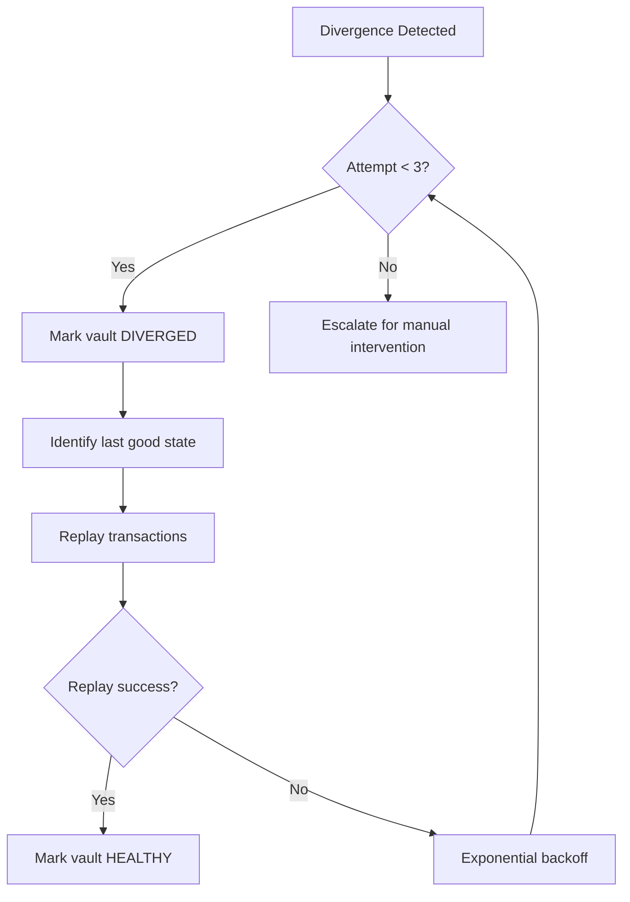

# InferaDB Ledger: A Cryptographically Verifiable Authorization Database

**Last Updated**: April 2026

---

## Executive Summary

Authorization systems face a fundamental tension: they must be fast enough for real-time decisions yet provide audit trails that can withstand legal and security scrutiny. Traditional approaches force a choice between performance and verifiability.

InferaDB Ledger resolves this tension through a hybrid architecture that separates state commitment from state storage. Authorization data lives in high-performance B+ tree indexes optimized for sub-millisecond reads. A parallel cryptographic layer computes state roots using bucket-based merkleization, enabling proof generation without impacting query latency.

**Performance characteristics**:

- **Sub-millisecond read latency** — in-memory B+ tree indexes serve authorization checks on the real-time request path.
- **High write throughput via batching** — consensus proposals aggregate many transactions so a single replication round-trip and WAL fsync amortize across the batch.
- **O(k) state root computation** — incremental bucket-based merkleization where k is the number of keys changed in a block, independent of total database size.
- **Independent verifiability** — every authorization decision can be verified against a tamper-evident chain of blocks signed by the cluster.

Each authorization decision can be independently verified against a tamper-evident chain of blocks signed by the cluster. This paper describes Ledger's architecture, explains the engineering trade-offs, and provides honest assessment of both capabilities and limitations.

### Contents

1. [Introduction](#1-introduction) — The authorization audit gap and Ledger's approach
2. [Background](#2-background) — Data model, consistency, and prior art
3. [Architecture](#3-architecture) — Component layers, isolation model, read/write paths
4. [State Root Computation](#4-state-root-computation) — Bucket-based merkleization and complexity analysis
5. [Fault Isolation and Recovery](#5-fault-isolation-and-recovery) — Per-vault chains and automatic recovery
6. [Data Protection](#6-data-protection) — Envelope encryption, key isolation, and key lifecycle
7. [Performance Characteristics](#7-performance-characteristics) — Benchmarks, latency, and throughput
8. [Limitations and Trade-offs](#8-limitations-and-trade-offs) — Known constraints and design decisions
9. [Comparison with Alternatives](#9-comparison-with-alternatives) — Ledger vs. SpiceDB vs. blockchain
10. [When to Use Ledger](#10-when-to-use-ledger) — Good and poor fit scenarios
11. [Conclusion](#11-conclusion)

---

## 1. Introduction

### The Authorization Audit Gap

Access control failures consistently rank among the most severe security vulnerabilities. The OWASP Top 10 lists Broken Access Control as the number one web application security risk, present in 94% of applications tested [1]. The 2024 Verizon Data Breach Investigations Report finds that credential abuse and privilege misuse account for 38% of breaches involving internal actors [2].

When breaches occur, organizations need to answer critical questions: Who had access to what? When did permissions change? Was this access legitimate at the time it was granted?

Traditional authorization systems struggle to provide definitive answers. Audit logs can be modified, timestamps can be forged, and reconstructing historical state requires trusting the system that may have been compromised.

### The Performance-Verifiability Trade-off

Cryptographic verification typically imposes performance costs. Merkle Patricia Tries (MPTs), used by Ethereum and many blockchain systems, require O(log n) operations per key access [3]. Each state update triggers multiple tree rebalances and hash recomputations.

For authorization systems handling thousands of permission checks per second, this overhead is prohibitive. A single request to a microservices application might trigger dozens of authorization checks. Adding 10-50ms of latency per check would degrade user experience unacceptably.

### Ledger's Approach

InferaDB Ledger takes a different path. Rather than embedding cryptographic structures in the hot path, it separates concerns:

1. **State storage** uses conventional high-performance data structures optimized for read latency
2. **State commitment** runs in parallel, computing cryptographic proofs without blocking queries
3. **Verification** happens on-demand, typically during audits or incident response

This separation enables sub-microsecond authorization checks during normal operation while maintaining a complete cryptographic history for when it matters most.

---

## 2. Background

> **For decision-makers**: This section explains the data model and consistency requirements. Skip to Section 3 for architecture details or Section 7 for performance benchmarks.

### Authorization Data Model

Ledger follows the relationship-based access control model pioneered by Google's Zanzibar system [4]. Authorization state consists of tuples:

```text
(resource, relation, subject)
```

For example: `(document:budget-2024, viewer, user:alice)` grants Alice viewer access to the budget document.

This model supports:

- **Direct relationships**: Explicit grants between resources and subjects
- **Computed relationships**: Permissions derived from other relationships (e.g., editors are also viewers)
- **Hierarchical resources**: Permissions that flow through containment (e.g., folder access implies document access)

### Consistency Requirements

Authorization decisions must be consistent across the cluster. A permission granted on one node must be visible to all nodes before any node can act on it. Stale reads could allow access that should have been revoked.

Ledger uses Raft consensus to ensure linearizable writes [5]—a strong consistency guarantee where all nodes see permission changes in the same order, preventing race conditions where access might be granted using stale data. All mutations flow through a single leader, are replicated to a majority of nodes, and only then become visible to readers. This provides strong consistency at the cost of write throughput.

### Prior Art

**Google Zanzibar** [4] introduced relationship-based access control at scale, handling millions of authorization checks per second. However, Zanzibar optimizes for availability over verifiability—it does not provide cryptographic proofs of state.

**SpiceDB and OpenFGA** are open-source implementations of the Zanzibar model [6][7]. They provide excellent authorization semantics but inherit the same limitation: audit logs without cryptographic guarantees.

**Blockchain databases** like BigchainDB and Hyperledger Fabric provide cryptographic verification but impose significant performance overhead [8]. They are designed for scenarios where verification happens on every read, not just during audits.

---

## 3. Architecture

> **For decision-makers**: Ledger uses a layered architecture with gRPC APIs, Raft consensus for durability, and a custom B+ tree storage engine. The key insight is separating fast reads from cryptographic commitment.

### Component Overview

Ledger consists of five primary layers:

```text
┌─────────────────────────────────────────────────────────────┐
│                      gRPC Services                          │
│  Read | Write | Organization | Vault | Admin | User         │
│  Invitation | App | Token | Events | Health | Discovery    │
│  Raft  (Schema is proto-defined; not yet implemented)       │
├─────────────────────────────────────────────────────────────┤
│                    Consensus Layer                          │
│   Custom Multi-Shard Raft Engine                            │
│   Event-driven Reactor · Segmented WAL · Leader lease       │
├─────────────────────────────────────────────────────────────┤
│                 Raft Operationalization                     │
│   ApplyPool/ApplyWorker · Batching · Saga Orchestrator      │
│   Background Jobs · Leader Transfer                         │
├─────────────────────────────────────────────────────────────┤
│                     State Layer                             │
│     Entity Store | Relationship Store | State Roots         │
├─────────────────────────────────────────────────────────────┤
│                    Storage Layer                            │
│           B+ Tree Engine | Page Management                  │
└─────────────────────────────────────────────────────────────┘
```

**gRPC Services** expose the public API. Fourteen services are defined in protobuf; thirteen have server-side implementations. They cover authorization operations (ReadService, WriteService), entity management (OrganizationService, VaultService, UserService, AppService), invitations (InvitationService), authentication token issuance (TokenService), administration (AdminService), observability (EventsService, HealthService), and cluster coordination (SystemDiscoveryService, RaftService). SchemaService is proto-defined as a placeholder for future schema-registry functionality.

**Consensus Layer** is a purpose-built multi-shard Raft engine (`inferadb-ledger-consensus`). It is designed around a determinism boundary: the engine is a single-task event-driven `Reactor` that takes events and returns `Action`s rather than performing I/O directly, which makes it simulation-testable. Non-determinism (time, randomness, disk, network) is injected through trait abstractions, and the crate ships a simulation harness that replays Raft invariants with seeded RNG and virtual time. Core components include `Shard` (single Raft instance), `Reactor` (event loop across shards), `WalBackend` (pluggable WAL trait with segmented, encrypted, in-memory, and io_uring backends — the production backend writes per-vault AES-256-GCM-encrypted segments), `LeaderLease` (leader-lease read optimization), and `ClosedTimestampTracker` (bounded-staleness reads). All writes are proposed to the leader, replicated to followers, and committed only after majority acknowledgment.

**Raft Operationalization** (`inferadb-ledger-raft`) wraps the consensus engine with the app-layer concerns that don't belong in the engine itself: apply-phase parallelism via `ApplyPool`/`ApplyWorker` (per-shard state-machine apply), a batching layer that aggregates multiple client requests into single Raft proposals, the `SagaOrchestrator` for cross-region distributed transactions, graceful shutdown with leader transfer, rate limiting, hot-key detection, and ~20 background jobs (compaction, retention, token maintenance, events GC, etc.).

**State Layer** maintains the domain model. Entities store key-value data with versioning and TTL support. Relationships store authorization tuples. The StateLayer applies blocks and computes state roots.

**Storage Layer** provides durable persistence via a custom B+ tree implementation with page-level management. Backend-agnostic design supports both file-based production storage and in-memory testing.

### Isolation Model

Ledger isolates tenants through a three-level hierarchy designed for data residency, governance, and regulatory compliance:

- **Region**: Geographic zone mapped 1:1 to a Raft consensus group. Each organization declares a region at creation, binding its data to a specific geographic jurisdiction. Protected regions (e.g., EU, China) replicate only to in-region nodes, enforcing data residency laws such as GDPR and China's PIPL. Non-protected regions replicate to all cluster nodes for maximum availability.
- **Organization**: Logical tenant within a region. Multiple organizations share a region's Raft group and underlying storage, with data isolation enforced through B-tree key prefixes. Cross-organization operations are prohibited at the API layer.
- **Vault**: Container for related authorization data within an organization. Each vault maintains its own blockchain with independent state roots, block heights, and hash chains.

This isolation model enables:

1. **Data residency compliance**: Organizations declare jurisdictional regions, ensuring authorization data never leaves the required geographic boundary—critical for GDPR, HIPAA, and sovereignty requirements
2. **Fault containment**: A bug affecting one vault cannot corrupt another vault's state, even within the same organization
3. **Independent verification**: Auditors can verify a single vault without accessing other tenants' data, enabling per-customer compliance attestation
4. **Flexible governance**: Different organizations can operate under different regulatory regimes by selecting appropriate regions

### Write Path

A write request follows this path:


```mermaid
sequenceDiagram
    participant C as Client
    participant N as Any Node
    participant L as Leader
    participant F as Followers
    participant S as State Layer

    C->>N: WriteRequest (gRPC)
    N->>L: Forward to leader
    L->>L: Validate & check idempotency
    L->>L: Batch aggregation (≤100 tx, ≤5ms)
    L->>F: Raft AppendEntries
    F-->>L: Majority ACK
    L->>S: Apply transactions
    S->>S: Update indexes + state root
    L-->>C: Response with block header
```

1. Client sends WriteRequest to any node via gRPC
2. Non-leader nodes forward to current leader
3. Leader validates request and checks idempotency key for duplicate detection
4. Batcher aggregates request with others (up to 100 transactions or 5ms timeout)
5. Batch becomes a Raft proposal
6. Leader replicates proposal to followers
7. Majority acknowledgment commits the proposal
8. State layer applies transactions, updating indexes and computing new state root
9. Response returns to client with block header containing the new state root hash

**Write latency**: end-to-end latency with Raft consensus targets sub-50ms at p99, dominated by the replication round-trip. Per-operation storage-layer work is a small fraction of that budget thanks to batch amortization.

### Read Path

Read requests take a simpler path:


```mermaid
sequenceDiagram
    participant C as Client
    participant N as Node
    participant S as Storage (B+ Tree)

    C->>N: ReadRequest (gRPC)
    alt Linearizable read
        N->>N: Confirm leadership
    end
    N->>S: B+ tree lookup
    S-->>N: Entity data
    N-->>C: Response + block height
```

1. Client sends ReadRequest to any node
2. For linearizable reads: node confirms leadership or forwards to leader
3. For eventually consistent reads: node serves directly from local state
4. Storage layer retrieves data from B+ tree indexes
5. Response includes entity value and current block height; state roots are available via block headers on write responses and the GetTip RPC for on-demand verification

**Read latency**: reads serve directly from in-memory B+ tree indexes with sub-millisecond latency (see Section 7).

---

## 4. State Root Computation

> **For decision-makers**: Ledger uses a bucket-based approach that computes cryptographic commitments in O(k) time where k is the number of changed keys—independent of total database size. This enables cryptographic proofs without the performance penalty of traditional Merkle trees.

### The Challenge

Traditional Merkle Patricia Tries recompute hashes from leaf to root on every update. For a tree with n keys, each update requires O(log n) hash computations [3]. Worse, tree rebalancing can trigger cascading updates affecting many nodes.

At scale, this becomes prohibitive. A vault with millions of relationships would spend more time maintaining the Merkle tree than serving authorization requests.

### Bucket-Based Approach

Ledger uses a bucket-based merkleization scheme inspired by research on efficient state commitments [10][11]. Instead of a per-key tree structure, keys are distributed across 256 buckets using `seahash(key) % 256`. Seahash provides fast, deterministic distribution with minimal collision bias across the bucket space.

Each bucket maintains:

- A sorted list of (key, value) pairs
- A running hash updated incrementally as pairs change
- Metadata for efficient proof generation

The state root is computed as:

```text
state_root = SHA-256(bucket_hash[0] || bucket_hash[1] || ... || bucket_hash[255])
```

### Complexity Analysis

When a block contains k key updates:

1. Identify affected buckets: O(k)
2. Update bucket hashes: O(k) hash operations
3. Recompute state root: O(256) = O(1) hash operations

Total: **O(k)** where k is the number of modified keys, independent of total database size.

Compare to naive MPT: O(k × log n) where n is total keys.

**Complexity validation**: State root computation time is constant regardless of database size — benchmark runs across databases differing by orders of magnitude in entity count produce materially identical state-root latencies, confirming O(k) scaling in the number of _changed_ keys rather than total keys.

### Write Amplification

Ledger minimizes write amplification by separating storage writes from cryptographic computation. Each key update requires:

1. Write to entity/relationship store (the only durable write per key)
2. Bucket hashes recomputed on-demand from entity data (not persisted separately)
3. Block metadata written once per block (amortized across all keys in the batch)

Total: **~1 durable write per key update**, with bucket hashing computed post-hoc during state root derivation.

A naive MPT implementation updating internal nodes would require approximately 15-45 writes per update depending on tree depth and rebalancing [12].

### Trade-offs

The bucket approach sacrifices proof size for computation efficiency. Proving a single key's inclusion requires:

1. The key's bucket contents
2. All 255 other bucket hashes
3. The state root

For sparse proofs, this is larger than an MPT proof of O(log n) hashes. However, for audit scenarios that verify entire vault state rather than individual keys, the trade-off favors bucket-based approaches.

---

## 5. Fault Isolation and Recovery

### Per-Vault Chains

Each vault maintains an independent blockchain. A vault's chain contains:

- **Block headers**: Height, timestamp, previous hash, state root, transactions root
- **Transaction log**: All mutations applied to this vault
- **State snapshots**: Periodic checkpoints for efficient recovery

Independence means a corrupted vault does not affect siblings. If vault A experiences a Byzantine failure (hardware corruption, software bug), vault B continues operating normally.

### Automatic Recovery

When Ledger detects state divergence—for example, a follower computing a different state root than the leader—it initiates automatic recovery:


```mermaid
flowchart TD
    A[Divergence Detected] --> B{Attempt < 3?}
    B -->|Yes| C[Mark vault DIVERGED]
    C --> D[Identify last good state]
    D --> E[Replay transactions]
    E --> F{Replay success?}
    F -->|Yes| G[Mark vault HEALTHY]
    F -->|No| H[Exponential backoff]
    H --> B
    B -->|No| I[Escalate for manual intervention]
```

1. Mark affected vault as `DIVERGED` (blocks new writes)
2. Identify last known-good state root
3. Replay transactions from that point
4. If replay succeeds, mark vault as `HEALTHY`
5. If replay fails, escalate for manual intervention

The recovery process uses a circuit breaker pattern: 3 attempts with exponential backoff (5s, 10s, 20s) before escalating.

### Consistency Verification

All nodes—leader and followers alike—compute state roots deterministically when applying blocks. This deterministic computation provides the foundation for detecting divergence:

1. Apply block received from leader
2. Compute local state root from the applied state
3. State roots are included in block headers, enabling external and cross-node comparison
4. If divergence is detected (e.g., through operational monitoring or snapshot comparison), the automatic recovery process described above is triggered

This architecture catches non-determinism bugs (timestamp dependencies, floating-point, hash iteration order) by ensuring all nodes produce identical state roots for identical transaction sequences.

---

## 6. Data Protection

> **For decision-makers**: Ledger encrypts all data at rest using per-region envelope encryption. Encryption keys never travel via the consensus protocol. Destroying a region's master key renders all its data cryptographically unrecoverable—enabling GDPR-compliant crypto-shredding without rewriting the blockchain.

### Trust Model

Ledger operates within a trusted network boundary. Access control relies on network-level isolation: WireGuard tunnels, VPC peering, or Kubernetes NetworkPolicy.

There is no application-layer authentication. Ledger **is** the authorization store—authenticating callers against itself creates a circular dependency. The sub-millisecond read path leaves no room for per-request credential verification. Optional mutual TLS via service mesh provides defense-in-depth without adding application overhead.

Ledger does provide a TokenService that issues JWTs for upstream services (Control and Engine) to authenticate their end users. This is token issuance, not authentication of Ledger's own API—requests to Ledger itself remain unauthenticated at the application layer.

### Envelope Encryption

Each page is encrypted with a unique random 256-bit Data Encryption Key (DEK). The DEK encrypts the page body using AES-256-GCM [15] with a random 12-byte nonce and the 16-byte page header as additional authenticated data (AAD). Authenticating the header prevents an attacker from swapping headers between pages without detection.

The DEK itself is wrapped with the Region Master Key (RMK) using AES-KWP [14]. AES-KWP is a nonce-free key-wrapping algorithm, eliminating an entire class of nonce-reuse vulnerabilities at the wrapping layer.

Per-page crypto metadata is stored in a 72-byte sidecar entry alongside each page:

```text
┌──────────────────────────────────────────────────────────────────────┐
│                     Crypto Metadata (72 bytes)                       │
├──────────────┬───────────────┬──────────────┬────────────────────────┤
│ rmk_version  │  wrapped_dek  │    nonce     │       auth_tag         │
│   (4 bytes)  │  (40 bytes)   │  (12 bytes)  │      (16 bytes)        │
└──────────────┴───────────────┴──────────────┴────────────────────────┘
```

The encryption flow:

```text
┌─────────────────┐                           ┌─────────────────┐
│   Page Write     │                           │   Page Read      │
├─────────────────┤                           ├─────────────────┤
│ 1. Generate DEK  │                           │ 1. Load sidecar  │
│ 2. Encrypt body  │──── AES-256-GCM ────      │ 2. DEK cache hit?│
│    (header=AAD)  │                           │    ├─ Yes: use   │
│ 3. Wrap DEK      │──── AES-KWP ───────      │    └─ No: unwrap │
│    with RMK      │                           │       with RMK   │
│ 4. Store sidecar │                           │ 3. Decrypt body  │
│ 5. Write cipher  │                           │ 4. Cache DEK     │
└─────────────────┘                           └─────────────────┘
```

A two-tier cache minimizes crypto overhead on reads. The DEK cache (LRU, keyed by wrapped DEK bytes) avoids repeated AES-KWP unwrap operations. The RMK cache maps version numbers to loaded master keys, typically holding 1–2 entries. Cache misses fall through to the key manager backend.

### Per-Region Key Isolation

Each region has its own RMK with independent versioning. Protected regions (EU, China) ensure RMKs only exist on in-region nodes—key material never leaves the geographic boundary, satisfying GDPR and PIPL requirements at the cryptographic layer rather than relying solely on replication policy.

**Crypto-shredding**: Destroying a region's RMK makes all data in that region cryptographically unrecoverable. This satisfies GDPR Article 17 (right to erasure) [16] without rewriting any on-chain history. The blockchain remains intact but becomes opaque ciphertext, indistinguishable from random data.

Key asymmetry governs replication: non-protected region data replicates to all cluster nodes for availability, while protected region data and keys remain strictly in-region.

### Key Lifecycle

RMK versions progress through three states: **Active** → **Deprecated** → **Decommissioned**. Active versions encrypt new writes (highest version wins during brief multi-version overlap). Deprecated versions remain loadable for reading existing data but do not encrypt new pages. Decommissioned versions are permanently unloadable—all data must have been re-wrapped to a newer version first.

Multiple versions coexist at runtime for seamless rotation. A background DEK re-wrapping job updates sidecar metadata to reference the new RMK version without touching encrypted page bodies—a metadata-only operation that preserves ciphertext integrity. The job runs on the leader, processes pages in configurable batches, and is resumable across restarts.

Three key backends support different deployment contexts:

| Backend               | Use Case          | Key Source                          |
| --------------------- | ----------------- | ----------------------------------- |
| Secrets manager       | Production        | Infisical, Vault, AWS/GCP/Azure KMS |
| Environment variables | Staging / CI      | `LEDGER_RMK_{REGION}_V{VERSION}`    |
| File-based            | Local development | `{key_dir}/{region}/v{version}.key` |

Nodes validate all required RMK versions at startup before joining consensus, preventing a node from accepting reads it cannot decrypt.

---

## 7. Performance Characteristics

> **For decision-makers**: Ledger is designed for real-time authorization workloads. Reads serve from in-memory B+ tree indexes and complete well within the millisecond budget typical of request paths. Writes batch at the leader so consensus overhead amortizes across many transactions. State root computation is incremental — work scales with the number of keys changed in a block, not with database size.

### Read Path

Read requests traverse the B+ tree index directly. No cryptographic work sits on the read path — state roots are computed as writes apply, not as reads serve. Leader reads short-circuit when the leader lease is valid (avoiding a replication round-trip); follower reads use `ReadIndex` for linearizability, or local state for bounded-staleness reads via the closed-timestamp tracker. Per-key lookup is O(log n) on the B+ tree and the entire hot path stays in memory under normal operation.

### Write Path

Writes batch at the leader before becoming Raft proposals. A single batch amortizes consensus overhead across many transactions: one replication round-trip, one WAL barrier fsync, and one applied state transition per batch rather than per transaction. Default batch parameters cap each batch at 100 transactions or 5 milliseconds (whichever arrives first); operators can tune these via the runtime configuration surface (`UpdateConfig` RPC).

The storage layer keeps the per-transaction cost within the batch small: entity writes hit the B+ tree in memory and reach disk via the batched fsync. Per-key durable write cost is approximately one — the entity/relationship record itself — with bucket hashes computed on demand during state root derivation rather than persisted separately.

### State Root Computation

Bucket-based merkleization (Section 4) recomputes only the buckets touched by a block. Cost is O(k) where k is the number of keys changed — independent of total database size. This keeps state-root work constant as the database grows, which is the property that makes cryptographic commitment practical at scale.

### Encryption Overhead

When encryption at rest is enabled, writes incur one AES-256-GCM encryption and one AES-KWP key wrap per page. Reads hit the DEK cache on most requests, reducing encryption overhead to a single AES-256-GCM decryption. The overhead is small relative to the consensus round-trip on writes and stays well within the millisecond budget on reads.

### Reproducing Benchmarks

The workload drivers in `crates/profile/` and the stress harnesses under `crates/server/tests/` are designed for reproducible benchmarking on your own hardware. Specific numbers depend on CPU, memory, disk class, network topology, workload shape, and configuration — run them against your target deployment rather than relying on any published figure.

### Idempotency

Clients include a `client_id` and a 16-byte `idempotency_key` (UUID) with each write request. The leader maintains an in-memory cache of recently processed requests, keyed by the combination of organization, vault, client ID, idempotency key, and request payload hash. Duplicate requests return the cached response without re-execution. The server assigns a monotonically increasing sequence number to each committed write, returned in the response for ordering guarantees.

This enables safe client retries on timeout without risking duplicate mutations. The cache evicts entries after a configurable TTL (default: 24 hours).

---

## 8. Limitations and Trade-offs

### No Byzantine Fault Tolerance

Ledger uses Raft, a crash fault-tolerant consensus protocol [5]. It tolerates (n-1)/2 node failures in a cluster of n nodes. It does **not** tolerate Byzantine (malicious or arbitrary) failures.

If a node is compromised and sends incorrect data, other nodes may accept it. Ledger detects this through state root verification but cannot prevent a Byzantine leader from proposing invalid blocks.

For environments requiring Byzantine fault tolerance, consider Tendermint-based systems or PBFT variants [13]. These provide stronger guarantees at significant performance cost (typically 3x latency).

### Single-Leader Write Bottleneck

All writes flow through the Raft leader within a region. This provides strong consistency but limits write scalability per region. Horizontal scaling is achieved through multi-region deployment, where each region operates an independent Raft consensus group with its own leader.

Read scaling is more flexible: any node can serve eventually consistent reads, and linearizable reads only require a leadership check.

### No Cross-Vault Transactions

Transactions are scoped to a single vault. Operations spanning multiple vaults require application-level coordination (saga pattern, two-phase commit).

This limitation enables the per-vault isolation that makes independent verification and fault containment possible.

### No Range Proofs

The bucket-based state root design optimizes for point queries and full-vault verification. It does not efficiently support range proofs (e.g., prove all keys between A and B).

Applications requiring range proofs should consider augmenting Ledger with a separate range-proof structure or using traditional MPT-based systems.

### Eventual Consistency Window

Eventually consistent reads may return stale data during the Raft replication window (typically milliseconds). Applications requiring strict consistency must use linearizable reads, which add latency.

### No Application-Layer Authentication

Ledger trusts all inbound connections within the network boundary. Callers are responsible for authenticating end users before querying Ledger. The `actor` field in transactions is a claim provided by the caller, not a cryptographically verified identity. This design avoids the circular dependency of Ledger authenticating against itself, but means network-level access control is the sole enforcement boundary. Note that while Ledger issues JWTs via TokenService for upstream consumption, it does not authenticate its own inbound API calls.

### Idempotency Tiered Architecture

Idempotency deduplication uses a two-tier design. Tier 1 is a Moka TinyLFU in-memory cache providing fast-path deduplication on the current leader; this cache is lost during leader failover. Tier 2 is the ClientSequences B+ tree table, which stores persistent `ClientSequenceEntry` records replicated through Raft. Because Tier 2 survives failover, a retried request after leader election is still deduplicated as long as it falls within the 24-hour TTL window.

The practical limitation is that deduplication keys older than 24 hours are evicted from the persistent table. Clients retrying operations beyond this window should use application-level idempotency keys stored in the vault itself.

---

## 9. Comparison with Alternatives

| Capability           | Ledger              | SpiceDB               | Traditional Blockchain |
| -------------------- | ------------------- | --------------------- | ---------------------- |
| Authorization model  | Zanzibar-style      | Zanzibar-style        | Generic                |
| Cryptographic proofs | Yes                 | No                    | Yes                    |
| Read latency         | Sub-millisecond     | Single-digit ms       | Tens to hundreds of ms |
| Write throughput     | High (batched)      | High                  | Low                    |
| Fault tolerance      | Crash               | Crash                 | Byzantine              |
| State verification   | Per-vault           | N/A                   | Global                 |
| Encryption at rest   | Per-region envelope | Disk-level (external) | Per-block              |

**Choose Ledger when**: You need cryptographic verification of authorization state without blockchain-level latency, and crash fault tolerance is sufficient.

**Choose SpiceDB/OpenFGA when**: You need maximum write throughput and don't require cryptographic proofs. Audit logs suffice for compliance.

**Choose traditional blockchain when**: You need Byzantine fault tolerance and can accept higher latency. Multi-party trust scenarios where no single operator is trusted.

---

## 10. When to Use Ledger

### Good Fit

- **Regulatory compliance**: SOC 2, HIPAA, PCI-DSS require tamper-evident audit trails
- **Data residency requirements**: GDPR, PIPL, and sovereignty laws requiring authorization data to stay within geographic boundaries—Ledger's region-based isolation enforces this at the consensus layer
- **Security-critical applications**: Financial services, healthcare, government
- **Post-breach forensics**: Prove historical access state during incident response
- **Multi-tenant SaaS**: Independent verification per customer without exposing other tenants

### Not a Good Fit

- **Write-heavy workloads** that exceed a single region's sustained write capacity — horizontal write scaling is achieved through multi-region deployment with per-region leaders
- **Byzantine threat model**: Use Tendermint or PBFT if operators are untrusted
- **Range queries over proofs**: Traditional MPT better for range proofs
- **Simple audit logging**: If cryptographic proofs aren't required, SpiceDB is simpler

---

## 11. Conclusion

InferaDB Ledger addresses the gap between high-performance authorization and cryptographic verifiability. By separating state storage from state commitment, it achieves authorization latency competitive with non-verifiable systems while maintaining tamper-evident audit trails.

The bucket-based state root computation reduces hash operations from O(k × log n) to O(k), making cryptographic commitment practical at scale. Benchmark runs confirm the claim: state root computation time stays flat across databases that differ by orders of magnitude in entity count.

Real-time authorization workloads see sub-millisecond read latencies from the in-memory B+ tree index, while consensus batching amortizes the Raft round-trip across many writes. Per-vault isolation enables independent verification and fault containment.

These benefits come with trade-offs: no Byzantine fault tolerance, single-leader write bottleneck, and no cross-vault transactions. Organizations should evaluate whether these limitations are acceptable for their threat model and operational requirements.

For authorization scenarios requiring both performance and verifiability—regulatory compliance, security-critical applications, or environments where audit integrity matters—Ledger provides a practical middle ground between traditional databases and full blockchain systems.

To get started, see the [documentation](https://docs.inferadb.com), explore the [source code](https://github.com/inferadb/ledger), or join the [community on Discord](https://discord.gg/inferadb).

---

## References

[1] OWASP Foundation. "OWASP Top 10:2021 - A01 Broken Access Control." https://owasp.org/Top10/A01_2021-Broken_Access_Control/

[2] Verizon. "2024 Data Breach Investigations Report." https://www.verizon.com/business/resources/reports/dbir/

[3] Wood, G. "Ethereum: A Secure Decentralised Generalised Transaction Ledger." Ethereum Project Yellow Paper, 2014.

[4] Pang, R., et al. "Zanzibar: Google's Consistent, Global Authorization System." USENIX ATC 2019.

[5] Ongaro, D. and Ousterhout, J. "In Search of an Understandable Consensus Algorithm." USENIX ATC 2014.

[6] AuthZed. "SpiceDB: Open Source Fine-Grained Permissions Database." https://authzed.com/spicedb

[7] OpenFGA. "OpenFGA: High-Performance Authorization System." https://openfga.dev/

[8] Hyperledger Foundation. "Hyperledger Fabric: Enterprise-Grade Permissioned Distributed Ledger." https://www.hyperledger.org/projects/fabric

[9] DatafuseLabs. "OpenRaft: Advanced Raft Consensus in Async Rust." https://github.com/datafuselabs/openraft (Historical inspiration; Ledger's consensus layer is a purpose-built multi-shard engine in `crates/consensus/`, not an openraft dependency.)

[10] Shomroni, I., et al. "QMDB: Quick Merkle Database for Blockchain State Storage." arXiv:2501.05262, 2025.

[11] Sei Labs. "SeiDB: Optimistic State Commitment for High-Performance Blockchains." https://blog.sei.io/seidb/

[12] Pappalardo, G. and Ferretti, S. "Distributed Ledger Technologies: State of the Art, Challenges, and Beyond." IEEE Access, 2022.

[13] Buchman, E., Kwon, J., and Milosevic, Z. "The Latest Gossip on BFT Consensus." arXiv:1807.04938, 2018.

[14] Housley, R. and Dworkin, M. "Advanced Encryption Standard (AES) Key Wrap with Padding Algorithm." RFC 5649, IETF, 2009.

[15] Dworkin, M. "Recommendation for Block Cipher Modes of Operation: Galois/Counter Mode (GCM) and GMAC." NIST Special Publication 800-38D, 2007.

[16] European Parliament and Council. "Regulation (EU) 2016/679 (General Data Protection Regulation), Article 17: Right to Erasure." Official Journal of the European Union, 2016.
