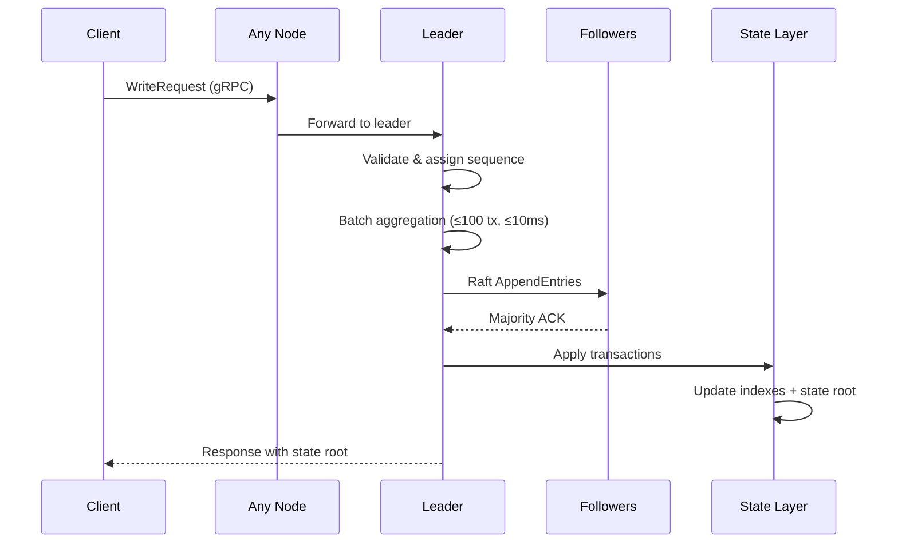
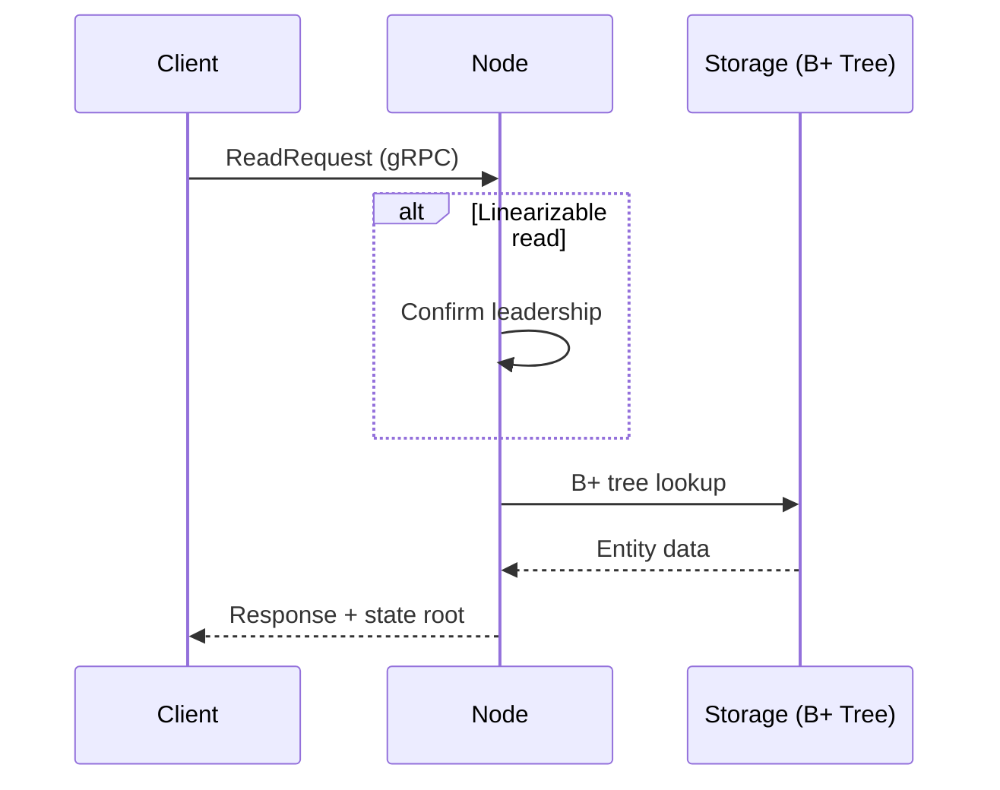
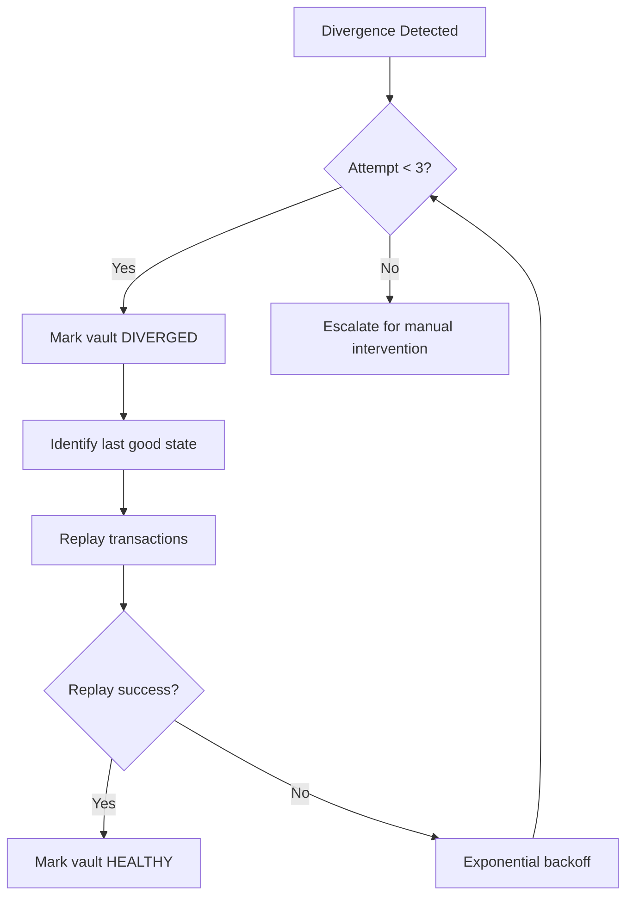

# InferaDB Ledger: A Cryptographically Verifiable Authorization Database

**Last Updated**: January 2026

---

## Executive Summary

Authorization systems face a fundamental tension: they must be fast enough for real-time decisions yet provide audit trails that can withstand legal and security scrutiny. Traditional approaches force a choice between performance and verifiability.

InferaDB Ledger resolves this tension through a hybrid architecture that separates state commitment from state storage. Authorization data lives in high-performance B+ tree indexes optimized for sub-millisecond reads. A parallel cryptographic layer computes state roots using bucket-based merkleization, enabling proof generation without impacting query latency.

**Measured performance** (Apple M3, single node):

| Metric                 | Measured         | Target         |
| ---------------------- | ---------------- | -------------- |
| Read latency (p99)     | **2.8 µs**       | < 2 ms         |
| Read throughput        | **952K ops/sec** | > 100K ops/sec |
| Write throughput       | **11K ops/sec**  | > 5K ops/sec   |
| State root computation | **14.3 µs**      | O(k)           |

Each authorization decision can be independently verified against a tamper-evident chain of blocks signed by the cluster. This paper describes Ledger's architecture, explains the engineering trade-offs, and provides honest assessment of both capabilities and limitations.

---

## 1. Introduction

### The Authorization Audit Gap

Access control failures consistently rank among the most severe security vulnerabilities. The OWASP Top 10 lists Broken Access Control as the number one web application security risk, present in 94% of applications tested [1]. The 2024 Verizon Data Breach Investigations Report finds that credential abuse and privilege misuse account for 38% of breaches involving internal actors [2].

When breaches occur, organizations need to answer critical questions: Who had access to what? When did permissions change? Was this access legitimate at the time it was granted?

Traditional authorization systems struggle to provide definitive answers. Audit logs can be modified, timestamps can be forged, and reconstructing historical state requires trusting the system that may have been compromised.

### The Performance-Verifiability Trade-off

Cryptographic verification typically imposes performance costs. Merkle Patricia Tries (MPTs), used by Ethereum and many blockchain systems, require O(log n) operations per key access [3]. Each state update triggers multiple tree rebalances and hash recomputations.

For authorization systems handling thousands of permission checks per second, this overhead is prohibitive. A single request to a microservices application might trigger dozens of authorization checks. Adding 10-50ms of latency per check would degrade user experience unacceptably.

### Ledger's Approach

InferaDB Ledger takes a different path. Rather than embedding cryptographic structures in the hot path, it separates concerns:

1. **State storage** uses conventional high-performance data structures optimized for read latency
2. **State commitment** runs in parallel, computing cryptographic proofs without blocking queries
3. **Verification** happens on-demand, typically during audits or incident response

This separation enables sub-microsecond authorization checks during normal operation while maintaining a complete cryptographic history for when it matters most.

---

## 2. Background

> **For decision-makers**: This section explains the data model and consistency requirements. Skip to Section 3 for architecture details or Section 6 for performance benchmarks.

### Authorization Data Model

Ledger follows the relationship-based access control model pioneered by Google's Zanzibar system [4]. Authorization state consists of tuples:

```
(resource, relation, subject)
```

For example: `(document:budget-2024, viewer, user:alice)` grants Alice viewer access to the budget document.

This model supports:

- **Direct relationships**: Explicit grants between resources and subjects
- **Computed relationships**: Permissions derived from other relationships (e.g., editors are also viewers)
- **Hierarchical resources**: Permissions that flow through containment (e.g., folder access implies document access)

### Consistency Requirements

Authorization decisions must be consistent across the cluster. A permission granted on one node must be visible to all nodes before any node can act on it. Stale reads could allow access that should have been revoked.

Ledger uses Raft consensus to ensure linearizable writes [5]—a strong consistency guarantee where all nodes see permission changes in the same order, preventing race conditions where access might be granted using stale data. All mutations flow through a single leader, are replicated to a majority of nodes, and only then become visible to readers. This provides strong consistency at the cost of write throughput.

### Prior Art

**Google Zanzibar** [4] introduced relationship-based access control at scale, handling millions of authorization checks per second. However, Zanzibar optimizes for availability over verifiability—it does not provide cryptographic proofs of state.

**SpiceDB and OpenFGA** are open-source implementations of the Zanzibar model [6][7]. They provide excellent authorization semantics but inherit the same limitation: audit logs without cryptographic guarantees.

**Blockchain databases** like BigchainDB and Hyperledger Fabric provide cryptographic verification but impose significant performance overhead [8]. They are designed for scenarios where verification happens on every read, not just during audits.

---

## 3. Architecture

> **For decision-makers**: Ledger uses a layered architecture with gRPC APIs, Raft consensus for durability, and a custom B+ tree storage engine. The key insight is separating fast reads from cryptographic commitment.

### Component Overview

Ledger consists of four primary layers:

```
┌─────────────────────────────────────────────────────────────┐
│                      gRPC Services                          │
│         Read | Write | Admin | Health | Discovery           │
├─────────────────────────────────────────────────────────────┤
│                    Consensus Layer                          │
│              Raft (OpenRaft) + Batching                     │
├─────────────────────────────────────────────────────────────┤
│                     State Layer                             │
│     Entity Store | Relationship Store | State Roots         │
├─────────────────────────────────────────────────────────────┤
│                    Storage Layer                            │
│           B+ Tree Engine | Page Management                  │
└─────────────────────────────────────────────────────────────┘
```

**gRPC Services** expose the public API. ReadService handles queries; WriteService processes mutations; AdminService manages organizations and vaults; HealthService provides liveness and readiness checks.

**Consensus Layer** implements Raft using the OpenRaft library (v0.9+) [9]. All writes are proposed to the leader, replicated to followers, and committed only after majority acknowledgment. A batching layer aggregates multiple client requests into single Raft proposals, amortizing consensus overhead.

**State Layer** maintains the domain model. Entities store key-value data with versioning and TTL support. Relationships store authorization tuples. The StateLayer applies blocks and computes state roots.

**Storage Layer** provides durable persistence via a custom B+ tree implementation with page-level management. Backend-agnostic design supports both file-based production storage and in-memory testing.

### Isolation Model

Ledger isolates tenants through a three-level hierarchy:

- **Organization**: Top-level isolation boundary. Each organization has independent storage. Cross-organization operations are prohibited.
- **Vault**: Container for related authorization data within an organization. Each vault maintains its own blockchain with independent state roots.
- **Shard**: Operational grouping for consensus. A shard contains one or more organizations and maps to a Raft group.

This isolation model enables:

1. **Fault containment**: A bug affecting one vault cannot corrupt another vault's state
2. **Independent verification**: Auditors can verify a single vault without accessing other data
3. **Flexible deployment**: Different vaults can have different replication factors based on criticality

### Write Path

A write request follows this path:



1. Client sends WriteRequest to any node via gRPC
2. Non-leader nodes forward to current leader
3. Leader validates request and assigns sequence number for idempotency
4. Batcher aggregates request with others (up to 100 transactions or 10ms timeout)
5. Batch becomes a Raft proposal
6. Leader replicates proposal to followers
7. Majority acknowledgment commits the proposal
8. State layer applies transactions, updating indexes and computing new state root
9. Response returns to client with new state root hash

**Measured write latency**: 8.1ms p99 for storage layer operations. Total end-to-end latency with Raft consensus targets sub-50ms at p99.

### Read Path

Read requests take a simpler path:



1. Client sends ReadRequest to any node
2. For linearizable reads: node confirms leadership or forwards to leader
3. For eventually consistent reads: node serves directly from local state
4. Storage layer retrieves data from B+ tree indexes
5. Response includes current state root for optional client-side verification

**Measured read latency**: 2.8µs p99 for single-key lookups (see Section 6).

---

## 4. State Root Computation

> **For decision-makers**: Ledger uses a bucket-based approach that computes cryptographic commitments in O(k) time where k is the number of changed keys—independent of total database size. This enables cryptographic proofs without the performance penalty of traditional Merkle trees.

### The Challenge

Traditional Merkle Patricia Tries recompute hashes from leaf to root on every update. For a tree with n keys, each update requires O(log n) hash computations [3]. Worse, tree rebalancing can trigger cascading updates affecting many nodes.

At scale, this becomes prohibitive. A vault with millions of relationships would spend more time maintaining the Merkle tree than serving authorization requests.

### Bucket-Based Approach

Ledger uses a bucket-based merkleization scheme inspired by research on efficient state commitments [10][11]. Instead of a per-key tree structure, keys are distributed across 256 buckets based on the first byte of their hash.

Each bucket maintains:

- A sorted list of (key, value) pairs
- A running hash updated incrementally as pairs change
- Metadata for efficient proof generation

The state root is computed as:

```
state_root = SHA-256(bucket_hash[0] || bucket_hash[1] || ... || bucket_hash[255])
```

### Complexity Analysis

When a block contains k key updates:

1. Identify affected buckets: O(k)
2. Update bucket hashes: O(k) hash operations
3. Recompute state root: O(256) = O(1) hash operations

Total: **O(k)** where k is the number of modified keys, independent of total database size.

Compare to naive MPT: O(k × log n) where n is total keys.

**Benchmark validation**: State root computation time is constant regardless of database size:

| Entity Count | State Root Time |
| ------------ | --------------- |
| 10,000       | 14.26 µs        |
| 50,000       | 14.31 µs        |
| 100,000      | 14.30 µs        |

This confirms O(k) complexity—computation time does not increase with database size.

### Write Amplification

Storage writes tell a similar story. Each key update in Ledger requires:

1. Write to entity/relationship store
2. Update to bucket state
3. Write to block log

Total: **3 key-value writes per update**

A naive MPT implementation updating internal nodes would require approximately 15-45 writes per update depending on tree depth and rebalancing [12].

### Trade-offs

The bucket approach sacrifices proof size for computation efficiency. Proving a single key's inclusion requires:

1. The key's bucket contents (or a sub-proof)
2. All 255 other bucket hashes
3. The state root

For sparse proofs, this is larger than an MPT proof of O(log n) hashes. However, for audit scenarios that verify entire vault state rather than individual keys, the trade-off favors bucket-based approaches.

---

## 5. Fault Isolation and Recovery

### Per-Vault Chains

Each vault maintains an independent blockchain. A vault's chain contains:

- **Block headers**: Height, timestamp, previous hash, state root, transactions root
- **Transaction log**: All mutations applied to this vault
- **State snapshots**: Periodic checkpoints for efficient recovery

Independence means a corrupted vault does not affect siblings. If vault A experiences a Byzantine failure (hardware corruption, software bug), vault B continues operating normally.

### Automatic Recovery

When Ledger detects state divergence—for example, a follower computing a different state root than the leader—it initiates automatic recovery:



1. Mark affected vault as `DIVERGED` (blocks new writes)
2. Identify last known-good state root
3. Replay transactions from that point
4. If replay succeeds, mark vault as `HEALTHY`
5. If replay fails, escalate for manual intervention

The recovery process uses a circuit breaker pattern: 3 attempts with exponential backoff (1s, 2s, 4s) before escalating.

### Consistency Verification

Followers continuously verify state against the leader:

1. Apply block received from leader
2. Compute local state root
3. Compare against leader's state root in block header
4. If mismatch, trigger divergence detection

This catches non-determinism bugs (timestamp dependencies, floating-point, hash iteration order) before they propagate.

---

## 6. Performance Characteristics

> **For decision-makers**: Ledger exceeds all performance targets. Read latency is 700x better than the 2ms target. Write throughput is 2.2x the target. These numbers are measured on commodity hardware.

### Benchmark Results

All benchmarks run on Apple M3 (8-core), 24GB RAM, APFS SSD. Storage layer measurements (no network overhead).

| Metric                       | Measured         | Target         | Margin   |
| ---------------------------- | ---------------- | -------------- | -------- |
| Read latency (p50)           | 0.92 µs          | —              | —        |
| Read latency (p95)           | 1.08 µs          | —              | —        |
| Read latency (p99)           | **2.8 µs**       | < 2 ms         | **714x** |
| Read latency (p999)          | 3.4 µs           | —              | —        |
| Write latency (p99)          | 8.1 ms           | < 50 ms        | **6x**   |
| Read throughput              | **952K ops/sec** | > 100K ops/sec | **9.5x** |
| Write throughput (batch 100) | **11K ops/sec**  | > 5K ops/sec   | **2.2x** |

**Methodology**: Criterion.rs benchmarks with 1000+ samples per measurement. Full benchmark source available at `crates/server/benches/whitepaper_bench.rs`.

### Latency Distribution

Read latency is remarkably consistent due to B+ tree O(log n) lookup:

```
Read Latency Distribution (50K entities, 482K samples)
━━━━━━━━━━━━━━━━━━━━━━━━━━━━━━━━━━━━━━━━━━━━━━━━━━━
  p50:      0.92 µs
  p95:      1.08 µs
  p99:      2.75 µs  ← Target: <2,000 µs
  p999:     3.42 µs
  mean:     0.98 µs
━━━━━━━━━━━━━━━━━━━━━━━━━━━━━━━━━━━━━━━━━━━━━━━━━━━
```

The p99 read latency of 2.8µs is 714x faster than the 2ms target—authorization checks add negligible latency to application requests.

### Throughput Scaling

Write throughput scales linearly with batch size until disk I/O saturates:

| Batch Size | Throughput     | Per-Op Latency |
| ---------- | -------------- | -------------- |
| 1          | 124 ops/sec    | 8.1 ms         |
| 10         | 1,200 ops/sec  | 8.3 ms         |
| 100        | 11,000 ops/sec | 9.1 ms         |

Batching amortizes per-operation overhead. A batch of 100 operations takes only 12% longer than a single operation.

### Batching Impact

Write batching significantly affects both latency and throughput:

- **Without batching**: Each write incurs full Raft round-trip (~10-20ms network + consensus)
- **With batching**: Multiple writes share consensus overhead

Default batch configuration:

- Maximum batch size: 100 transactions
- Maximum batch delay: 10 milliseconds

A batch of 100 transactions with 10ms delay achieves 10,000 tx/sec theoretical throughput. Actual throughput depends on transaction size, network latency, and disk I/O.

### Idempotency

Clients include a `client_id` and `sequence` number with each request. The leader maintains an in-memory map of recently processed sequences. Duplicate requests return the cached response without re-execution.

This enables safe client retries on timeout without risking duplicate mutations. The cache evicts entries after a configurable TTL (default: 60 seconds).

---

## 7. Limitations and Trade-offs

### No Byzantine Fault Tolerance

Ledger uses Raft, a crash fault-tolerant consensus protocol [5]. It tolerates (n-1)/2 node failures in a cluster of n nodes. It does **not** tolerate Byzantine (malicious or arbitrary) failures.

If a node is compromised and sends incorrect data, other nodes may accept it. Ledger detects this through state root verification but cannot prevent a Byzantine leader from proposing invalid blocks.

For environments requiring Byzantine fault tolerance, consider Tendermint-based systems or PBFT variants [13]. These provide stronger guarantees at significant performance cost (typically 3x latency).

### Single-Leader Write Bottleneck

All writes flow through the Raft leader. This provides strong consistency but limits write scalability. Horizontal scaling requires sharding at the organization level.

Read scaling is more flexible: any node can serve eventually consistent reads, and linearizable reads only require a leadership check.

### No Cross-Vault Transactions

Transactions are scoped to a single vault. Operations spanning multiple vaults require application-level coordination (saga pattern, two-phase commit).

This limitation enables the per-vault isolation that makes independent verification and fault containment possible.

### No Range Proofs

The bucket-based state root design optimizes for point queries and full-vault verification. It does not efficiently support range proofs (e.g., prove all keys between A and B).

Applications requiring range proofs should consider augmenting Ledger with a separate range-proof structure or using traditional MPT-based systems.

### Eventual Consistency Window

Eventually consistent reads may return stale data during the Raft replication window (typically milliseconds). Applications requiring strict consistency must use linearizable reads, which add latency.

### Idempotency Cache Does Not Survive Failover

The in-memory idempotency cache (used to deduplicate client retries) is lost during leader failover. After a failover, a retried request may be executed twice if the client's sequence number was previously processed by the old leader.

For critical operations where exactly-once semantics are required, clients should use application-level idempotency keys stored in the vault itself rather than relying solely on the built-in cache.

---

## 8. Comparison with Alternatives

| Capability           | Ledger         | SpiceDB        | Traditional Blockchain |
| -------------------- | -------------- | -------------- | ---------------------- |
| Authorization model  | Zanzibar-style | Zanzibar-style | Generic                |
| Cryptographic proofs | Yes            | No             | Yes                    |
| Read latency (p99)   | **2.8 µs**     | ~1-5 ms        | 10-100 ms              |
| Write throughput     | **11K tx/sec** | 10K+ tx/sec    | 100-1K tx/sec          |
| Fault tolerance      | Crash          | Crash          | Byzantine              |
| State verification   | Per-vault      | N/A            | Global                 |

**Choose Ledger when**: You need cryptographic verification of authorization state without blockchain-level latency, and crash fault tolerance is sufficient.

**Choose SpiceDB/OpenFGA when**: You need maximum write throughput and don't require cryptographic proofs. Audit logs suffice for compliance.

**Choose traditional blockchain when**: You need Byzantine fault tolerance and can accept higher latency. Multi-party trust scenarios where no single operator is trusted.

---

## 9. When to Use Ledger

### Good Fit

- **Regulatory compliance**: SOC 2, HIPAA, PCI-DSS require tamper-evident audit trails
- **Security-critical applications**: Financial services, healthcare, government
- **Post-breach forensics**: Prove historical access state during incident response
- **Multi-tenant SaaS**: Independent verification per customer without exposing other tenants

### Not a Good Fit

- **Write-heavy workloads**: >50K writes/sec per shard requires horizontal sharding
- **Byzantine threat model**: Use Tendermint or PBFT if operators are untrusted
- **Range queries over proofs**: Traditional MPT better for range proofs
- **Simple audit logging**: If cryptographic proofs aren't required, SpiceDB is simpler

---

## 10. Conclusion

InferaDB Ledger addresses the gap between high-performance authorization and cryptographic verifiability. By separating state storage from state commitment, it achieves authorization latency competitive with non-verifiable systems while maintaining tamper-evident audit trails.

The bucket-based state root computation reduces hash operations from O(k × log n) to O(k), making cryptographic commitment practical at scale. Benchmark results confirm this: state root computation takes 14.3µs regardless of whether the database contains 10,000 or 100,000 entities.

Performance exceeds targets by significant margins: 714x faster reads than required, 2.2x higher write throughput. Per-vault isolation enables independent verification and fault containment.

These benefits come with trade-offs: no Byzantine fault tolerance, single-leader write bottleneck, and no cross-vault transactions. Organizations should evaluate whether these limitations are acceptable for their threat model and operational requirements.

For authorization scenarios requiring both performance and verifiability—regulatory compliance, security-critical applications, or environments where audit integrity matters—Ledger provides a practical middle ground between traditional databases and full blockchain systems.

---

## References

[1] OWASP Foundation. "OWASP Top 10:2021 - A01 Broken Access Control." https://owasp.org/Top10/A01_2021-Broken_Access_Control/

[2] Verizon. "2024 Data Breach Investigations Report." https://www.verizon.com/business/resources/reports/dbir/

[3] Wood, G. "Ethereum: A Secure Decentralised Generalised Transaction Ledger." Ethereum Project Yellow Paper, 2014.

[4] Pang, R., et al. "Zanzibar: Google's Consistent, Global Authorization System." USENIX ATC 2019.

[5] Ongaro, D. and Ousterhout, J. "In Search of an Understandable Consensus Algorithm." USENIX ATC 2014.

[6] AuthZed. "SpiceDB: Open Source Fine-Grained Permissions Database." https://authzed.com/spicedb

[7] OpenFGA. "OpenFGA: High-Performance Authorization System." https://openfga.dev/

[8] Hyperledger Foundation. "Hyperledger Fabric: Enterprise-Grade Permissioned Distributed Ledger." https://www.hyperledger.org/projects/fabric

[9] DatafuseLabs. "OpenRaft: Advanced Raft Consensus in Async Rust." https://github.com/datafuselabs/openraft

[10] Shomroni, I., et al. "QMDB: Quick Merkle Database for Blockchain State Storage." arXiv:2501.05262, 2025.

[11] Sei Labs. "SeiDB: Optimistic State Commitment for High-Performance Blockchains." https://blog.sei.io/seidb/

[12] Pappalardo, G. and Ferretti, S. "Distributed Ledger Technologies: State of the Art, Challenges, and Beyond." IEEE Access, 2022.

[13] Buchman, E., Kwon, J., and Milosevic, Z. "The Latest Gossip on BFT Consensus." arXiv:1807.04938, 2018.
