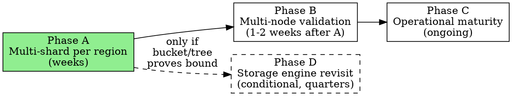

# Multi-Shard Scaling Roadmap (2026-04-20)

**Status:** COMPLETE. Phase A landed; Phase B realized as `2026-04-23-per-vault-consensus.md` (also complete) rather than the original fixed-shard B. The "linear scaling with active workers" goal this roadmap aimed for is achieved end-to-end via per-vault consensus + per-vault storage + per-vault backup.
**Date opened:** 2026-04-20
**Date closed:** 2026-04-26
**Author:** Performance working group.
**Supersedes:** "What remains for multi-worker parallel apply" section in `project_write_optimization_cascade.md`.

---

## 2026-04-20 Phase B pivot

After landing Phase A's per-shard infrastructure (storage layout, per-`(region, shard)` consensus engines, service-layer routing, `LeaderHint` shard label, saga forwarding), the multi-tenancy concerns about hash-routed shard fairness drove a pivot:

**Phase B becomes "org-as-Raft-group"** (each organization is its own consensus group; no more fixed `shards_per_region`). Phase A's infrastructure carries over directly — per-`(region, X)` storage and per-X consensus stack are exactly what org-as-shard needs. Phase A's routing layer collapses (`org_id` IS the routing key — no hash function).

See [`2026-04-20-phase-b1-org-as-shard.md`](2026-04-20-phase-b1-org-as-shard.md) for the implementation spec. Phases B.2 (hibernation) and B.3 (cluster-membership reconciliation) follow.

The original Phase B (multi-node validation of fixed-shard scaling) is folded into Phase B.1's validation suite — the same infrastructure works either way.

The original Phase A Steps 6–9 (per-shard metric label completion, scaling-curve test, profile preset, fixed-shard docs) are dropped — they validate a model the codebase no longer carries.

---

## Context: where we are

After the 2026-04-20 optimization sprints (`project_write_optimization_cascade.md`), the measured ceiling on a **single-shard-per-region single-node** profile cluster is:

| Workload @256 clients, 30s          |   Throughput |   p50 |    p99 |
| ----------------------------------- | -----------: | ----: | -----: |
| concurrent-writes (single-vault)    | 10,099 ops/s | 24 ms | 105 ms |
| concurrent-writes-multivault (M=16) | 10,311 ops/s | 20 ms | 138 ms |
| concurrent-writes-multiorg (ORGS=8) | 10,246 ops/s | 20 ms | 137 ms |
| concurrent-reads                    | 41,131 ops/s |  6 ms |  10 ms |

The ceiling is flat across workload shape — **10k ops/s write, 40k ops/s read per node per shard**. Flamegraph analysis shows the remaining cost is intrinsic per-op work: `apply_operations_in_txn` (5.2µs per entity) + `apply_request_with_events` dispatch (2.3µs per call). These can't be meaningfully reduced without architectural changes.

The flat scaling across `ORGS={1,4,8}` confirmed the bottleneck: a single-shard region funnels all orgs through one `ApplyWorker`. **Per-node throughput is capped by per-shard throughput × shard count.** Today shard count per region is 1.

## The architectural answer, benchmarked against the space

Every adjacent system (CockroachDB, TiKV, YugabyteDB, Dgraph) uses the same scaling axis: **many Raft groups per node, not faster Raft groups**. CockroachDB runs thousands of 512 MB ranges per node; TiKV runs hundreds of 96 MB regions; each with its own Raft group and apply pipeline. This isn't an optimization — it's the fundamental structure that makes these databases scalable.

InferaDB's architecture already names this concept: `ShardManager` hashes orgs to shards, `RaftManager` runs one Raft group per shard, each region has N shards. **The mechanism exists. What's missing is actually running N > 1 in production.**

Per-node throughput projection at 16 shards per region:

- Write: 10k × ~12 (some overhead + CPU saturation) ≈ **120-160k ops/s per node**
- Read: 40k × ~12 ≈ **300-500k ops/s per node**
- 3-node cluster: ~360-480k writes/s, ~900k-1.5M reads/s

Those numbers put InferaDB in CockroachDB/TiKV range.

## Four-phase path

### Phase A — Multi-shard per region

**Goal:** Validate that per-node throughput scales linearly in shard count. Unlock 10-16× single-node throughput.

**Shape:** Configurable `shards_per_region` (default 1 for backward compat). Each region runs N independent Raft groups, each with its own WAL, state DBs, apply worker. `ShardManager` routes orgs to shards via hash. Each shard has its own Merkle chain (per-shard audit trail).

**Risk profile:** Low-to-medium. The architectural mechanism exists (`ShardManager`, per-shard `ConsensusEngine`). The work is configuration surface + file layout + wiring + verification. No consensus protocol changes; no semantic changes to the ledger commitment model — each shard's chain is independently verifiable.

**Expected gain:** 8-16× per-node write throughput. If measured scaling is sub-linear, we've uncovered a cross-shard serialization bug — valuable to find before production.

**See:** `2026-04-20-phase-a-multi-shard-per-region.md` for the implementation plan.

### Phase B — Multi-node validation

**Goal:** Confirm cluster-level throughput scales with node count + shard count. Strengthen durability story.

**Shape:** Stand up 3-node cluster with N shards per region. Each shard's leadership spreads across nodes. Measure aggregate cluster throughput. Verify:

- Aggregate throughput ≈ `N_nodes × N_shards_per_node × per_shard_throughput` minus replication overhead (~10-20%).
- Leader-election + quorum apply behave correctly at scale.
- Crash of any single node loses zero committed writes (Raft quorum property).

**Risk profile:** Low. Raft replication is already shipped and tested. This is primarily a validation sprint, not a feature sprint.

**Expected gain:** 3× cluster throughput vs single-node (one leader per shard, spread across 3 nodes). More importantly: **durability model gets materially stronger**. The `pipelined_commit` kernel-panic loss window becomes practically irrelevant in a multi-node deployment because a single node's unsynced tail can be recovered from quorum peers.

**New failure-mode matrix after Phase B**:

| Failure         | Single-node result          | 3-node result                        |
| --------------- | --------------------------- | ------------------------------------ |
| Process crash   | No loss (WAL replay)        | No loss                              |
| Kernel panic    | Potential tail loss         | **No loss — quorum has the log**     |
| Power loss      | Potential tail loss         | **No loss — quorum has the log**     |
| Disk corruption | Node fails; manual recovery | **No loss — reprovision from peers** |

### Phase C — Operational maturity

**Goal:** Production-ready scaling behavior. Hot-shard detection, dynamic rebalancing, per-shard observability.

**Shape:** A collection of smaller workstreams, driven by what production telemetry actually reveals:

1. **Per-shard metrics** — throughput, apply lag, queue depth, WAL size. Labels `{region, shard_id}` on existing histograms.
2. **Hot-shard detection** — identify shards absorbing disproportionate write load (one org dominating). Reuse `HotKeyDetector` logic at the shard level.
3. **Dynamic shard splitting** — like CockroachDB's range splitting. When shard S exceeds a write-rate threshold, split into S' and S''. Requires:
   - Deterministic split-point selection (by org-id hash range).
   - Online split protocol: freeze S briefly, allocate S' and S'', migrate orgs via Raft proposal, unfreeze.
   - Client routing cache invalidation.
4. **Coalesced heartbeats** at scale — with 16+ shards per node, per-shard heartbeats become wasteful. Batch per-peer across shards (CockroachDB's technique).
5. **Shard rebalancing across nodes** — when one node holds more leaders than peers. Raft leadership transfer is already implemented; this is automation on top.

**Risk profile:** Medium. Each item is small but multi-shard rebalancing + splitting touch hot-path code.

**Expected gain:** Operational robustness under varied workloads. Not primarily a throughput move — that's Phase A's job.

### Phase D — Storage engine revisit (conditional)

**Goal:** Evaluate whether the B+ tree remains the right storage engine.

**Shape:** Research + measurement. **Only pursue if Phase A's per-shard ceiling proves to be bound by B+ tree write cost specifically** (not fsync, not apply dispatch, not gRPC). Evidence would look like: `state.rs:327` + COW page work dominating the flamegraph under multi-shard load.

**Candidate engines:**

- **Pebble** (Go LSM, Rust wrapper via CockroachDB's crate) — battle-tested at CockroachDB scale.
- **BadgerDB-like Rust-native LSM** — less proven but would match the workspace's Rust-only discipline.
- **Keep B+ tree but optimize hot-path writes** — incremental; may suffice.

**Migration cost:** Large. Storage engine swap is a 2-3 month project. Requires:

- Durable format migration (old B+ tree files → new SSTables).
- Rewrite `StorageEngine` / `WriteTransaction` APIs.
- Re-derive MVCC semantics in LSM.
- Re-audit durability contracts (LSM memtable flush semantics differ from COW B+ tree).

**Why conditional:** The B+ tree's `commit_in_memory` path already gives us most of LSM's hot-write benefit (writes land in page cache, flushed lazily). The real question is whether per-entity write cost (currently 5.2µs) is inherent to B+ tree structure or just to the current implementation. Measurement after Phase A will tell us.

**Risk profile:** High. Storage engine swap can introduce subtle correctness bugs that only surface under unusual workloads.

**Expected gain:** 2-3× write throughput _IF_ we're B+-tree-write-bound. Unknown until measured.

## Decision log

Options considered and rejected:

- **Parallel apply within a single shard** — rejected. RegionBlock is per-batch, shared region state (sequences, chain) is per-shard-global, Raft log is a single linear order. Partitioning apply within a shard requires reinventing a cross-worker coordination protocol to preserve determinism. Much more complexity than Phase A for uncertain gain.

- **Rewrite consensus protocol** (Paxos, EPaxos, VSR) — rejected. Custom in-house Raft is shipped and stable. Consensus protocol is not the bottleneck; apply is.

- **io_uring / SPDK / DPDK userspace I/O** — deferred. WAL fsync is 3% of wall time today. Even eliminating it entirely nets ~3% throughput. Not a priority lever compared to Phase A's 10-16× potential.

- **LSM migration first** (before proving Phase A's ceiling) — rejected. We don't yet know if the B+ tree is actually bound. Doing LSM speculatively risks 2-3 months of work for unknown gain. Measure first.

- **Range-based sharding** (split by key range, not by org) — deferred. CockroachDB/TiKV do this; it allows finer-grained load balancing. But InferaDB's multi-tenancy model fits org-based sharding naturally (an org's data belongs together for residency + access control purposes). Revisit in Phase C if single orgs dominate load.

## Ordering rationale

**Why Phase A first**: single biggest lever, architecturally aligned (mechanism exists), reveals hidden serialization bugs before production traffic does, unlocks everything downstream.

**Why Phase B second**: completes the durability story. Single-node performance numbers are only half the picture — multi-node is what ships.

**Why Phase C as follow-up rather than parallel**: Phase C items (metrics, splitting, rebalancing) are specific responses to observed production behavior. Do them reactively based on telemetry, not speculatively.

**Why Phase D is conditional**: storage engine swap is expensive and only justified if data shows it's needed. Keep it on the table but don't pre-commit.

## Success metrics for the roadmap

**Phase A complete when:**

- `shards_per_region = 16` measured at ≥80k ops/s sustained on a single node (8× scaling) with zero correctness regressions across the existing test suite and a new multi-shard integration test.
- Flamegraph after Phase A shows what the new dominant cost is (feeds Phase C + D decisions).

**Phase B complete when:**

- 3-node cluster measures ≥ 200k ops/s aggregate writes across all shards.
- Crash-of-one-node integration test demonstrates zero committed-write loss.

**Roadmap complete when:**

- Production deployment runs with `shards_per_region ≥ 8` across multi-node cluster and sustains the target workload without per-shard hot-spotting.

## Future considerations not in scope

- **Cross-shard atomic transactions.** InferaDB doesn't need them today (each org is atomic within its shard). If future workloads require them, design separately — CockroachDB's 2PC-via-intents is the relevant prior art.
- **Geo-replication across regions.** Already sketched in `docs/operations/durability.md`; independent of shard count.
- **Snapshot rebalancing across shards.** Phase C, driven by observed hot-shard patterns.
